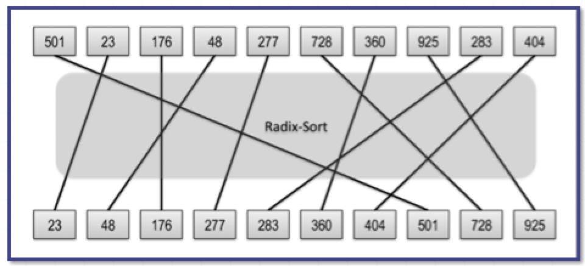
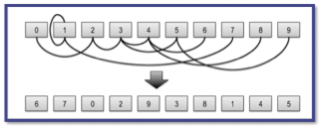

# Random permutations

## Generating permutations

### Problem statement

- The input to the random permutation problem is a list of $n$ elements that we want to randomly permute
- The output is a reordering of the elements done in a way so that all permutations are equally likely
- We can use a function, `random(k)`, which returns an integer in the range $[0, k-1]$ chosen uniformly and independently at random

### Randomized algorithms

- A **randomized algorithm** is an algorithm whose behavior depends, in part, on the outcomes of random choices or the values of random bits
- The main advantage of using randomization in algorithm design is that results are often simple and efficient
- In addition, there are some problems that need randomization for them to work effectively

## Random sort

### Description

> This algorithm simply chooses a random number for each element in an input array and sorts the elements using values as keys



### Analysis

- To see that every permutation is equally likely to be output by the random-sort method, note that each element $x_{i}$ in $X$ has an equal probabilities $\frac{1}{n}$, of having its random $r_{i}$ value be the smallest
- Thus, each element in $X$ has equal probability of $\frac{1}{n}$ of being the first element in the permutation
- Applying this reasoning recursively, implies that the permutation that is output has the following probability of being chosen

$$
    \left( \frac{1}{n} \right) \left( \frac{1}{n-1} \right) \dots \left( \frac{1}{2} \right) \left( \frac{1}{1} \right) = \frac{1}{n!}
$$

- That is, each permutation is equally likely to be output
- There is a small probability that this algorithm will fail, however, if the random values are not unique

## Fisher-Yates shuffling

### Description

> There is a different algorithm, known as the Fisher-Yates algorithm, which **always succeed** (and is faster)



```
define FisherYates(X):
    for k = n - 1...1 do
        j := random(k+1) // j is random integer in [0,k]
        swap(X[k], X[j]) // may swap an element with itself
    return X
```

### Analysis

- This algorithm considers the items in the array one at time from the end and swaps each element with an element in the array from that point to the beginning
- Notice, that each element has an equal probability, of $\frac{1}{n}$, of being chosen as the last element in the array $X$ (including the element that starts out in that position)
- Applying this analysis recursively, we see that the output permutation has probability

$$
        \left( \frac{1}{n} \right) \left( \frac{1}{n-1} \right) \dots \left( \frac{1}{2} \right) \left( \frac{1}{1} \right) = \frac{1}{n!}
$$

- This is, each permutation is equally likely