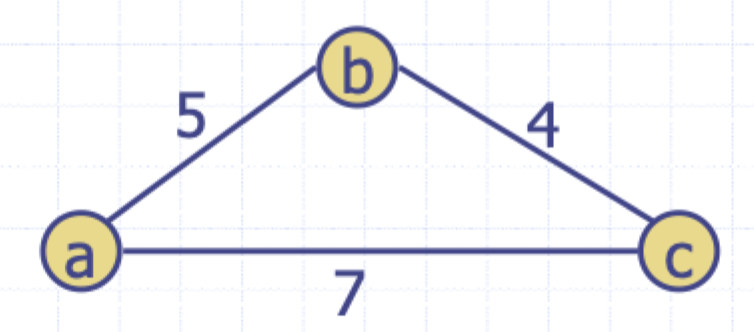

# Approximation

## Applications

### Traveling salesperson

- There is a collection of cities that are connected by a road network
- Each road connects two cities and has a cost to traverse
- A minimum distance tour of the cities that starts and ends at the same city
- Unfortunately, this is NP-complete and can only approximate a solution

### Vertex cover

- A **vertex cover** of graph `G = (V, E)` is a subset $W$ of $V$ such that for every edge in $E$, that starting vertex is in $W$ or the ending vertex is in $W$.
- The optimal solution would find a vertex cover of minimal size for a given graph $G$
- This problem is NP-hard, so a solution must be approximated

### Set cover

- Each of the distinct sets of objects that can be included in a single observation is given as an input set and the optimization problem is to minimize the number of sets whose union includes all the objects of interest
- This problem is NP-complete, but is a problem where an approximate solution is sufficient

## Approximation ratios

- Optimization problems
    - We have some problem instance $x$ that has many feasible solutions
    - We are trying to minimize (or maximize) some cost function for a solution $S$ to $x$
- An approximation produces a solution $T$
    - $T$ is a **k-approximation** to the optimal solution if `c(T)/c(OPT) <= k`

### 2-approximation for traveling salesperson

#### Special case

- Consider a special case of this problem where the edge weight satisfy the following

$$
    w(a, b) + w(b, c) \ge w(a, c)
$$

- A visualization of such an instance would be



#### Implementation

```
define TSPApprox(G):
    M := /* a minimum spanning tree for G */
    P := /* an euler tour traversal of M, starting at some vertexs */
    T := []
    for v in P do
        if not v.visited then
            T.push(v)
            v.visited = true
    T.push(s)
    return T
```

#### Proof of approximation

- The optimal tour is a spanning tour; hence $\vert M \vert \le \vert \text{OPT} \vert$
- The [Euler Tour](https://en.wikipedia.org/wiki/Euler_tour_technique) $P$ visits each edge of $M$ twice, hence $\vert P \vert = 2 \vert M \vert$
- Each time, we shortcut a vertex in the Euler Tour and will not increase the total length, by the triangle equality; hence $\vert T \vert \le \vert P \vert$
- Therefore, $\vert T \vert \le \vert P \vert = 2 \vert M \vert M \le 2 \vert \text{OPT} \vert$

### 2-approximation for vertex cover

#### Implementation

```
define VertexCoverApprox(G):
    C := {}
    while /* G still has edges */ do
        e := /*random edge in G*/
        C.add(e.start)
        C.add(e.end)
        for /*f incident to e.start or e.end*/ do
            /* remove f from G */
    return C
```

#### Proof of approximation

- Every chosen edge $e$ has both ends in $C$
- But $e$ must be covered by an optimal cover; hence one of $e$ must be in the optimal solution
- Thus, there is at most twice as many vertices in $C$ as there are in the optimal solution

### Greedy approach to set cover

#### Implementation

```
define SetCoverApprox(S):
    C = {} // The set cover built so far
    E = {} // Elements from S currently coverd by C
    while E != S do
        S_i := /* Select a subset of S that has the maximum number of uncovered elements */
        C.add(S_i)
        E.union(S_i)
    return C
```

#### Analysis

- Consider the moment in our algorithm when a set $S_{j}$ is added to $C$, and let $k$ be the number of previously uncovered elements in $S_{j}$
- We pay a total charge of $1$ to add this set to $C$, so we charge each previously uncovered element $i$ of $S_{j}$ a charge of `c(i) = 1/k`
- Thus, the total size of our cover is equal to the total charges made
- To prove the approximation bound, we will consider that charges made to the elements in each subset $S_{j}$ that belongs to an optimal cover $C'$. So, suppose $S_{j}$ belongs to $C'$
- Let us write $S_{j} = \{ x_{1},\, x_{2},\, \dots ,\, x_{nj} \}$ so that $S_{j}$'s elements are listed in order in which they covered by our algorithm
- The total about of charges made to $C$ is

$$
    \sum \limits_{l=1}^{n_{j}} \frac{1}{l}
$$

- This is the familiar **harmonic sequence** which indicates a running complexity of $O(\log n_{j})$
- Our charge scheme implies that $c(S_{j})$ is the same, so summing over the sets of $C'$

$$
    \sum \limits_{S_{j} \in C'} c(S_{j}) \le \sum \limits_{S_{j} \in C'} b \log n_{j}
    \le b \vert C' \vert \log n_{j}
$$

- For some constant $b \ge 1$, but since $C'$ is a set cover

$$
    \sum \limits_{i \in S} c(i) \le \sum \limits_{S_{j} \in C'} c(S_{j})
$$

- Therefore $\vert C \vert \le b \vert C' \vert \log n$

## Polynomial-time approximation schemes

- A problem $L$ has a **polynomial-time approximation scheme** if it has a polynomial time $(1 + \epsilon)$-approximation algorithm, for any fixed $\epsilon > 0$ (this value may appear in the running time)
- The 0/1 knapsack problem has a PTAS with a running time that is $O(n^{3} / \epsilon)$