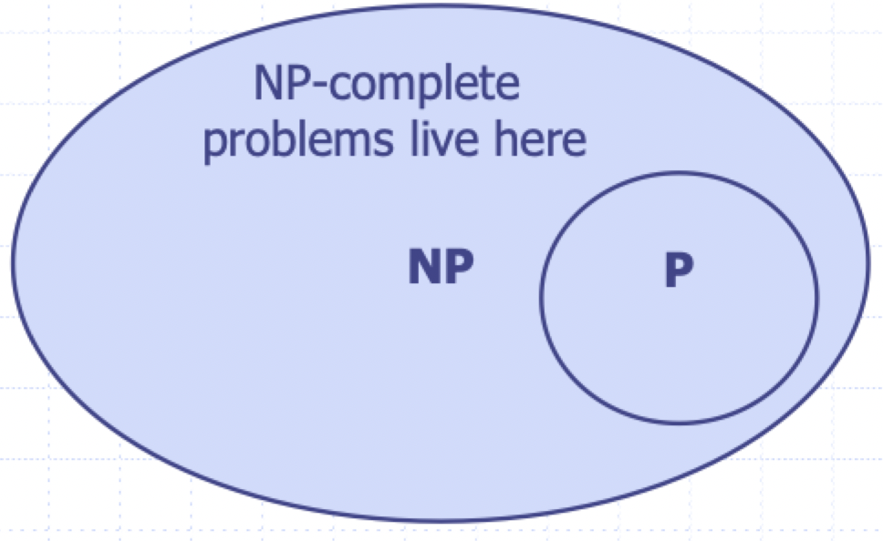

# NP completeness

## Dealing with hard problems

What to do when we find a hard problem...

1) Can't find a polynomial-time algorithm and give up
2) Show that the problem is hard, collectively

### Polynomial-time decision problems

- To simplify the notion of "hardness", we define the following
    - Polynomial-time: the cut-off for efficiency
    - Decision problem: output is "yes" or "no"

### Problems and languages

- A **language** $L$ is a set of strings defined over some alphabet $\sum$
- Every decision algorithm $A$ defines a languages $L$
    - $L$ is the set consisting of every string $x$ such that $A$ outputs "yes" on input $x$
    - We say that $A$ *accepts* $x$

## Complexity classes

> A **complexity class** is a collection of languages

### P-class

- $P$ is the complexity class consisting of all languages that are accepted by **polynomial-time** algorithms
- A polynomial-time algorithm has a running time of $O(n^{c})$
- For each language $L$ in $P$, there is a polynomial-time decision algorithm $A$ for $L$
    - If $n = \vert x \vert$, then $A$ runs in $p(n)$ time on input $x$
    - The function $p(n)$ is some polynomial function

### NP-class

- We say that an algorithmic is **non-deterministic** if it uses the following operation
    - `choose(b)` to choose a bit b
    - Can be used to choose an entire string $y$ (with $\vert y \vert$ choices)
- We say that a **non-deterministic** algorithm $A$ *accepts* a string $x$ if there exist some sequence of `choose` operations that causes $A$ to output "yes" on input $x$
- $NP$ is the complexity class consisting of all languages accepted by **polynomial-time non-deterministic** algorithms

#### Alternative definition

- We say that an algorithm $B$ *verifies* the acceptance of a language $L$ if and only if, for any $x$ in $L$, there exists a certificate $y$ such that $B$ outputs "yes" on `input(x, y)`
- $NP$ is the complexity class consisting of all languages verified by **polynomial-time** algorithms

### NP-completeness

- A language $M$ is polynomial-time **reducible** to a language $L$ if an instance of $x$ for $M$ can be transformed in polynomial time to an instance $x'$ for $L$ such that $x$ is in $M$ if and only if $x'$ is in $L$
- A problem (language) $L$ is **NP-hard** if every problem in $NP$ is polynomial-time reducible to $L$
- A problem (language) $L$ is **NP-complete** if it is in $NP$ *and* it is NP-hard

### Thoughts about P and NP

- It is believed that $P \subset NP$
- This implies that NP-complete are the hardest in $NP$
- If we could solve an NP-complete problem in polynomial time, then every problem in $NP$ can be solved in polynomial time
- That is, if an NP-complete problem is solvable in polynomial time, than $P = NP$
- Since so many people have attempted without success to find polynomial-time solutions to NP-complete problems, showing your problem is NP-complete is equivalent to showing that a lot of smart people have worked on your problem and found no polynomial-time algorithm

