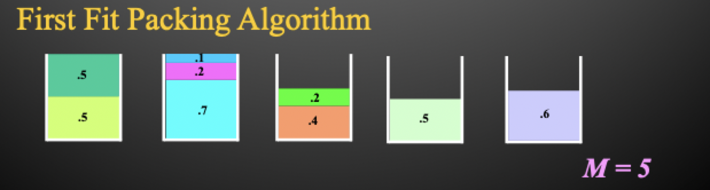

# Bin packing

## The bin packing problem

### Problem statement

- Given $n$ items with sizes $s_{1},\, s_{2},\, \dots ,\, s_{n}$ such that $0 \le s_{i} \le 1$ and $1 \le i \le n$, pack them into the fewest number of unit capacity bins
- This is a NP-hard problem - there is no known polynomial time algorithm for its solution and it is conjectured that non exists

### Applications

1) Filling recycling bins
2) Loading trucks
3) Organizing mix tapes

### Optimal solution

For the following items:

$$
    0.5,\, 0.7,\, 0.5,\, 0.2,\, 0.4,\, 0.2,\, 0.5,\, 0.1,\, 0.6,\,
$$

An optimal packing would look like

## Approximate solutions

### Next fit algorithm

> Check to see if the current item fits in the current bin. If so, then place it there, otherwise start a new bin

#### Approximation ratio

> Theorem: Let $M$ be the number of bins required to pack a list of items optimally. The next fit algorithm will use at most $2M$ bins

- Let $s(B_{i})$ be the sum of sizes of the items assigned to bin $B_{i}$ in the next fit solution
- For any two adjacent bins ($B_{j}$ and $B_{j + 1}$), we know that $s(B_{j}) + s(B_{j+1}) > 1$
- Let $k$ be the number of bins used by the next fit for a given list. 
    - As stated above, $s(B_{1}) + s(B_{2}) > 1$ ... $s(B_{k-1}) + s(B_{k}) > 1$
    - Adding the inequalities we get $\sum s(B_{i}) > \frac{k}{2}$
    - By definition, $\text{OPT} = M > \frac{k}{2}$ which implies $\text{SOL} = k < 2M$
- There exists sequences such that next fit uses $2M - 2$ bins

### First fit algorithm

> Scan the bins in order and place the new item in the first bin that is large enough to hold it. A new bin is created only when an item does not fit in *any* previous bin

#### Approximation ratio

> Let $M$ be the optimal number of bins required to pack a list optimally. The first fit packing method never uses more than $1.7M$

- There exists sequences such that first-fit use $1.66\dots M$

#### Implementation

- Can easily be implemented in $O(n^{2})$ running time
- Can be optimally implemented with a running time of $O(n \log n)$
    - Idea is to use a balanced search tree with height $O(\log n)$
    - Each node has 3 values
        1) Index of the bin
        2) Remaining capacity of the bin
        3) Best (largest) in all bins represented by the subtree rooted at that node
    - The ordering of the tree is by bin index

### Best fit algorithm

> New item is placed in a bin where it fits the tightest. If it does not fit in any bin, start a new bin

#### Implementation

- Can be implemented in $O(n \log n)$ time by using a balanced binary tree
- Tree is ordered by remaining capacity
- Depth first search of the tree will find the bin with the tightest fit
- Requires repeated delete/inserts to update remaining capacities in the tree

### Other heuristics

- **First fit decreasing**: first order the items by size, from largest to smallest, then run the first fit algorithm
- **Best fit decreasing**: first order the items by size, from largest to smallest, then run the best fit algorithm

## Experiments

- It can be difficult to experimentally compute approximation ratios
    - REQUIRES KNOWLEDGE OF AN OPTIMAL SOLUTION (we don't have one)
- But we can do experiments for a related parameter
- Define the **waste** for a bin packing algorithm $A$ to be the number of bins that it uses minus the total size of all $n$ items
- We are interested in experiments for estimating the waste $W(A)$ as a function of $n$ as it grows toward infinity, for random items uniformly distributed in the interval $[0,\,1]$
