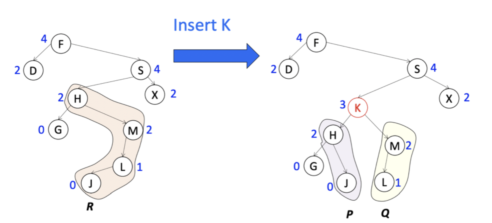
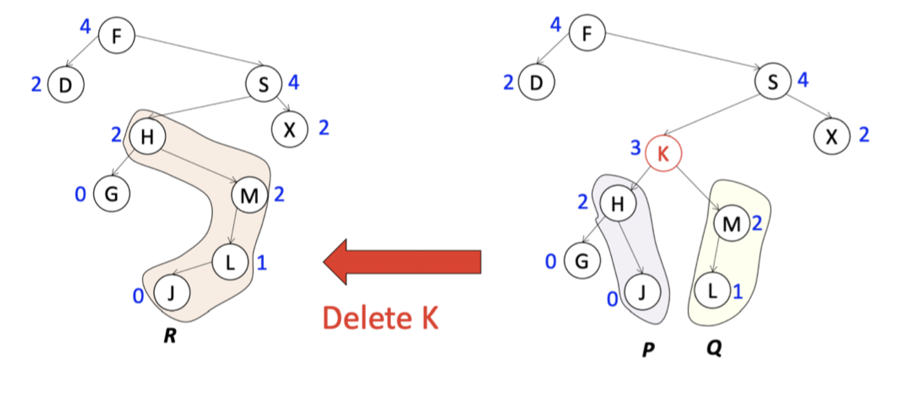

# Zip trees

## What are they?

A zip tree is a binary search tree in which each node has a numeric **rank** and the tree is map-heap ordered with respect to ranks, with rank ties broken in favor of smaller keys

### Heights

- Idea: on insertion, choose a height for an item and insert it at the given height, or close to it
- Choose  heights like those in a best-case binary search tree
- We cannot choose the heights exactly. Instead, for each node to be inserted we choose a rank as follows
    1) Flip a fair coin
    2) Count the number of heads before the first tails
- The rank of a node has a geometric distribution: $P(\text{rank is k}) = \frac{1}{2^{k+1}}$

### Ordering

A binary search tree in which each node has a rank chosen randomly on insertion, with nodes symmetrically ordered by key and heap-ordered by rank, breaking ties in favor of smaller keys

```
x.left.key < x.key < x.right.key
x.left.rank < x.rank
x.right.rank <= x.rank
```

## Operations on zip trees

### Insert



1) Choose the rank of the node randomly; here let is be 3
2) Search for the node with key 'K'
3) Find a node $y$ such that `y.rank <= x.rank` with the strict inequality if `y.key < x.key` (y = node H here)
4) Insert the given node, then places keys less than `x.key` to the left and those greater than `x.key` to the right

#### Recursive implementation

```
define insert(x, root):
    if root == null then
        x.left := x.right
        x.right := null
        x.rank := RandomRank()
        return x
    if x.key < root.key then
        if insert(x, root.left) == x then
            if x.rank < root.rank then
                root.left := x
            else
                root.left := x.right
                x.right := root
                return x
    else
        if insert(x, root.right) == x then
            if x.rank <= root.rank then
                root.right := x
            else
                root.right := x.left
                x.left := root
                return x
    return root
```

#### Iterative implementation

```
define insert(x):
    rank := x.rank := RandomRank()
    key := x.key
    cur := x.root
    while cur != null and (rank < cur.rank or (rank == cur.rank and key > cur.key)) do
        prev := cur
        cur := cur.left if key < cur.key else cur.right
    if cur == root then
        root := x
    else if key < prev.key then
        prev.left := x
    else
        prev.right := x

    if cur == null then
        x.left := x.right
        x.right := null
        return
    if key < cur.key then
        x.right := cur
    else
        x.left := cure
        prev := x

    while cur != null do
        fix := prev
        if cur.key < key then
            repeat 
                prev := cur
                cur := cur.right
            until cur == null or cur.key > key
        else
            repeat
                prev := cur
                cur := cur.left
            until cur == null or cur.key < key
        if fix.key > key or (fix == x and prev.key > key) then
            fix.left := cur
        else
            fix.right := cur
```

### Delete



1) Search for the node with key 'K' in the tree
2) Form a single path $R$ by merging them from top to bottom in non-increasing rank order, breaking a tie in favor of the smaller key

#### Recursive implementation

```
define zip(x, y):
    if x == null then return y
    if y == null then return x
    if x.rank < y.rank then
        y.left := zip(x, y.left)
        return y
    else
        x.right := zip(x.right, y)
        return x

define delete(x, root):
    if x.key == root.key then 
        return zip(root.left, root.right)
    if x.key < root.key then
        if x.key == root.left.key then
            root.left := zip(root.left.left, root.left.right)
        else
            delete(x, root.left)
    else
        if x.key == root.right.key then
            root.right := zip(root.right.left, root.right.right)
        else
            delete(x, root.right)
    return root
```

#### Iterative implementation

```
define delete(x)
    key := x.key
    cur := root
    while key != cur.key do
        prev := cur
        cur := cur.left if key < cur.key else cur.right
    left := cur.left
    right := cur.right
    if left == null then
        cur := right
    else if right == null then
        cur := left
    else if left.rank >= right.rank then
        cur := left
    else
        cur := right

    if root == x then
        root := cur
    else if key < prev.key then
        prev.left := cur
    else
        prev.right := cur

    while left != null and right != null do
        if left.rank >= right.rank then
            repeat
                prev := left
                left := left.right
            until left == null or left.rank < right.rank
            prev.right := right
        else
            repeat
                prev := right
                right := right.left
            until right == null or left.rank >= right.rank
            prev.left := left
```

## Properties of zip trees

### Static properties

- The structure of a zip tree is uniquely determined by the keys and ranks of its nodes
- The expected root rank is $\log n + O(1)$
- There is a high probability that the rank of the root is $O(\log n)$
- Tree depth is $O(\log n)$ with high probability as well

### Dynamic properties

- The expected restructuring time to insert or delete a node of rank $k$ is $O(k)$
- In other words, restructuring time is constant
- The probability of restructuring taking $O(k)$ time is exponentially small in $k$
- Insertion and deletion can be done purely top-down