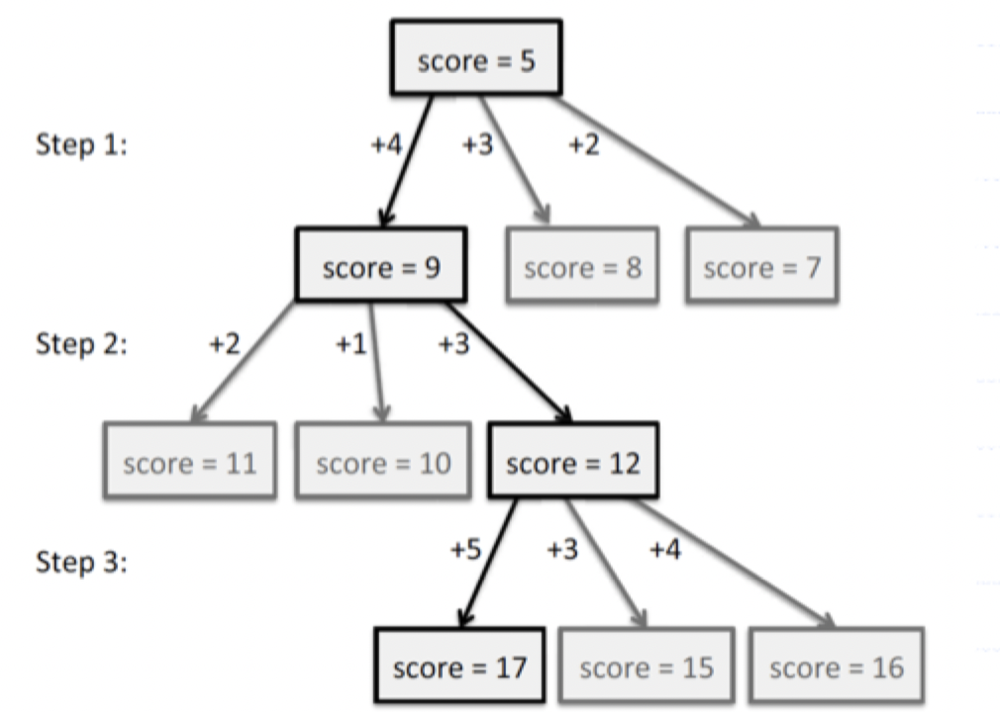
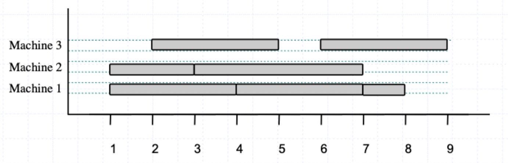
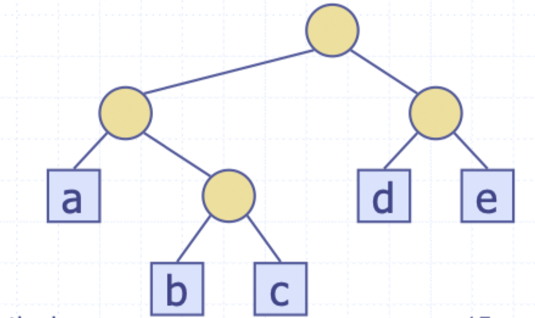
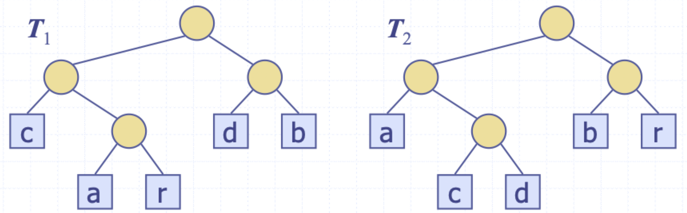
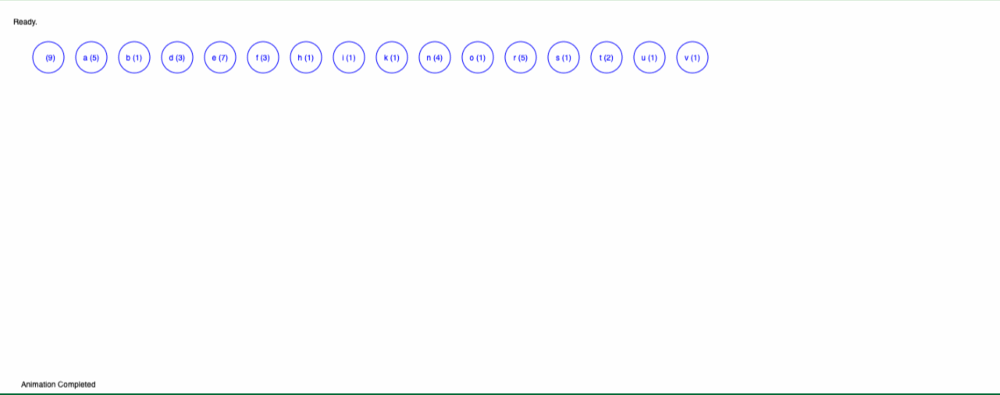

# The greedy method

## Greedy algorithms

### Paradigm

**The greedy method** is a general algorithm design paradigm built on the following elements

- *Configurations*: different choices, collections, or values to find
- *Objective function*: a score assigned to configurations, aiming to either minimize or maximize

### Greedy choice property

- Works best when applied to problems with the **greedy choice** property
- A globally optimal solution can *always* be found by a series of improvements from a starting configuration
- The sequence of choices starts from some well-understood starting configuration, and then iteratively makes the decision that is best from all those that are currently possible, in terms of improving the objective function



## Fractional knapsack

### Problem statement

- Given a set $S$ of $n$ items, each item having
    - $b_{i}$: a positive benefit
    - $w_{i}$: a positive weight
- The goal is to determine which items will yield the maximum total benefit but limited by some weight $W$
- If we are allowed to take fractional amounts, then we let $x_{i}$ be the amount we take of item $i$
- The objective is to *maximize*: $\sum \limits_{i \in S} b_{i}\left( \frac{x_{i}}{w_{i}} \right)$
- We are constrained by $\sum \limits_{i \in S} x_{i} \le W$

### Solution

- Greedy choice: keep taking the item with the highest **benefit to weight ratio**

```
define FractionalKnapsac(S, W):
    taken := [null for i in S.length]
    values := [null for i in S.length]
    for i in S.length do
        taken[i] := 0
        values[i] := S[i].benefit / S[i].weight
    w := 0
    while w < W do
        /* Remove item i in S with highest value */
        taken[i] := min(S[i].weight, W - w)
        w := w + min(S[i].weight, W - w)

    return taken
```

### Proof of correctness

Suppose that their *is* a better solution

1) There is an item $i$ with higher value than a chosen item $j$, but 
    - $x_{i} < w_{i}$
    - $x_{j} > 0$
    - $v_{i} < v_{j}$
2) If we substitute some $i$ with $j$, we increase the total benefit without changing the weight
3) This contradicts the assumption that the non-greedy solution is optimal

### Analysis

- We can sort the items by their benefit-to-weight ratios and then process them in order
- This would require $O(n\log n)$ time to sort and $O(n)$ time to process the items

## Task scheduling

### Problem statement

- Given a set $T$ of $n$ tasks, each having
    - A start time $s_{i}$
    - A finish time $f_{i}$ that is guaranteed to be larger than its start time
- Perform all tasks using the minimum number of machine



### Solution

- Greedy choice: consider tasks by their start time and use as few machines as possible with this order

```
define TaskSchedule(T):
    m := 0 // number of machines
    while /* T is not empty */ do
        t := /* remove the task with smallest start time */
        if /* there's a machine j for i */ then
            /* schedule i on machine j */
        else
            m := m + 1
            /* schedule i on a new machine */
    
    return m
```

### Proof of correctness

Suppose there *is* a better schedule that is using $k - 1$ machines

1) Let $i$ be the first task scheduled on machine $k$
2) Task $i$ must conflict with $k - 1$ other tasks
3) But that means there is no non-conflicting schedule using $k - 1$ machines

## Text compression

### Problem statement

- Given a string $X$, efficiently encode it into a smaller string $Y$
- This helps to save memory and/or bandwidth

### Encoding trees

- A **code** is a mapping of each character of an alphabet to a binary code-word
- A **prefix code** is a binary code such that no code-word is the prefix of another code word
- An **encoding tree** represents a prefix code
    - Each external node stores a character
    - The code-word of a character is given by the path from the root to the external node storing the character (0 for left child and 1 for right child)



| Character | Encoding |
|:---------:|:--------:|
| a | 00 |
| b | 010 |
| c | 011 |
| d | 10 |
| e | 11 |

- Given a text string $X$, we want to find a prefix code for the characters of $X$ that yields the smallest encoding for $X$
    - Frequent characters should have short code-words
    - Rare characters should have long code-words



- If `X = "abracadabra"`, $T_{1}$ encodes the string into 29 bits while $T_{2}$ encodes it into 24 bits

### Huffman trees

#### Algorithm

- Given a string $X$, construct a prefix tree that minimizes the size of the encoding of $X$
- Runs in $O(n + d \log d)$ time where
    - $n$ is the size of $X$
    - $d$ is the number of *distinct* characters in $X$
- A heap-based priority queue is used as an auxiliary structure

```
define Huffman(X):
    f := /* Computes the frequecies of each character in X */
    pq := /* Initialize a priority queue */
    for char in X do
        T := /* Create a single node binary tree for char */
        pq.enque(T, f(char))
    while pq.size() > 1 do
        f1, T1 := pq.remove_min()
        f2, T2 := pq.remove_min()
        T := /* Create a new binary tree with left subtree T1 and right subtree T2*
        pq.enque(T, f1 + f2)

    (f, T) := pq.remove_min()
    return T
```

#### Walkthrough

> Build a Huffman Tree for "a fast runner need never be afraid of the dark"

