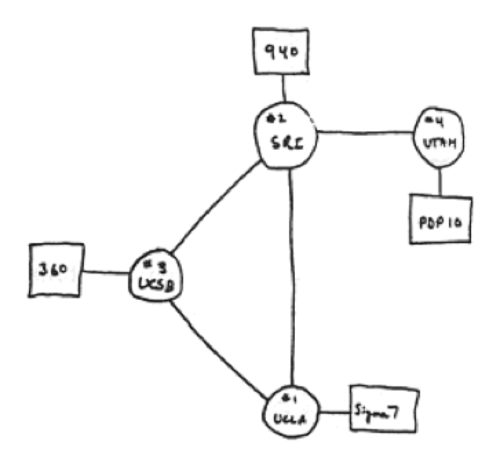
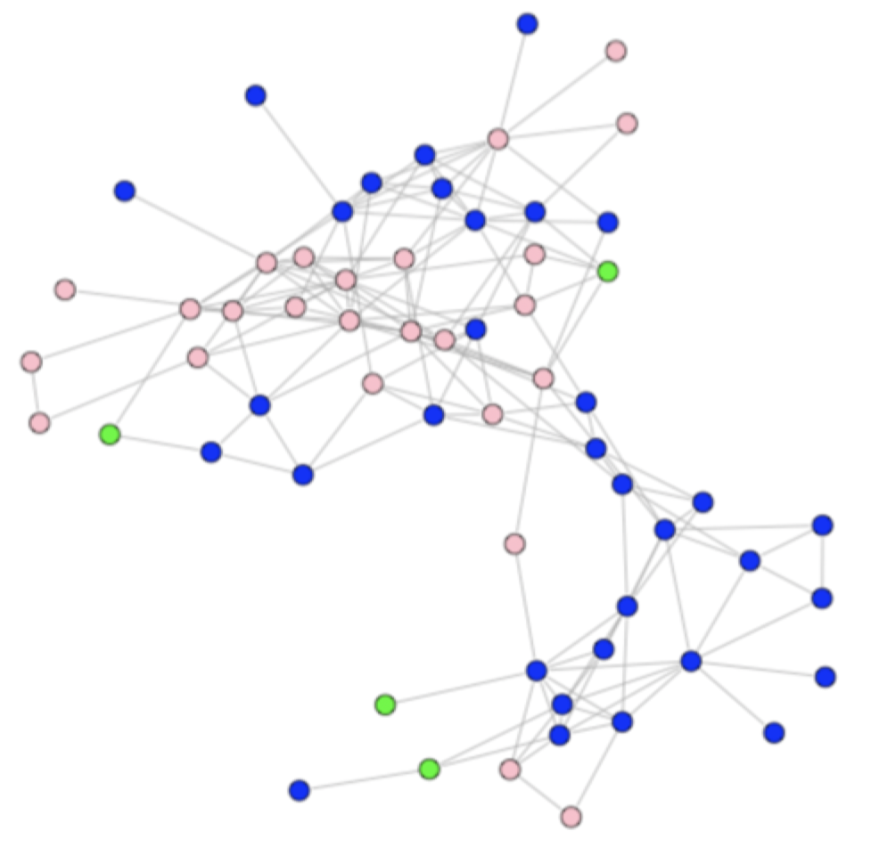
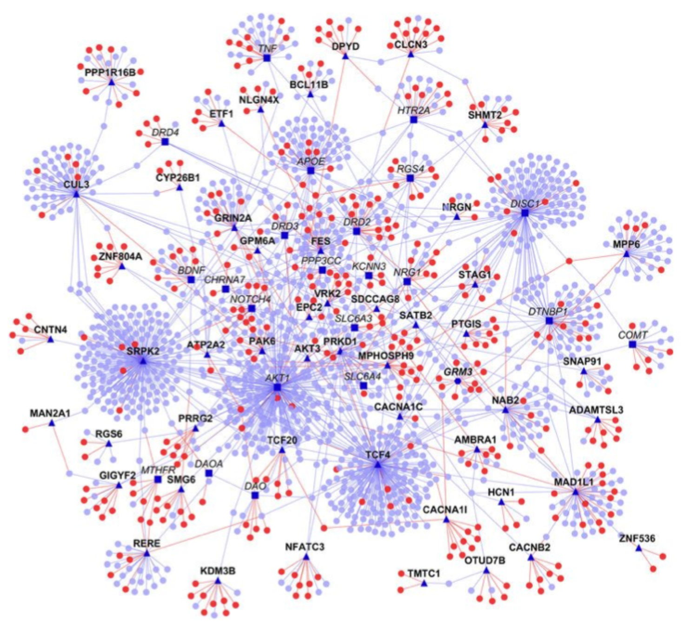
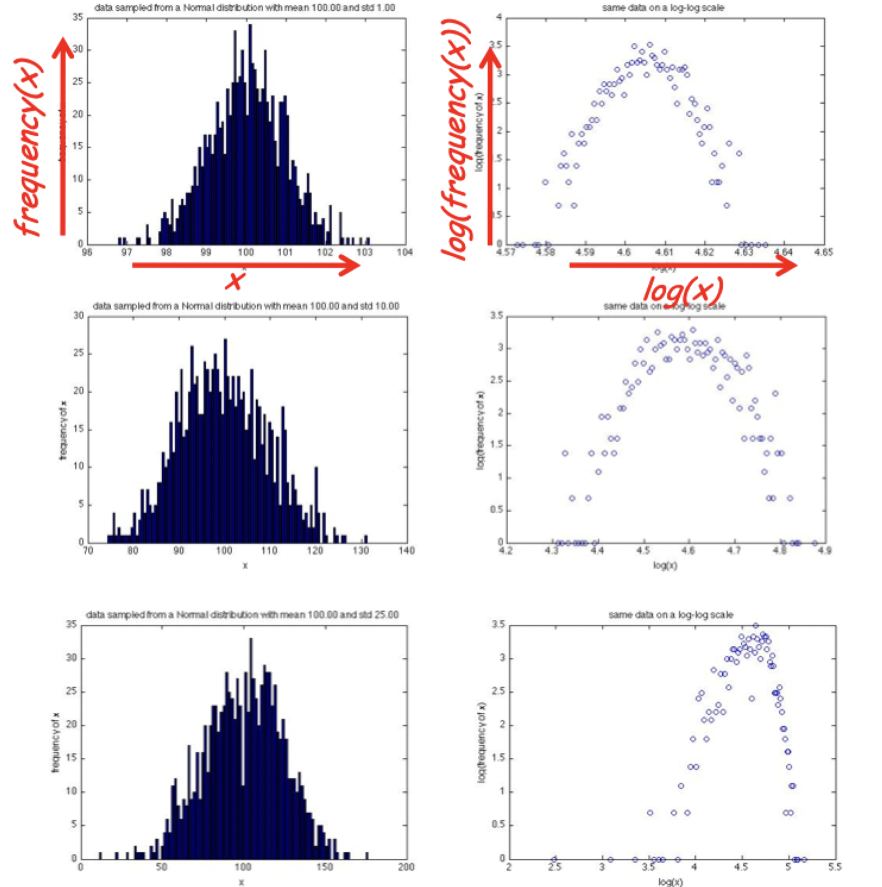
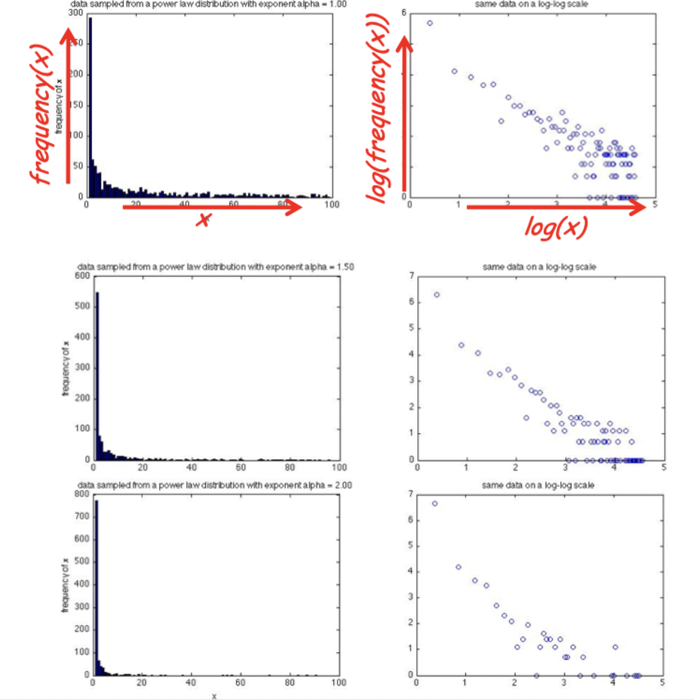
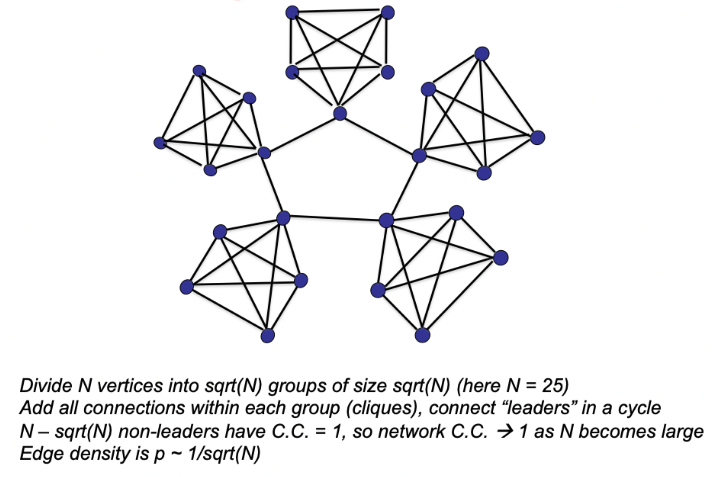
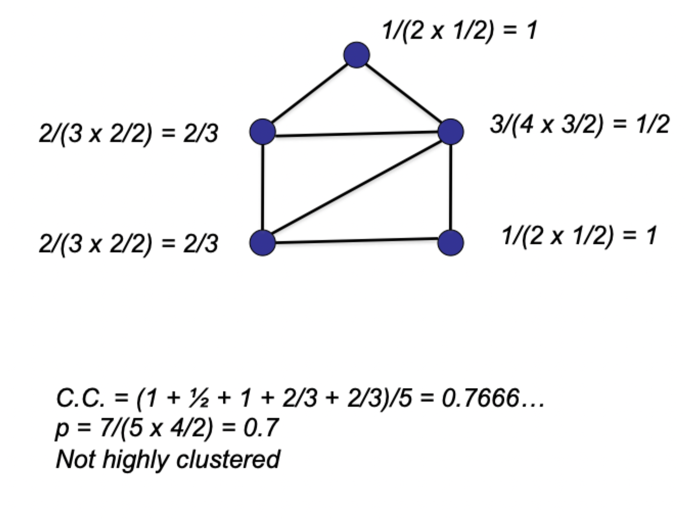

# Network structure

## Terminology

### Graphs

- A graph is a network, `G=(V,E)`, consisting of two sets
    - A set of vertices $V$
    - A set of edges $E$
- Vertices are the *entities* of a graph (also called nodes or actors)
- Edges are the *pairwise relationships* between vertices (also called ties)

### Degrees of separation experiment

- An experiment by Travers and Milgram published in 1969 to determine how many acquaintance "hops" exist between people in America
- Random people in Nebraska were asked to send a letter to a stockbroker in Boston
- Participants could only mail the letter to personal acquaintances, sending it directly only if they knew the stockbroker and otherwise sending it to a friend they thought might be able to reach the target
- 64 out of the 296 starting letters succeeded to be delivered to the stockbroker in Boston
- The average number of hops for successful letters was between 5 and 6

> This result gave rise to the expression that everyone in America has at most **six degrees of separation**

## Example networks

### The internet

- Vertices are physical machines
- Edges are physical wires
- Interactions are electronic

### Social networks

- Vertices are people or animals
- Edges are social relationships
- Interactions can be relationships, professional, or virtual

### Protein interactions

- Vertices are proteins in a cell
- Edges represent the physical contacts between proteins in the cell

### Why?

- Computer scientists
    - Understand and design complex, distributed networks
    - View "competitive" decentralized systems as economies
- Social scientists, behavioral psychologists, economists
    - Understand human behavior in simple settings
    - Revised views of economic rationality in humans
    - Theories and measurement of social networks
- Biologists
    - Protein-protein interaction networks
    - Gene regulatory networks
- Physicists and mathematicians
    - Interests and methods in complex systems
    - Theories of macroscopic behavior (phase transitions)
- Communities and *interacting* and *collaborating*

## Structural properties of networks

### Basic definitions

- A network or graph is
    - A collection of individuals or entities, each called a vertex or node
    - A list of pairs of vertices that are neighbors, representing edges or links
- Networks can represent any **binary** relationships over individuals
- Often helpful to visualize networks with a diagram, but the network is innately the list of vertices and edges, not the visualization

### Basic properties

- We will use the following notations
    - $n$ to denote the number of vertices, $\vert V \vert$, in a network
    - $m$ to denote the number of edges, $\vert E \vert$, in a network
- The number of possible edges is ${ n \choose 2}$ in a directed graph
- In an undirected graph (assuming no parallel or looping edges), $m \le \frac{n(n-1)}{2}$
- The degree of a vertex is its number of neighbors
- The sum of all degrees is $2m$

$$
    \sum \limits_{v \in V} \deg(v) = 2 \vert E \vert
$$

### Distance

The **distance** between two vertices is the length of the shortest path connecting them

- This assumes the network has only a single connected component
- If two vertices are in different components, their distance is infinite

### Diameter

The **diameter** of a network is the maximum distance between a pair of vertices in the network

- It measures how far or near typical individuals are from each other

## Network topology

- Emphasize purely *structural* properties
    - Size, diameter, connectivity, degree distribution, etc
    - May examine statistics across networks
    - The term **topology** also refers to structure
- Structure can reveal
    - Community
    - Important vertices, centrality, etc
    - Robustness and vulnerabilities
    - Can also impose *constraints* on dynamics
- Less emphasis on what actually occurs *on* network
    - Web pages are linked, but people surf the web
    - Buyers and sellers exchange goods and cash
    - Friends are connected, but have specific interactions

### Power law degree distributions

- A distribution has a **power law** if
    - $P(k) = ck^{\alpha}$ for constants $c$ and $\alpha$
    - So $\log P(k) = \log c + -\alpha \log k$
    - This has the same form as $y = mx + b$
- General theme
    - *Rank* events by their *frequency of occurrence*
    - Resulting distribution often is a power law
- Power law distribution is a good mathematical model for heavy-tailed
- Normal, or bell-shaped curves are not
- The statistical signature of power law causes it to be linear on the log-log scale
- Many social and other networks exhibits this signature

#### Not heavy-tailed

- Mathematical model of a typical "bell-shaped" distribution
    - The normal or Gaussian distribution over some quantity $x$
    - Good for modeling many real-world quantities, but not degree distributions
    - If mean/average is $\mu$, then $P(x) = e^{-(x - \mu)^{2}}$
    - Main point: exponentially fast decay as $x$ moves away from $\mu$
    - If we take the logarithm from both sides: $\log(P(x)) = -(x - \mu)^{2}$
- If we plot $\log x$ vs $\log(P(x))$, we get a strong curvature

#### Heavy-tailed

- One mathematical model of typically "heavy-tailed" distribution
    - $P(x) = \frac{1}{x^{\beta}}$
    - Main point: inverse polynomial decay as $x$ increases
    - Taking the logarithm of both sides: $\log(P(x)) = -\beta \log(x)$
- If we plot $\log(x)$ vs $\log(P(x))$, we get a straight line

### Small diameter

- Recall the definition of diameter
    - Assumes network has a single connected component
    - For every pair of vertices $u$ and $v$, compute the shortest-path distance $d(u, v)$
- What is the smallest or largest `diameter(G)` could be?
    - Smallest: 1
    - Largest: linear in $N$
- Small diameter
    - No precise definition, but certainly much less than $N$
    - May want to allow diameter to grow slowly with $N$
    - There is plenty of empirical support for small diameter

### Clustering of connectivity

#### Clustering coefficient

- Intuition: a measure of how "bunched up" edges are
- The clustering coefficient of vertex $u$
    - Let $k = deg(u)$ or the number of neighbor $u$ has
    - The max number of edges between neighbors of $u$ if $\frac{k(k-1)}{2}$
    - `c(u)` is the actual number between neighbors of $u$
    - Fraction of pairs of friends that are also friends
    - `0 <= c(u) <=1` is a measure of *cliquishness* of $u$'s neighbors
- The clustering coefficient of a graph is the average of `c(u)` over all nodes

#### High clustering

- `CC(G)` measures how likely vertices with a common neighbor are to be neighbors themselves
- Should be compared to how likely *random* pairs of vertices are to be neighbors
- Let $p$ be the edge density of a network or graph

$$
    p = E/\left(\frac{N(N-1)}{2}\right)
$$

- Here, $E$ is the total number of edges in a network or graph
- If we picked a pair of vertices at random in $G$, the probability they are connected is **exactly** $p$
- The clustering coefficient is "high" if `CC(G)` is much greater than $p$

#### Low clustering

