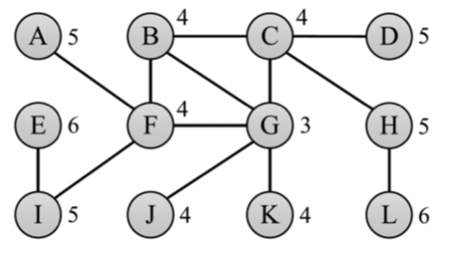
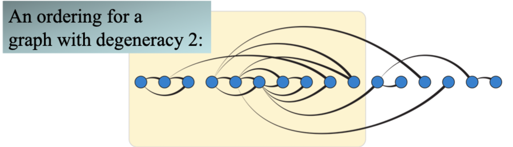

# Network algorithms

## Computation representation of graphs

### Table of edges

```
G = {(A, B), (C, B), (D, B), (D, C)}
```

- Essentially a set of ordered pairs, where each pair represents an edge
- Requires $O(n + m)$ space
- Good for representing directed graphs in a simple manner
- Does not provide much information about the graph itself

### Adjacency matrix

$$
    \begin{bmatrix}
        0 & 0 & 1 & 0 \\
        0 & 0 & 0 & 0 \\
        0 & 1 & 0 & 0 \\
        0 & 1 & 1 & 0
    \end{bmatrix}
$$

- Store an two-dimensional array where indices are the graph's vertices
- If a `1` is stored in a slot, an edge exists between the two vertices
- Does *not* distinguish directionality in a graph
- Requires $O(m^{2})$ space, and can be quite wasteful for a sparsely connected graph

### Adjacency list

```
A -> {(A, C)}
B -> {}
C -> {(C, B)}
D -> {(D, B), (D, C)}
```

- Vertices are keys in a map-like structure that map to a list of edges that leave the vertex
- Requires more complex way of representing edges and vertices

## Degree distribution

1) Compute the degree, $\deg(v)$, of each vertex $v$
    - This is easily done with an adjacency list implementation: `G[v].size()`
    - Slightly more complicated with other implementations
2) Create a histogram count array, $H$, of size $n$, and initialize each `H[i] = 0`
3) For each vertex $v$ increment `H[deg(v)]`
4) Plot the values of $H$ from 0 to $n-1$ on a regular and log-log scale
5) If the values on the log-log plot form a straight line, determine its slope and find the exponent of the power law degree distribution

## Diameter

### Definitions

- Consider a connected undirected graph `G = (V, E)` with $n = \vert V \vert$ nodes and $m = \vert E \vert$ edges
- **Distance**, $d(v, w)$, is the length of the *shortest path* between nodes $v$ and $w$
- **Diameter**, $D(G)$ is the *maximal* distance (longest shortest path length) over all pairs 
- **Eccentricity** $e(v)$ is the length of the longest shortest path from vertex $v$
- The eccentricity distribution is the relative frequency, $f(x)$ of each eccentricity value $x$

$$
    f(x) = \frac{\vert \{ u \in V \vert e(u) = x \} \vert}{n}
$$

### Naïve algorithm

```
define allPairsShortestPath(G):
    diameter := 0
    for v, w in G such that v -> w do
        path := BFSPath(v, w)
        diameter := max(diameter, path.length)
    return diameter
```

- This algorithm has a time complexity of $O(nm)$
    - Each breadth-first search requires $O(m)$
    - We need to perform $n$ such searches
- This is problematic for large graphs, which can least to unrealistic runtimes

### Heuristic idea 1

> If we find one of the nodes in a diameter pairs, we can compute the diameter with one more BFS

1) Perform a BFS from a random sample of nodes, recording nodes the maximum found distance $d$
2) Perform a BFS from all the far nodes (if small) or a random sample of this set (if large)



- Say we sample $S = \{A, G, D\}$
- The diameter discovered using this heuristic is $5$
- This misses the graph's true diameter

### Heuristic idea 2

> If the distance from $r$ to $w$ is larger than $D_{\max}$, set $D_{\max}$ to this distance, let $r = w$ and repeat the BFS

1) Let $r$ be a random vertex and $D_{\max} = 0$
2) Perform a BFS from $r$
3) Select the farthest node, $w$, in this BFS


- Say $r$ is initialized to $C$
- The farthest node from $C$ with a distance of 4 is $E$
- The farthest node from $E$ with a distance of 5 is $L$
- We will begin bouncing between $E$ and $L$, so we stop and report a diameter of 6

## Clustering coefficient

> "Friend of a friend is a friend"

- If $a$ connects $b$, and $b$ to $c$, then with high probability that $a$ connects to $c$

$$
    C = \frac{3 * \text{number of triangles}}{\text{number of 2-edge paths}}
$$

### Computing the denominator

1) For each vertex $v$, compute $\deg(v)$
2) The number of paths of length 2 with $v$ in the middle is ${\deg(v) \choose 2}$
3) Thus, the denominator of the clustering coefficient is $\sum \limits_{v \in G} {\deg(v) \choose 2}$

### Computing the numerator

#### Counting triangles

```
define countTriangles(G):
    count := 0
    for /* each triple u, v, w */ in G do
        if /*u, v, w form a triangle */ then
            count := count + 1
    return count
```

- This is *bad*, with a running time of $O(n^{4})$ if `G` is represented with an adjacent list
- Can make a slight improvement by putting each edge into a hash table, but this only reduces running time to $O(n^{3})$

#### Graph degeneracy

- The **degeneracy** of a graph is the smallest value of $d$ for which every subgraph has a vertex of degree at most $d$
- if a graph has a degeneracy $d$, then there exists an ordering of the vertices $G$ in which each vertex has at most $d$ neighbors that are earlier in the ordering



#### Degeneracy ordering algorithm

1) Repeatedly find and remove the vertex of smallest degree, adding it to the end of the list
2) The degeneracy is then the highest degree $d$ of any vertex at the moment it is removed
3) The ordering is a *d-degeneracy ordering*

```
define degeneracyOrdering(G):
    L := []
    d := [deg(v) for v in G]
    D := {i: [v for v in G if deg(v) == i]}
    N := {v: [] for v in G}
    k := 0
    repeat G.size() times do
        i := /* smallest index such that D[i] is nonempty */
        k := max(k, i)
        v := D[i].pop()
        L.prepend(v)
        for /* each neighber w of v not already in L */ do
            d[w] := d[w] - 1
            D[d[w]].push(w)
            N[v].push(w)
    return L
```

#### Counting triangles (improved)

1) Compute a $d$-degeneracy ordering of the vertices
2) Process the vertices according to this ordering as follows

```
define betterCountTriangles(G):
    count := 0
    for v in degeneracyOrdering(G) do
        for /* each pair of vertices u and w adjacent to and before v */ do
            if /*u -> w is a edge in G */ then
                count := count + 1
    return count
```

- The running time as described is $O(d^{2}n)$
- It can be improved to $O(dm)$ if edges are stored in a hash table

