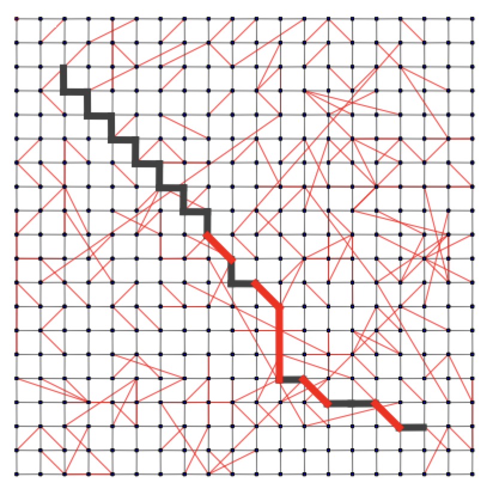

# Navigation and propagation

## Review: Milgram's experiment

### Small world phenomena

- Instructions: given an individual target (stockbroker in Boston), pass the message to a person you correspond with who is "closest" to the target
- Outcome: 64/300 postcards arrived to the target, with an average chain length between 5 and 6

### Repeated with email

- Increased the number of targets to 18 and extended to 13 different countries
- With over 60,000 participants and 24,163 message chains, 384 email reached their targets with an average path length of 4.0

### Results

1) There are short paths in large networks that connect individuals
2) People are able to find these short paths using a simple, greedy, decentralized algorithm

### Kleinberg's model

- Consider a directed 2-dimensional lattice

- For each vertex, and $q$ shortcuts
    - Choose a vertex $v$ as the destination of the shortcut with probability proportional to $d(u, v)^{r}$ (also known as the taxi-cab distance)
    - When $r = 0$, we have uniform probabilities

## Searching in a small world

### Greedy local search

- Given a source $s$ and a destination $t$, define a greedy local search algorithm that
    1) Knows the positions of the nodes on the grid
    2) Knows the neighbors and shortcuts of the current node
    3) Knows the neighbors and shortcuts of all nodes seen so far
    4) Operates greedily, each time moving as close to $t$ as possible
- Kleinberg proves the following
    - When $r = 2$, an algorithm that uses only local information at each node (not 2) can reach the destination in expected time $O(\log^{2} n)$
        - Only case when short paths exist *and* a greedy algorithm can find them
    - When $r < 2$, a local greedy algorithm (1-4) needs expected time $\Omega(n^{(2-r)/3})$
        - Graph has paths of logarithmic length, but a greedy algorithm cannot find them
    - When $r > 2$, a local greedy algorithm (1-4) needs expected time $\Omega(n^{(r-2)/(r-1)})$
        - Graph does not support short paths

### Network without locality

- When $r = 0$, links are randomly distributed
- Any decentralized algorithm is at least $O(n^{(2-r)/3})$
- Long terms contacts are not useable

### Overly localized network

- When $r > 2$, the expected search time is $O(N^{(r-2)/(r-1)})$
- Long term contacts aren't very long

### Geographically balanced locality

- Links are balanced between long and short range
- Expected greedy search time is $O(\log^{2} n)$

### Extension

- If there are $\log n$ shortcuts, then the search time is $O(\log n)$ and we save the time required for finding the shortcut
- If we know the shortcuts of $\log n$ neighbors, the search time becomes $O(\log^{1+1/d} n)$

## Diffusion and failures

- A fundamental process in networks: behaviors that cascade from node to node
    - News, opinions, rumors, fads, urban legends
    - Word-of-mouth effects of marketing
    - Virus, disease propagation
    - Change in social priorities
    - Saturation news coverage: topic diffusion among bloggers
    - Internet-energized political campaigns
    - Cascading failures in financial markets
    - Localized effects
- Fault propagation
    - Scale-free networks are far more resistant to random failures than ordinary random networks
    - But failure of *hubs* can be catastrophic, vulnerable or targets of deliberate attacks
    - May make scale-free networks *more* vulnerable to deliberate attacks

## Hubs and authorities

- People's decisions are affected by what others do and think
- Efficient strategy when insufficient knowledge or expertise
- This is fundamental for Google's [PageRank](https://en.wikipedia.org/wiki/PageRank) algorithm, which ranks influential webpages on the web