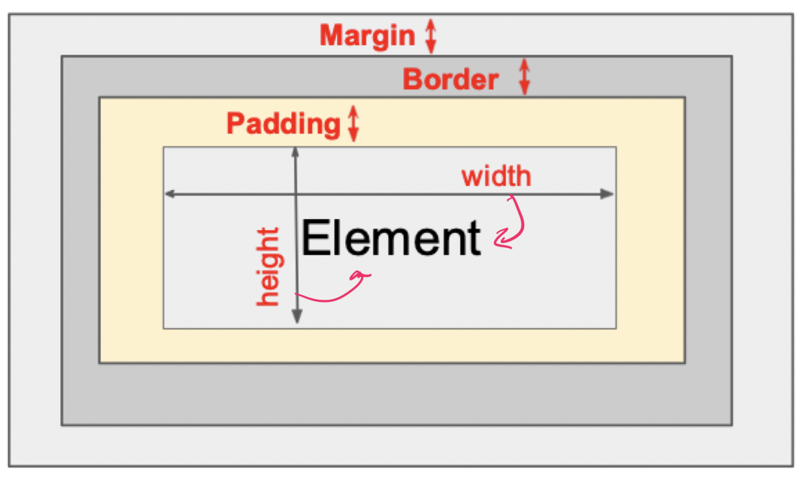

# CSS

## Why CSS?

### Driving problem

- What font type and size does `<h1>Introduction</h1>` generate?
    - Depends on the default font setting from the browser
    - Leads to inconsistent rendering when style is not explicit
- Early HTML utilizes attributes to override defaults
    - Can result is really long element tag specifications
    - Viewed as sloppy by many
- Style sheets were added to address this
    - Specify style to use rather than the browser default
    - Avoid having (potentially duplicate) style code on every element

### Separate style from content

- Original HTML used attributes and tags to control the style of text and objects
- HTML should be primarily concerned with *content* rather than presentation
- **Cascading style sheets** were added to allow for more abstraction
    - The *same style commands* can be used in different places in a document
    - The *same style commands* can be applied to different documents
    - It is essential to **keep visual and design coherency** in large websites

> DRY principle: *D*ont't *R*epeat *Y*ourself

### Style sheets

```CSS
/*Selector: what to apply styles to
  |
  V                              */
body { /* Declaration block */
    font-family: Tohoma, Arial, sans-serif;
    color: black;
    background: white;
    margin: 8px;
/*  property: value; */
}
```

## Employing CSS

### Inline

> The HTML **style attribute** can be inserted into various HTML elements

```HTML
<span style="color:red">
<a href="./index.html" style="text-decoration:none;color:blue;">
<span style="color:#800000;font-size:60%;font-style:italic">
<p style="text-align:justify;font-style:italic;font-family:comic sans ms;font-size:85%">
```

### Document level

- In the head

```HTML
<head>
    <title>...</title>
    <style>
        P{text-align:justify}
        P.menu{font-size:75%;color:"#555555";background-color:"#E4E4E4"}
        A.hover{background:white}
    </style>
</head>
```

- In the body

```HTML
<p class="menu">
    <a href="#CLASSES">Classes</a>
    <a href="#RSRCH">Research</a>
</p>
```

### External

- In a separate file: `mystyle.css`

```CSS
/* This is a comment */
P {
    text-align: justify;
}

LI {
    text-align: justify;
}

A:hover {
    background: white;
}

.ans {
    color: red;
}

DIV.sol {
    color: red;
    font-size: 80%;
}

SPAN.sol {
    color: red;
    font-size: 80%;
}

.noteI {
    color: red;
}

.noteII {
    color: red;
    font-style: italic;
}

.noteIII {
    color: red;
    font-weight: bold;
    font-style: italic;
}

.head {
    font-size: 150%;
    font-weight: bold;
}

TD.but {
    text-align: center;
    color: black;
    background: pink;
    font-size: 70%;
}

TD.topic {
    font-weight: bold;
}

.commands {
    font-family: helvetica;
    color: black;
    font-weight: bold;
    font-size: 90%;
}

.header {
    font-size: 115%;
    font-weight: bold;
    text-decoration: underline;
}

```

- In a document

```HTML
<head>
    <link rel="stylesheet" href="./mystyle.css" type="text/css" />
</head>
<body>
    <div class="head">
    <span class="noteI">
</body>
```

## Writing CSS

### Selectors

- **Element selector**: applies to *all* occurrences of all elements

```CSS
p { /* Apply to all <p> tags */
    ...
}
```

- **Class selector**: allows different classes of the same element to use different styles

```CSS
p.normal { /* Apply to all <p class="normal"> tags */
    ...
}

p.warning { /* Apply to all <p class="warning"> tags */
    ...
}
```

- **Generic selector**: a class of style that applies to content of more than one kind of element

```CSS
.sale { /* Apply to all tags with class="sale" */
    ...
}
```

- **ID selector**: allows the application of a style to one specific element

```CSS
#section14 { /* Apply to the tag with id="section14" */
    ...
}
```

- **Contextual selector**: style should apply only to elements in certain positions in the document

```CSS
ul ol { /* Apply to contents of order lists that are descendants of unordered lists */
    ...
}
```

- **Pseudo classes**: style should apply when something happens

```CSS
h2:hover { /* Apply anytime the cursor is positioned over the h2 element */
    ...
}
```

- **Universal selector**: applies to all elements in a document

```CSS
* { /* Apply to all elements */
    ...
}
```

### Style precedence

- Precedence order: specificity -> inline -> document level -> external
- The more specific a style property, the higher precedence it has
- An external style is valid until a document level or inline style overrides it
- A document style is valid until an inline style overrides it

### Properties

CSS can control the following properties

- Color
- Size
- Position
- Many more...

#### Color

- Must ultimately turn into red, green, and blue intensities between 0 and 255
- Predefined names are provided and ready to use
- Can declare your own colors with
    - 8-bit hexadecimal numbers for red, green, and blue (`#ff0000`)
    - 0-255 decimal intensities (`rgb(255, 255, 0)`)
    - Percentage intensities (`rgb(80%, 80%, 100%)`)

#### The box model



```
TotalElementWidth = ElementWidth + LeftPadding + RightPadding + LeftBorder + RightBorder + LeftMargin + RightMargin
```

#### Distance units

| Value | Interpretation | Type |
| ----- | -------------- | ---- |
| 2px | 2 pixels | Absolute |
| 1mm | 1 millimeter | Absolute |
| 2cm | 2 centimeters | Absolute |
| 0.2in | 0.2 inches | Absolute |
| 3pt | 3 printer point (1/72 inch) | Absolute |
| 2em | 2 times the *current element's* font size | Relative |
| 3rem | 3 times the *root element's* font size | Relative |

#### Position

- `position: static` - the default position in document flow
- `position: relative` - position *relative to default position* via directional properties
- `position: fixed` - position to a *fixed location on the screen* via directional properties
- `position: absolute` - position *relative to ancestor absolute* element via directional properties

#### Visibility

- `display: none` - Element is not displayed and takes no space in the layout
- `display: inline` - Element is treated as an inline element
- `display: block` - Element is treated as a block element
- `display: flex` - Element is treated as a flex container
- `display: grid` - Element is treated as a grid container
- `visibility: hidden` - Element is hidden but space still allocated
- `visibility: visible` - Element is normally displayed

#### Other common properties

- `background-image: path` - Set an image for an element's background
- `background-repeat: bool` - Set if a background image be displayed in a repeating pattern (versus only once)
- `cursor: ` - Sets the cursor when over an element