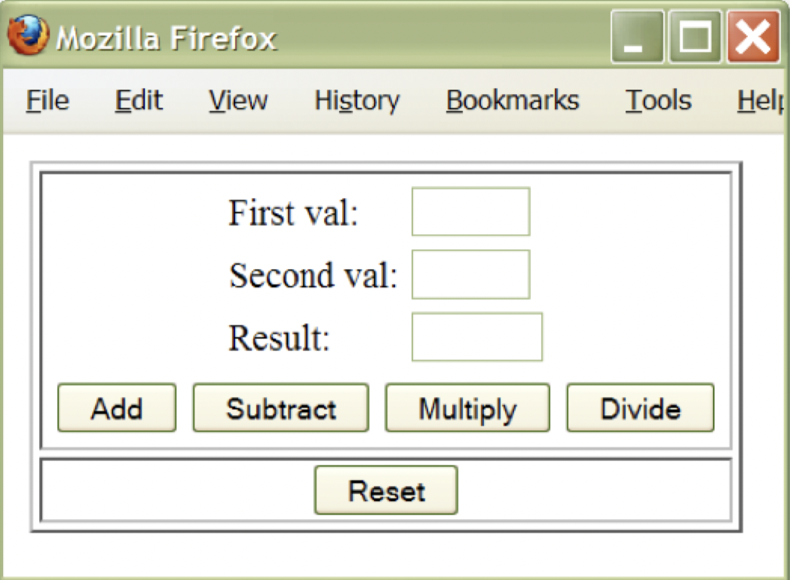
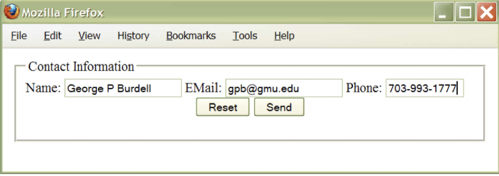

# HTML

## Learning HTML

### Why?

- May **What You See Is What You Get (WYSIWYG)** HTML editors are available
    - Really useful for static websites
    - Not so useful for more dynamic websites
- We can create reasonably good HTML without knowing the language, but
    - Need to know the language to write *excellent* HTML
    - Editors get in the way of small changes
    - Need to write programs that create HTML
- A **web software engineer** needs to know HTML, since HTML is the *output* of a dynamic website

### Basic definitions

- *Elements*: a piece of a document, such as a sentence, paragraph, list, table, heading
- *Tag*: a command to control the format

```HTML
<name>
    <!--NOT case sensitive-->
</name>
```

- *Attribute*: an option or parameter to a tag to modify the tag's behavior
- *Rendering*: a browser formats the text into a window according to the formatting rules

### Structure

```HTML
<html>
    <head>
        <title> My Little Web Page </title>
    </head>
    <body bgcolor="#FFFFFF">
        ...
    </body>
</html>
```

- Content in the `<head>` tag is not rendered by the browser
- The `bgcolor` attribute accepts a hex color code to set the background color on the site
- The contents in the `<body>` is rendered by the browser

## HTML tags

### Common tags

- Headers: `<h1>`,  `<h2>`, etc.
- Breaks: `<p>`, `<br>`, `<hr>`
- Fonts: `<b>`, `<em>`, `<strong>`, `<i>`, `<tt>`, `<u>`
- Lists: `<ul>`, `<ol>`, `<li>`
- Special characters: `&lt;`, `&gt;`, `&amp;`

### Links

- To link to other web sources
    - Use `<a href="..."></a>` where the `href` attribute is the resource
    - Accepts absolute and relative links
    - Setting `target=_blank` to open the resource in a new window or tab
    - Set `href=#NAME` to navigate to a tag within the current file
- Other tags that also accept resource links
    - `` to place an image in the webpage
    - `<script src="X.js"></script>` to add executable scripts to the webpage

### Tables

```HTML
<table>
    <tr><td></td><td></td></tr>
    <tr><td></td><td></td></tr>
</table>
```

- The snippet above create a 2x2 table
    - `<table>` declares a new table
    - `<tr>` declares a single row in the table
    - `<td>` states the data to place in a cell
- The following attributes can be used to set a table's properties
    - `border=2` to set the border thickness of the cell borders
    - `cellspacing=2` to adjust the whitespace between cells
    - `bgcolor="#FFFFFF"` to set the background color of the cells
    - `width=500` to set the width of the table
    - `align="center"` to center the contents of the table's cells

### Forms

```HTML
<html>
    <form method="POST" action="http://malek.ics.uci.edu:8080/malek/servlet/calculate">
        <table border=1> <!-- outer table -->
            <tr> <td>
                <table align="center">
                    <tr>
                        <td> First Val:
                        <td><input type="text" name="LHS" value="" size=5>
                    </tr>
                    <tr>
                        <td> Second Val:
                        <td><input type="text" name="RHS" value="" size=5>
                    </tr>
                    <tr>
                        <td> Result:
                        <td><input type="text" name="RSLT" value="" size=6>
                    </tr>
                </table>
                <table>
                    <tr>
                        <td><input type="submit" name="Operation" value="Add">
                        <td><input type="submit" name="Operation" value="Subtract">
                        <td><input type="submit" name="Operation" value="Multiply">
                        <td><input type="submit" name="Operation" value="Divide">
                    </tr>
                </table>
            <tr>
                <td align="center"><input type="reset" name="reset" value="Reset">
        </table>
    </form>
</html>
```

- Server software will receive `Operation=Add` as a parameter



#### Radio buttons

```HTML
<form>
    <input type="radio" name="Year" id="freshman" value="freshman"/>
    <label for="freshman">freshman</label>
    <br/>

    <input type="radio" name="Year" id="sophomore" value="sophomore"/>
    <label for="sophomore">sophomore</label>
    <br/>

    <input type="radio" name="Year" id="junior" value="junior"/>
    <label for="junior">junior</label>
    <br/>

    <input type="radio" name="Year" id="senior" value="senior"/>
    <label for="senior">senior</label>
    <br/>
</form>
```

- All `name` values must have the same value to ensure only one is selected
- `<label>` tags allow user to click on the text to select in addition to the radio button

#### Checkboxes

```HTML
<form>
    I have a bike:
    <input type="checkbox" name="vehicle" value="bike" /><br/>
    I have a car:
    <input type="checkbox" name="vehicle" value="car" /><br/>
    I have an airplane:
    <input type="checkbox" name="vehicle" value="airplane" /><br/>
</form>
```

- Allows selection of *any* number of the following

#### Dropdown

```HTML
<form>
    <select name="major">
        <option value="SWE" selected="selected">SWE</option>
        <option value="CS">CS</option>
        <option value="ISA">ISA</option>
        <option value="INFS">INFS</option>
    </select>
</form>
```

- Select one of the following
- The `selected` attribute indicate which option is currently selected

#### Text areas

```HTML
<p align="justify">
    Enter your message in the box below
</p>

<form>
    <textarea rows=10 cols=70> </textarea>
</form>
```

- A way to gather free responses form users

#### Buttons

```HTML
<form>
    <input type="button" value="Don't click me!">
</form>
```

- Clickable by the user
- Usually handled by a JavaScript event listener

#### Fieldset borders and mail to

```HTML
<fieldset>
    <legend> Contact Information </legend>
    <form action="mailto:offutt@gmu.edu" method="POST" enctype="text/plain">
        Name: <input type="text" name="theName">
        Email: <input type="text" name="Email">
        Phone: <input type="text" name="Phone" maxlength=12 size=12>
        <center>
            <input type="reset" value="Reset">
            <input type="submit" value="Send">
        </center>
    </form>
</fieldset>
```




## HTML evolution

- Influenced by browser implementation quirks
    - What to do about missing closing tags?
    - Complain about malformed HTML and refuse to display the page
    - Infer the missing closing tag, add it and move on
- Early browsers tried to do the right thing even in the face of incorrect HTML
    - Ignore unknown tags
    - Carry on even with obvious syntax errors
    - Infer the position of missing closing tags
    - Guess that some characters should be literal
- Since browsers did not apply the same heuristics to resolve these ambiguities, web page *rendered differently* on different browser

### XHTML

- XHTML is a more strict version of HTML
- Uses an XML parser to parse the HTML document rather than a HTML parser
- Not tolerant of badly formed documents'
    - Does not try to do the right thing
    - Raises an error and refuses to display the page
- Enables **standardized rendering** of pages

```XML
<?xml version="1.0" encoding="utf-8"?>
<!DOCTYPE html PUBLIC "-//W3C//DTD XHTML 1.0 Strict//EN" "http://www.w3.org/TR/xhtml1/DTD/xhtml1-strict.dtd">
<html xmlns="https://www.w3.org/1999/xhtml" xml:lang="en" lang="en">
    <head>
        <title>Hello World</title>
    </head>
    <body>
        <p>Hello World</p>
    </body>
</html>
```

### HTML5

- A newer HTML specification
    - Subsumes prior HTML 4 specification and XHTML 1
    - Aims to balance strictness of XHTML against the practical reality of the fact that there are many badly formed documents
    - Standardizes how badly formed code should be treated by the parser
- It also includes tags to allow
    - Content definition
    - Drawing
    - Timed media playback