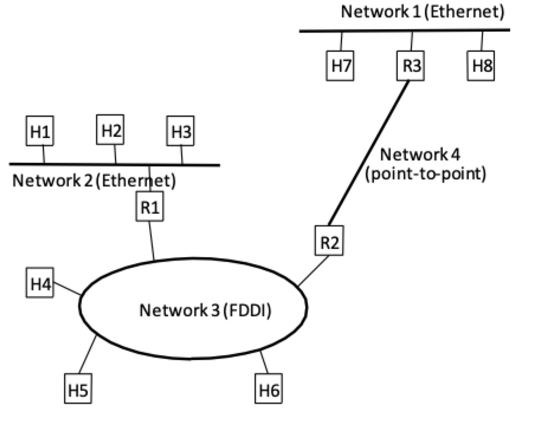
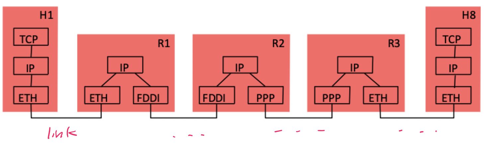
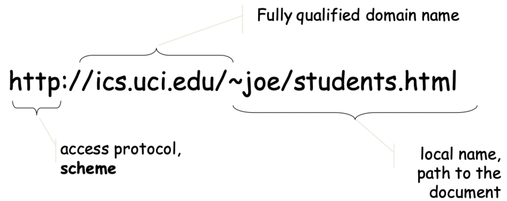
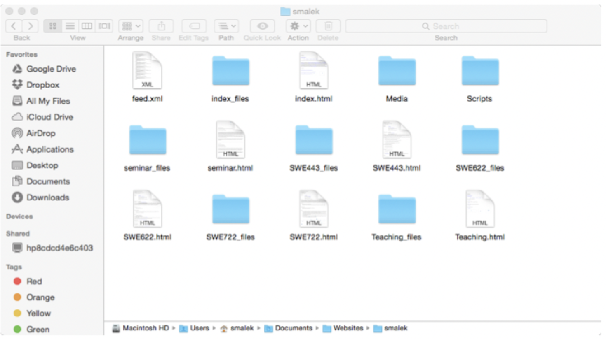
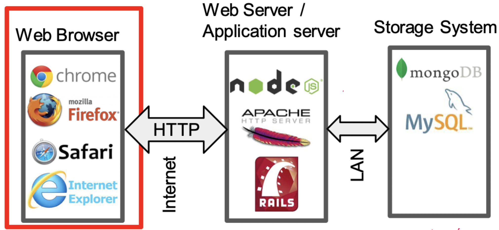

# Architecture of the web

## World wide web

### The internet

- The internet is a *network* of *computer networks*
    - Resilient and scalable
    - Not secure on its own

- Enabled by
    - A (standardized) protocol stack
    - IP address allows data to be routed to specific computers on a network

### Enablers

- Massive **collection of documents** and other web resources that are identified by unified resource locators (URLs), cross-referenced using hyperlink links, and accessible via **internet**
- Key enablers of web are
    - Hypertext Markup Language (HTML): a standardized markup language used to create web pages that appear on the WWW
    - Hypertext Transport Protocol (HTTP): an application protocol that runs on top of the TCP/IP for exchange of hypertext documents

### History

- **Tim Berners-Lee** led the invention of the WWW in 1989
- Born at CERN, a facility initially intended for physics research
- The [initial proposal](https://www.w3.org/History/1989/proposal.html) and the [first webpage](https://info.cern.ch/hypertext/WWW/TheProject.html)

### Navigation

- **URL (Uniform Resource Locator)**: referred to as a web address for humans
- A **Domain Name Service (DNS)** resolves a domain name to the IP address of the location where the document resides
    - Your web browser communicates with DNS to resolve a domain name
    - This is the weakest link in the internet

## Internet applications

### What is a website?

> A folder on a hard disk containing a group of HTML files and their related resources (e.g. images, scripts, server/client-side codes)

### What is a web server?

- A web server is used to refer to both
    - The computer that holds the website (hardware)
    - The software that lets the computer serve the site to another computer
- The great majority of web servers are running **Unix/Linux**
    - You should be comfortable with \*nix systems to work in this field
    - Some \*nix knowledge is required to complete class assignments
    - Some material will be provided later in the class to help you with basic commands
- Web server technologies
    - [Apache](https://httpd.apache.org): one of the oldest and most popular open-source web servers
    - [NodeJs](https://nodejs.org/en): more modern, minimalistic web server choice

### What is needed to make a website?

1) A domain name to register with DNS (at least if you want people to remember your site)
2) A web server to host your website (physical/VM + server software)
3) Environment to make and test the website locally on your computer
4) Tool to transfer (e.g. FTP) your website to the web server

### Architecture of a web application

