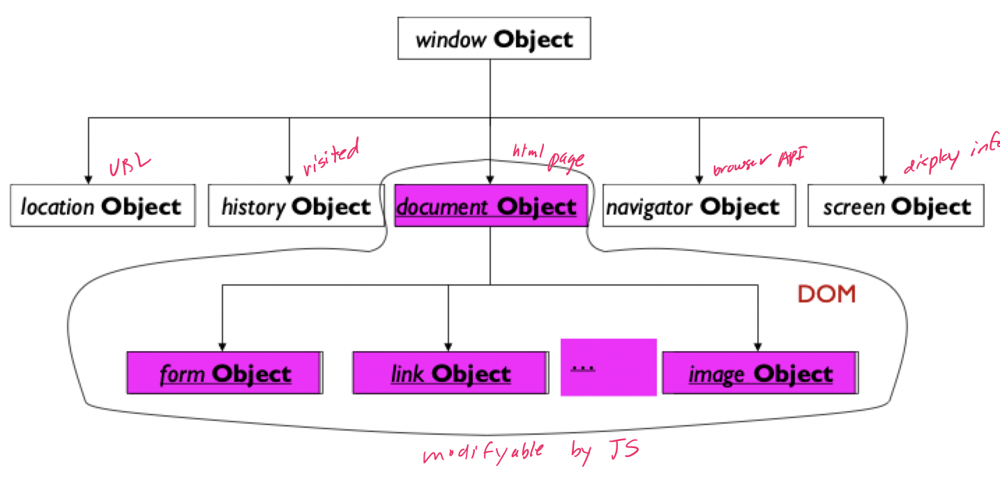

# Javascript

## Language summary

### Origins

- Introduced as a part of Netscape 2.0 browser
- Microsoft soon released its own version call **Jscript**
- ECMA developed a **standard** language known as **ECMAScript**
- **ECMAScript Edition 3** is the widely supported version and is what is commonly called "JavaScript"

> JavaScript **IS NOT** Java

### Strengths and weaknesses

| Advantages | Disadvantages |
| ---------- | ------------- |
| Fairly easy to get started with | Weak dynamic typing |
| Extensive support in terms of libraries and frameworks | Very large, continuously evolving, language |
| Portable as it is an interpreted language | Not as efficient or scalable as a compiled language |

### Developing with JS

- Surprisingly, *more programs* are written in JavaScript that any other language
    - Got a bad reputation for not following the best software engineering practices
    - Some good parts, and some not so good
- Writing JavaScript code
    - Use any text editor
    - Specialized software, such as an IDE
- Executing JavaScript code
    - Load into a browser (need an HTML document)
    - Browser detects **syntax** and **runtime** errors
    - JavaScript console in the browser shows errors

### Language characteristics

- What can be done with JavaScript on the client and **cannot** be done with other techniques on the server?
    - Monitor user events and take action
    - Create realtime dynamic effects
- What can be done on **both** client and server, but are (usually) better with JavaScript?
    - Build HTML dynamically when loaded
    - Interactive webpages
    - Communicate with the server asynchronously
- What are the **drawbacks** of JavaScript?
    - Can be turned off
    - Performance and security concerns
    - Hard to write reliable and maintainable JavaScript

### Running JS

- Between `<head>` and `</head>` or `<body>` and `</body>`

```HTML
<SCRIPT type="text/javascript">
    // JS code goes here
</SCRIPT>
<SCRIPT type="text/javascript" src="file.js"></SCRIPT>
```

- Embed calls into HTML tags

```HTML
<SELECT name=country onchange="jmp(url)">
<A href="javascript:new_window();">New Window</A>
```

## The syntax

### Syntax exploration

- Data types
    - Numeric, strings, arrays, boolean, and nulls
    - Good support for type casting between numbers and strings
- Variables
    - Begin with letter or an underscore
    - White space or punctuation is not allowed
    - Case sensitive
- Dynamic typing: types are determined at runtime
- Weak typing: types can be coerced

```JavaScript
var total = 25;
var deliver = "Your total is $" + total;
total = "is now a string"
```

- Most of the syntax is similar to C and Java
- JavaScript has 60 reserved words
- Can instantiate an object and add fields at anytime

```JavaScript
var tmp = new Object();
tmp.f1 = "yes";
tmp.f2 = 42;
```

- Objects can be created with a literal syntax

```JavaScript
var tmp2 = {
    f1: "yes",
    f2: 42
};
```

- Fields of an object can be traversed

```JavaScript
for (f in tmp2) {
    document.writeln(f + " is " + tmp2[f]);
}
```

- Another way of creating object is with functions
    - Can have properties
    - In a method, `this` will be bound to the properties of the object represented by the function
    - Outside a method, `this` will be the global object (`Window` in the case of a browser or `undefined` if `"use strict"` is specified )

```JavaScript
function Course(name, num, time, enroll) {
    this.name = name;
    this.num = num;
    this.time = time;
    this.enroll = enroll;
}

var INF124 = new Course("Internet Apps Engr", "INF124", "TuTh 17:00", 90);
```

- Object can be given methods through function pointers

```JavaScript
function Course(name, num, time, enroll) {
    this.name = name;
    this.num = num;
    this.time = time;
    this.enroll = enroll;
    this.CoursePrint = Print;
}

function Print() {
    document.writeln("<TABLE>\n" + "<TR><TH>Field<TH>Value\n");
    for (fname in this) {
        document.writeln("<TR><TD>" + fname + "<TD>" + this[fname]);    
    }
    document.writeln("</TABLE>");
}

var INF124 = new Course("Internet Apps Engr", "INF124", "TuTh 17:00", 90);
INF124.CoursePrint();
```

- Object can be specified as classes

```JavaScript
class Course {
    constructor (name, num, time, enroll) {
        this.name = name;
        this.num = num;
        this.time = time;
        this.enroll = enroll;
    }

    function Print() {
        document.writeln("<TABLE>\n" + "<TR><TH>Field<TH>Value\n");
        for (fname in this) {
            document.writeln("<TR><TD>" + fname + "<TD>" + this[fname]);    
        }
        document.writeln("</TABLE>");
    }
}

var INF124 = new Course("Internet Apps Engr", "INF124", "TuTh 17:00", 90);
INF124.Print();
```

- Object can take advantage of inheritance hierarchies

```JavaScript
class Animal {
    constructor (name) {
        this.name = name;
    }

    speak() {
        console.log(`${this.name} makes a noise.`);
    }
}

class Dog extends Animal {
    constructor (name) {
        super(name); // Call the super class constructor
    }
    speak() {
        console.log(`${this.name} barks.`)
    }
}

var d = new Dog('Mitzie');
d.speak(); // Mitzie barks
```

- Functions can be expressed in a typical C-like style

```JavaScript
function myFunction(a, b) {
    return a + b;
}
```

- Or using a **function expression**

```JavaScript
x = function(a, b) {return a + b};
```

- Or with its **arrow function** representation

```JavaScript
x = (a, b) => {return a + b};
```

- Similarly, classes can be declared as the are in Java

```JavaScript
class Rectangle {
    constructor(height, width) {
        this.height = height;
        this.width = width
    }
}
```

- Or assigned as an embedded class

```JavaScript
var Rectangle = class {
    constructor(height, width) {
        this.height = height;
        this.width = width
    }
}
```

- Arrays can be created to hold many objects, each object is accessible through its index

```JavaScript
var students = new Array(36);
students(0) = "AA";
for (var s=0; s<=students.length; s++) {
    document.writeln(students(s));
}
```

- String interpolation can be achieved with backticks and curly braces
    - The contents in `${}` will be evaluated
    - Escape characters are taken literally, so `\n` will generate multiline strings

```JavaScript
var str = `Hi ${name} your age is ${age}`;
```

- Data can be de-structured in multiple variables or new objects

```JavaScript
var arr = ['John', 'Smith'];
var [firstName, surname] = arr; // unpack contents of arr, order matters
var [surname, firstName] = arr; // swaps first name and surname

var options = {
    title: "Menu",
    width: 100,
    height: 200
};

var {title, width, height} = options; // unpack contents of options
var {height, width, title} = options; // same as above, but order does not matters
var {title: t, width: w, heigth: h} = options; // create aliases for fields of options
```

- The spread operator allows an iterable to be expanded

```JavaScript
var numberStore = [0, 1, 2];
var newNumber = 12;
numberStore = [...numberStore, newNumber];
```

- Default parameters for functions can be defined as follows

```JavaScript
// Old fashioned
function myFunc(a, b) {
    a = a || 1;
    b = b || "Hello";
}

// New method
function myFunc(a = 1, b = "Hello") {

}
```

- Export
    - Can be used to include JavaScript elements defined in another file
    - Either as a named or default element

```JavaScript
export var name = 'square';
export function draw(ctx, length, x, y, color) {
    ctx.fillStyle = color;
    ctx.fillRect(x, y, length, length);
    return {
        length: length,
        x: x,
        y: y,
        color: color
    }
}
export default draw; // Only one is allowed
```

- Import
    - Elements can be used in another file

```JavaScript
import {name, draw} from './modules/square.js'; // named
import mydraw from './modules/square.js'; // default
```

### Variable scoping

- There are two scopes
    - Global: variable is declared outside a function; available for use in the whole window
    - Function: declared within a function; only available within a function

```JavaScript
var tester = "hey hi";
function newFunction() {
    var hello = "hello";
}
console.log(hello); // error: hello is not defined
```

- Problem with `var`: variables declared with `var` can be redeclared and updated

```JavaScript
var greeter = "hey hi";
var times = 4;

if (times > 3) {
    var greeter = "say hello instead";
}

console.log(greeter); // say hello instead
```

- The `let` keyword block scopes variables
    - Anything within curly braces is a block
    - Variables declared with `let` can be updated, but not redeclared

```JavaScript
let greeter = "hey hi";
let times = 4;

if (times > 3) {
    let hello = "say hello instead";
    console.log(hello); // say hello instead
}

console.log(hello); // hello is not defined
```

- The `const` keyword also block scopes variables
    - Variables declared with `const` cannot be updated or redeclared
    - `const` variables must be initialized at the time of declaration
    - Updating refers to the top-level assignment, so changing fields of an object is still allowed

### Variable hoisting

- **Hoisting** is a JavaScript mechanism where variable and function declarations are moved to the top of their scope before code execution
- The following two functions have the same exact behavior

```JavaScript
function foo() {
    var x;
    x = 2;
}

function foo2() {
    x = 2;
    var x; // hoisted before update
}
```

- This can get confusing, so a good practice is to declare all variable at the top of the scope

## Browser object model

- The **Browser object model (BOM)** is a collection of objects that the browser makes available for use with JavaScript



- `window` is a global object
- Addressing is done by separating objects, methods, and properties with dots

```JavaScript
window.alert("Hello");
alert("Hello");

document.forms[0].elements[0].value;
document.forms["nameinput"].value;
```

## JavaScript objects

- JavaScript supports multiple programming paradigms
    - Object oriented
    - Imperative
    - Functional
- JS objects have collections of properties
- A property is something that can be modified
    - Data properties: primitive values or references to objects
    - Method properties: can be executed
- The math object contains several helpful mathematical functions
- The number object contains several significant constants and type coercion methods
- The String object contains several useful string methods

## Javascript's purpose

### Build HTML dynamically

- JavaScript will execute when the page is loaded, and output appears in the document

```HTML
<script type="text/javascript">
    document.write("JavaScript output\n");
</script>
```

- Different browsers support different versions of JavaScript

### Monitor user events and take action

```HTML
<HEAD>
    <SCRIPT>
        function dont_click() {
            alert("I told you not to click!");
        }
    </SCRIPT>
</HEAD>

<FORM>
    <INPUT type="button" value="don't click" onclick="dont_click()">
</FORM>
```

- Event handlers are attributes of HTML elements
- Values can be obtains from within the page
- Values can be modified by event handlers
- HTML elements can be added or removed from the page

### Customizing webpages

- Compatibility is a major problem with web browsers
- Professional websites go through a lot of trouble to check and adjust the web page

### Make webpages dynamic

- Can modify the document when an event occurrs

```HTML 
<head>   
    <script>
        function changeImage(){
            var image = document.getE1ementById('myImage');   
                if (image.src.match("bulbon")) {
                    Image. src = "pic bulboff.gif";   
                } else {
                    Image. src =  "pic bulbon.gif";
                }
    </script>   
    <body>   
           
    </body>
</html>   
```

### Validating forms

- Make sure each data value is *valid*
    - The value conforms to constraints
    - Not necessarily correct
- Validate each input field
- Submitting form data
    - `<FORM onsubmit="return submitIt(this)" method="POST" action="...">
    - If `submitIt` returns false, data will not be passed to the server
    - `this` refers to the current form