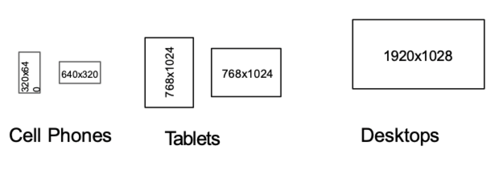
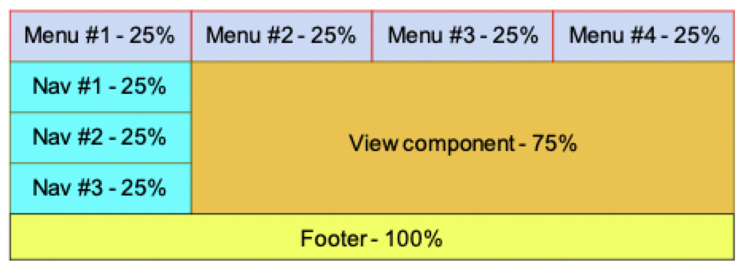
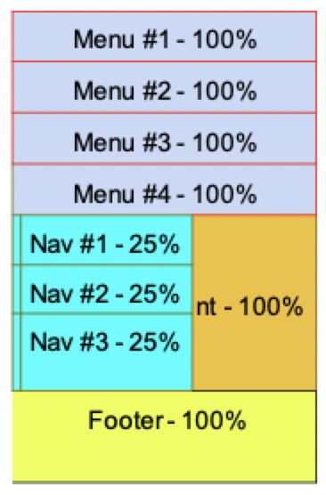
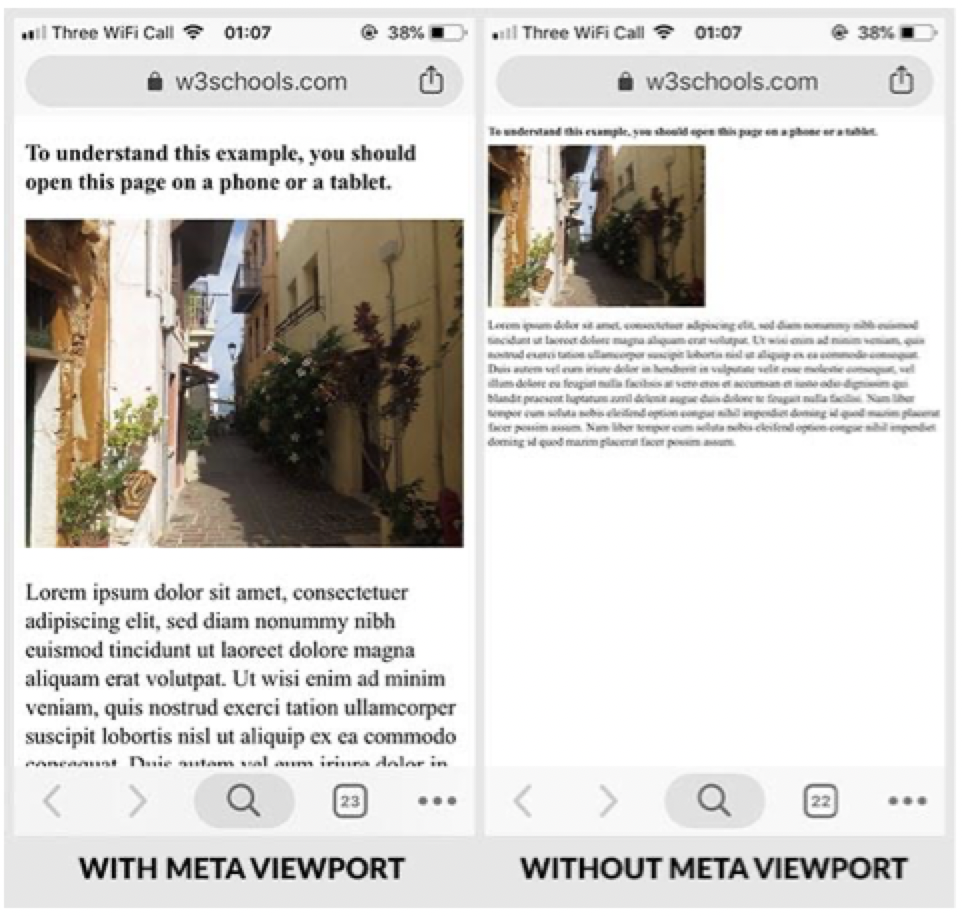

# Responsive web design

## Challenge: screen real estate

### Screen sizes

- Screen sizes and resolutions vary from device to device



- It may seem that different versions are needed for the same web application, but such an approach would be intensively laborious.

### Responsive content



- Instead, web content should be treated like water
- The web app should flow into and fill the device screen
- The web app should remain user friendly



## Responsive design techniques

### Set the viewport

- The viewport is the user's visible area of a web page
- HTML5 introduced the viewport element in the `<meta>` tag for instructing the browser on how to control the page's dimension and scaling

```HTML
<meta name="viewport" content="width=device-width, initial-scale=1.0">
```

- The `width=` assignment sets the width of the page to follow the screen width of the device
- The `initial-scale=` assignment sets the initial zoom level when the page is first loaded by the browser



### Grid view

- A responsive grid-view website is structured in terms of columns that shrink and expand based on the screen size
- Specify relative rather than absolute units
- Follow this three step process
    1) Determine the number of columns -> say 12
    2) Calculate the ratio of each column -> 100% / 12 columns = 8.33% per column
    3) Make a style class defining how many columns a section spans

```CSS
.col-1 {width: 8.33%}
.col-2 {width: 16.66%}
.col-3 {width: 25%}
.col-4 {width: 33.33%}
.col-5 {width: 41.66%}
.col-6 {width: 50%}
.col-7 {width: 58.33%}
.col-8 {width: 66.66%}
.col-9 {width: 75%}
.col-10 {width: 83.33%}
.col-11 {width: 91.66%}
.col-12 {width: 100%}
```

### Grid layout

- Grid layout module offers a grid-based system for all HTML elements
- A grid layout consists of a parent element with one or more child elements
- To make an HTML element behave as a grid container, set `display: grid`
- The `grid-template-columns` property allows you to define the number of columns in the grid layout

```CSS
.my-grid-container {
    display: grid;
    grid-template-columns: auto auto auto auto; /* Adjusted by the browser */
}
```

### Media queries

- Media query `@media` is used to include a block of CSS properties only if a certain condition is true
- Can be used to apply certain CSS blocks for specific screen sizes

```CSS
@media only screen and (max-width: 600px) { /*width <= 6000*/
    body {
        background-color: lightblue;
    }
}
```

- If the browser if `600px` or smaller, the background color should be light blue

#### Mobile first 

- Design for mobile before designing for desktop or any other device
- Makes the page display faster on smaller devices

```CSS
/* For mobile phones */
[class*="col-"] {
    width: 100%
}

@media only screen and (min-width: 768px) {
    /* For desktop */
    .col-1 {width: 8.33%}
    .col-2 {width: 16.66%}
    .col-3 {width: 25%}
    .col-4 {width: 33.33%}
    .col-5 {width: 41.66%}
    .col-6 {width: 50%}
    .col-7 {width: 58.33%}
    .col-8 {width: 66.66%}
    .col-9 {width: 75%}
    .col-10 {width: 83.33%}
    .col-11 {width: 91.66%}
    .col-12 {width: 100%}
}
```

#### Typical device breakpoints

```CSS
/* Extra small devices (phones, 600px and down) */
@media only screen and (max-width: 600px) {...}

/* Small devices (portrait tablets and large phones, 600px and up */
@media only screen and (min-width: 600px) {...}

/* Medium devices (landscape tablets, 768px and up */
@media only screen and (min-width: 768px) {...}

/* Large devices (laptops/desktops, 992px and up */
@media only screen and (min-width: 992px) {...}

/* Extra large devices (large laptops and desktops, 1200px and up */
@media only screen and (min-width: 1200px) {...}
```

### Relative sized images and videos

- Set the width *or* height property to a relative value and the other to `auto`
- This lets the browser decide the corresponding dimension to prevent distortion

```CSS
img {
    width: 100%;
    height: auto;
}
```

- Use the `max-width` property to allow the image to scale down, but never scale up beyond its original size

```CSS
img {
    max-width: 100%;
    height: auto;
}
```