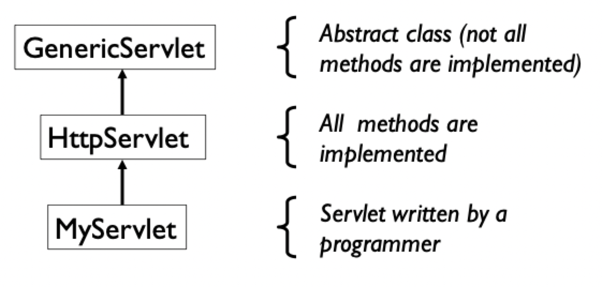
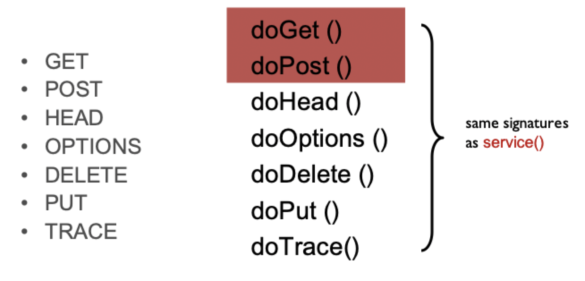
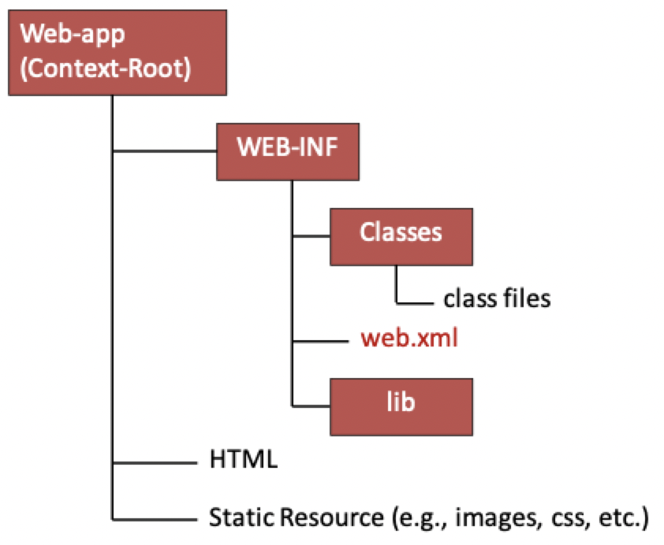
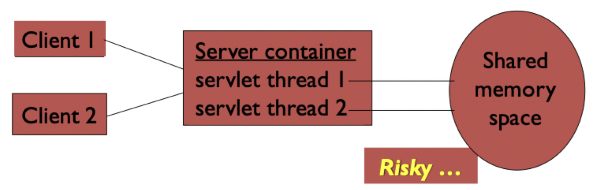
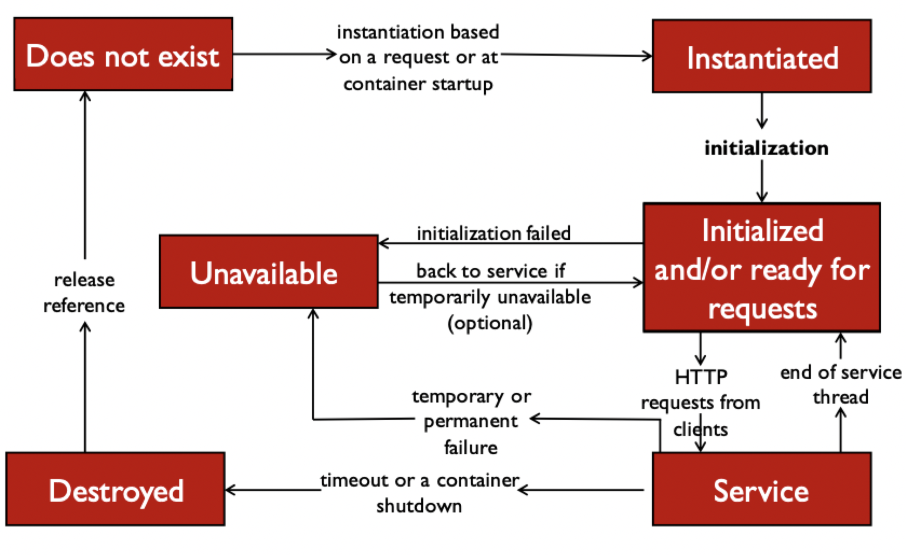

# Java servlets

## What are servlets?

Servlets are small Java classes that

1) Process an HTTP request
2) Return an HTTP response

The servlet container engine

- Connects to network
- Catches requests
- Produces responses
- Creates object instances of servlet classes
- Hands requests to the appropriate object

> Programmers use the **servlet API** to write servlet classes

### Servlets vs Java applications

- Servlets do not have a `main()` method
    - The `main()` method is in the server software
    - Entry point to a servlet is a call to a `do*()` method, where `*` is an HTTP verb
- Servlet interactions with the end user is *indirect* via request/response object APIs
- Servlet output is usually HTML

### Servlet container

- A servlet container is a **plugin** for handling Java servlets
- A servlet container has **5** jobs
    1) Create servlet instances
    2) Call the `init()` method
    3) Call the `service()` method when a request is made
        - `service()` calls the appropriate `do*()` method written by the programmer to handle the request
    4) Call the `destroy()` method before killing the servlet
    5) Destroy servlet instances
- When a request comes to a servlet, the servlet container does one of two things
    1) *If* there is an **active object** for the servlet, a Java thread is created to handle the request
    2) *If* there is no **active object** for the servlet, a new instance of the servlet is created and the object handles the request
- A servlet instance runs until the container decides to destroy it
    - Not specified in the the servlet configuration
    - Usually destroyed $N$ (set by a system administrator) minutes after the last request
    - Container can be configured to *never destroy* servlet objects (AKA production mode)

## Servlet API



| Method | Purpose |
|:------:| ------- |
| `init()` | Called when servlet starts |
| `service()` | Called to process requests |
| `destroy()` | Called before a servlet process ends |
| `getServletConfig()` | Access information about the servlet container |
| `getServletInfo()` | Access information about the servlet |

- These methods are defined by the library class `GenericServlet` and `HttpServlet`
- We write servlets by **extending** (inheriting from) them

### `init()`

- Read configuration data
- Read initialization parameters
- Initialize services
    - Database driver
    - Connection pool
    - Logging service
- Seldom used in *simple* applications

### `service()`

```Java
class HttpServlet {
    ...
    void service(HttpServletRequest req, HttpServletResponse res) throws ServletException, IOException {
        ...
    }
    ...
}
```

- The **entry point** for the servlet -- this is the method called from the servlet container
- Called *after* `init()` completes
- Primary purpose is to **decide** what type of request is coming in and *call* the appropriate `do*()` method



- `HttpServlet` implements these methods as stubs that print error messages
- Programmers implement services by **overriding** these methods

```Java
class HttpServlet {
    ...
    void doGet(HttpServletRequest req, HttpServletResponse res) throws ServletException, IOException {
        out.println("Error HTTP 405, doGet() not implemented")
    }
    ...
}
```

### `destroy()`

- Called by the servlet container before the servlet instance is killed
- The threads from the `service()` method are given time to terminate before `destroy()` is called
- Can be used to *clean up the state* of the servlet
    - Unregister a database driver
    - Closing a connection pool
    - Informing other applications the servlet is stopping
    - Saving the state of the servlet

### `getServletConfig()`

- Returns a `ServletConfig` object, which stores information about the servlet's configuration
- The `ServletConfig` was passed into `init()` by the servlet container

### `getServletInfo()`

- Returns a `String` object that stores information about the servlet
    - Author
    - Creation date
    - Description
    - Usage
- This string should be formatted for **human readability**

## Servlet development

### Directory structure

> The directory structure defines where to put the different types of files so that a web container knows where to find the information and respond to the client



### Deployment descriptor

- The **deployment descriptor** is an XML file, from which a web container gets the information about the servlet to be invoked
- Information captured in this file

```XML
<servlet>
    <servlet-name>helloServlet</servlet-name>
    <servlet-class>com.example.HelloServlet</servlet-class>
</servlet>
<servlet-mapping>
    <servlet-name>helloServlet</servlet-name>
    <url-pattern>/hello</url-pattern>
</servlet-mapping>
```

- Alternatively, annotations can be used to specify the information captured in the deployment descriptor

```Java
@WebServlet("/hello")
public class HelloServlet extends HttpServlet {
    ...
}
```

### Deployment testing

- Development and deployment computers often differ
- Web applications must be tested on final deployment platform
- Issues to check for
    - Different platforms
    - Incomplete deployment
    - Compiler and runtime versions
    - Permissions (databases and filesystem)

## Servlet parameters

### Requests

> **Request parameters** are conveniently stored in objects

- `String req.getParameter(String key)`
    - Returns the `value` of the form field with name `key`
    - Names are defined in HTML, values are supplied by the user
- `String[] req.getParameterValues(String key)`
    - Returns **all** values of `key`
    - Useful for form field like checkboxes
- `Enumeration req.getParameterNames()`
    - Returns an `Enumeration` object which lists all of the parameter names
- `String req.getQueryString()`
    - Returns the *entire* query string

### Transmission

- Parameter data is the web analog of *arguments* in a method call

```
http://www.example.com/servlet/PrintThis?arg=aString
```

- `PrintThis` is the servlet to be executed
- `arg=aString` is an argument passed with the request object to the servlet
- Multiple parameters are separated by `&`
- Order of parameters does not matter (they are all keyword)
- All parameter values are string (so type coercion may be needed for certain operations)

### Creation

- HTML forms generate query strings when submitted
- Parameter names are specified as the value of the *name* attribute in the form controls
- Parameter values depend on control type

| Control | Value |
|:-------:| ----- |
| `input`/`textinput`/`password`/`textarea` | Text the user has entered into the control field when the form is submitted |
| `input`/`checkbox`/`radio`/`image` | String assigned to the value attribute in the HTML tag. Control must be selected or clicked for parameter to be sent |
| `input`/`hidden` | String assigned to the value attribute. Not rendered by the client
| `select` | String assigned to the value attribute of the selected option, or content of any selected option for which the value is not defined

### Retransmission

- Most browsers give **a warning** before resubmitting `POST` data
- Users should be very careful before overriding this hesitation
- However, not many users understand the message


### Responses

- Standard output is sent directly back to the client browser
- `res.setContentType(String type)` sets the `Content-Type` in the response headers
- Can use `res.getWriter()` and its `print` and `println` methods to generate the response

## Servlet performance

- Some servlets run **a lot**
- Servlets run as *lightweight threads*, so are quite fast
- The **network speed** usually dominates, but several things can improve speed
    - Avoid string concatenation
    - The `flush()` method can send the current output to the client while processing continues
    - Concurrent processing

### Concurrency

- Servlets can receive multiple requests at the same time
- More than one execution thread may be running at the same time using the same memory



- By default, there is only **one instance** of a servlet class per servlet definition in the servlet container
- If the application is *distributable*, there is one instance of a servlet class per virtual machine
    - Sometimes each VM is on a different physical computer
    - Sometimes multiple VMs exist on the same physical computer

### Allowing concurrency

- Container may send multiple service requests to a single instance using Java threads
- Thus, your service methods should be **thread-safe**

> Loosely speaking, "thread-safe" means that if two or more requests are operating at the same time, they will *not* interfere with each other

### Concurrency bug

```Java
public class SimpleServlet extends HttpServlet {
    private int counter = 0; // A variable that is not thread-safe
    public void doGet(HttpServletRequest req, HttpServletResponse res) {
        res.getWriter().println("<HTML><BODY>");
        res.getWriter().println(this + ": <BR>");
        for (int c = 0; c < 10; c++) {
            res.getWriter().println("Counter = " + counter + "<BR>");
            try {
                Thread.sleep(Math.round(Math.random() * 1000));
                counter++;
            }
            catch (InterruptedException exc) {
                
            }
        }
        res.getWriter().println("</BODY></HTML>");
    }
}
```

### Mitigating concurrency bugs

- Give each thread its own local variables

```Java
public class SimpleServlet extends HttpServlet {
    public void doGet(HttpServletRequest req, HttpServletResponse res) {
        int counter = 0; // A variable that is thread-safe
        res.getWriter().println("<HTML><BODY>");
        res.getWriter().println(this + ": <BR>");
        for (int c = 0; c < 10; c++) {
            res.getWriter().println("Counter = " + counter + "<BR>");
            try {
                Thread.sleep(Math.round(Math.random() * 1000));
                counter++;
            }
            catch (InterruptedException exc) {
                
            }
        }
        res.getWriter().println("</BODY></HTML>");
    }
}
```

- Synchronize access to shared variables

```Java
public class SimpleServlet extends HttpServlet {
    private int counter = 0; // A variable that is not thread-safe
    public void doGet(HttpServletRequest req, HttpServletResponse res) {
        res.getWriter().println("<HTML><BODY>");
        res.getWriter().println(this + ": <BR>");
        increment(res)
        res.getWriter().println("</BODY></HTML>");
    }
    private synchronized void increment(HttpServletResponse res) {
        for (int c = 0; c < 10; c++) {
            res.getWriter().println("Counter = " + counter + "<BR>");
            try {
                Thread.sleep(Math.round(Math.random() * 1000));
                counter++;
            }
            catch (InterruptedException exc) {
                
            }
        }
    }
}
```

## Processing requests



## `GET` and `POST` requests

- An HTTP request is generated when the URL is entered directly
- An HTML form can generate either a `GET` or a `POST` request
- `GET` requests put data on the URL as parameters
- `POST` requests put data in the body of the request

| Comparison dimension | `GET` | `POST` |
|:--------------------:|:---:|:----:|
| Back/Reload button | Harmless | Data will be resubmitted (user should be alerted) |
| Bookmark | Can be bookmarked | *Cannot* be bookmarked |
| Cache | Can be cached | Not cached |
| History | Parameters remain in browser history | Parameters not saved in browser history |
| Data length | Limited by length of ULR (2048 characters) | No restrictions (may be restricted by web server software) |
| Data type | Only ASCII characters allowed | No restrictions; binary data is also allowed |
| Security | Less secure because data is sent as part of the URL | More secure as parameters are not stored in browser history or server logs |
| Visibility | Data visible to everyone in the URL | Data is not displayed in the URL |

> If a servlet supports both `GET` and `POST`, *good engineering* says to implement a new method invoked from both, rather than *cloning* the same code

```Java
protected void doGet(HTTPServletRequest req, HTTPServletResponse res) {
    processRequest(req, res);
}

protected void doPost(HTTPServletRequest req, HTTPServletResponse res) {
    processRequest(req, res);
}

protected void processRequest(HTTPServletRequest req, HTTPServletResponse res) {
    // Put process handling logic here
}
```

### Writing to files

- A common task is to save data to a file
- File must be in a **publicly writable** directory
- Open a file, write to it, and close it
    - `FileWriter outfile = new FileWriter("info-file.txt")`
    - `outfile.write(...)`
    - `outfile.close()`
- Open a file in append mode
    - `FileWriter outfile = new FileWriter("info-file.txt", true)`