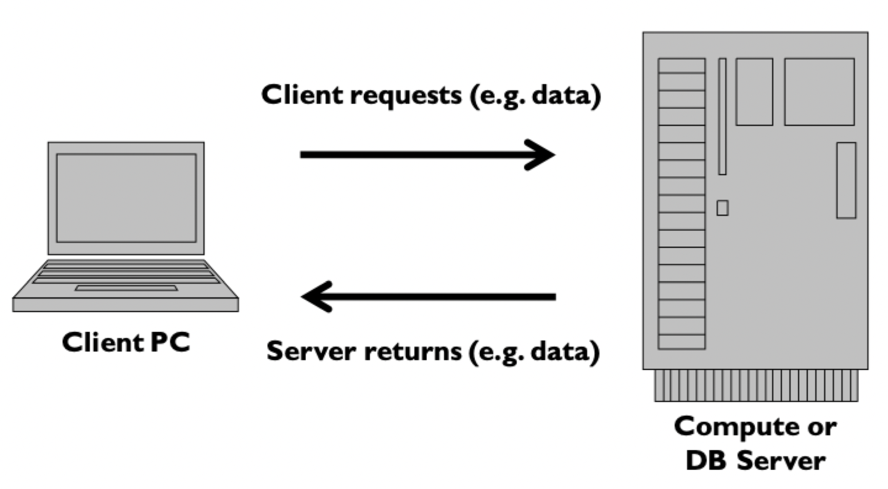
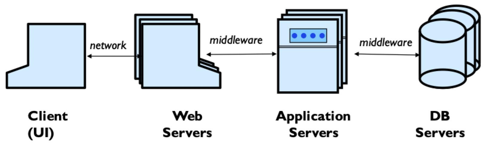
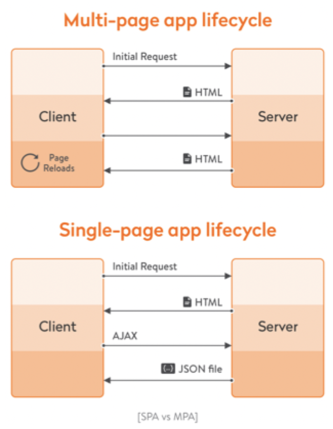
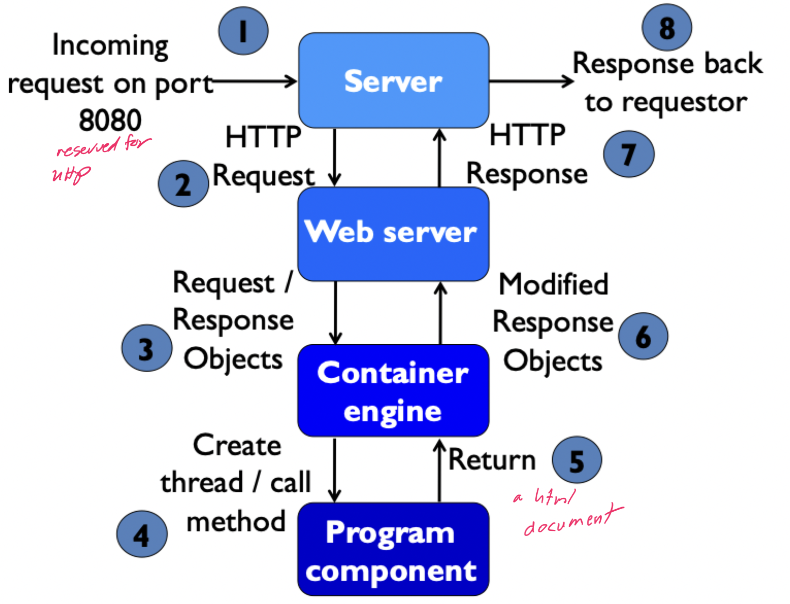
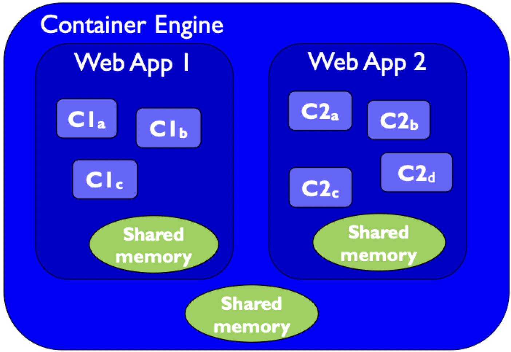

# Web application software model

## Web applications

- A web application is a program deployed on the web
- A web application use enabling technologies to
    1) Make web site contents dynamic
    2) Allow user of the system to implement business logic on the server
- Web applications let users affect state on the server

### Personal computing

- A user works with software on their computer
- Software assets are locally installed on the machine in a non-distributed fashion

### Server computing

- A user works with software of data on a separate computer called a server
- Client browser connects via the internet and software assets may be distributed

### Web architecture

- Many users work with servers and databases that can be reached through the internet with the hypertext transfer protocol
- Large applications run on many computers that have to coordinate with each other

### Multi-page vs single-page

- Multi-page application (MPA)
    - `index.html` links to `ticket.html` or some other HTML file
    - Requires a full or partial reload for each page change
- Single page application (SPA)
    - `index.html` links to `index.html/#ticket` or some other part of the *same* HTML file
    - Same page is always maintained
    - Content is loaded through AJAX requests and JSON data
    - Relies heavily on JavaScript

## Web actions

### Server-side processing

- Client
    - Implements a UI that is rendered by a web browser
    - Sends HTTP requests with data to a web server
- Server
    - Server computer runs a web server that listens for requests
    - Server computer runs a container engine that runs program components of a web application
    - Web server forwards request to appropriate container to process requests, then forwards the response from the container to the client

### Types of HTTP requests

| HTTP method | Purpose |
|:-----------:| ------- |
| `GET` | Retrieves data from a server |
| `POST` | Sends data to a server |
| `HEAD` | Requests header information, but no content |
| `OPTIONS` | Describe communication options |
| `PUT` | Replace a target resource |
| `DELETE` | Remove a target resource |
| `CONNECT` | Create a tunnel to a server |
| `TRACE` | Report the path taken between the client and server |

## Web container engine

> Web applications are constructed from diverse, distributed, and dynamically generated web components

### Web app actions

- Retrieve data from data client requests
    - Data comes in as a sequence of `name: value` pairs
    - Name is from HTML form elements
    - Value is always a string
- Implement logic based on the form data
- Persist data to storage (databases, files, messages, XML, etc.)
- Prepare a response
- Send a response to a client

> This is a **synchronous** process. Asynchronous request can be done as well

- Web applications can **forward** requests to other components and other web applications
- Web applications can **redirect** requests to other web applications
- Web applications manage concurrency among multiple users
- Web applications can send email notifications
- Get informations about the client, requests, etc.

### Session management

- HTTP client-server communication is *connectionless*
    - As soon as the request is fulfilled, the connection is *terminated*
    - Communication is *simple* and *resistant* to network problems
- Servers need to keep track of **state** of different clients
    - Session: a single coherent use of the system by the same user
    - Cookies: a string of characters that a web server places on a browser's client to keep track of a session
        - Usually used as an index into a table on the server
        - Most entries expire after a certain period of time

## Enabling technologies

> An enabling technology makes web pages interactive and response to user input

### CGI

- **C**ommon **G**ateway **I**nterface allows clients to execute applications on the server
- CGI applications typically reside in a special "safe" directory and can be written in any language
- CGI applications typically
    1) Process data
    2) Modify server state
    3) Return information (usually an HTML page)
- Problems
    - Each and every execution requires a **new process** on the web server
    - CGI poses significant security risks
    - CGI does not provide session management services

### Web server plugins

- A plugin is an extension to a web server that allows different program to handle certain types of requests
    - Compiled module applications: conventional languages are used to generate HTML/JS
    - Scripted page applications: HTML and logic are mixed together
- Plugins typically keep an **active process** as long as the web server is active