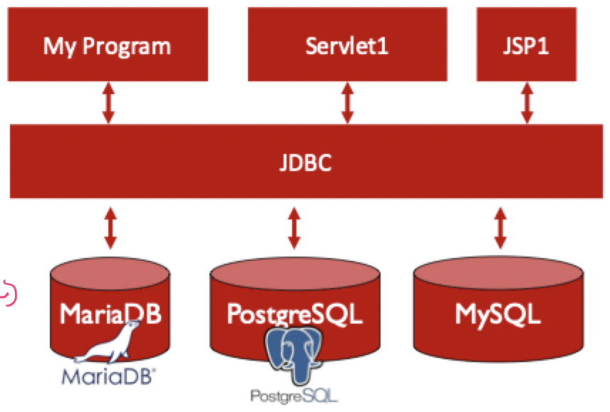
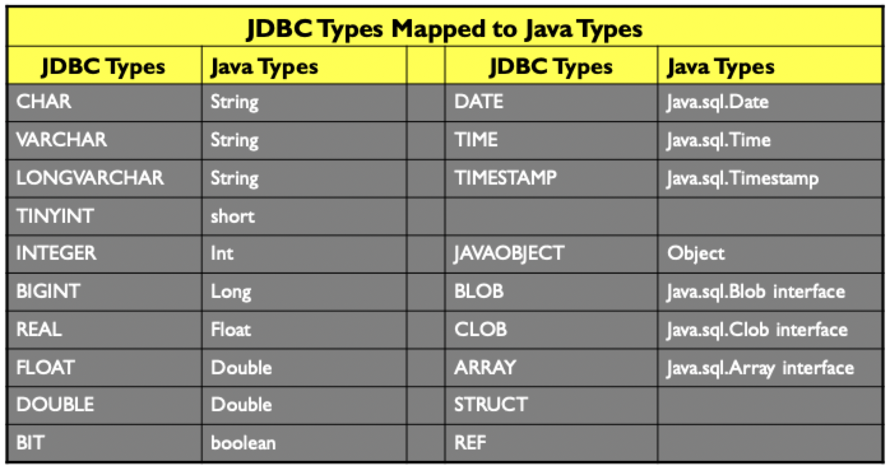

# JDBC

## What is it?

- JDBC is a library specification that allows Java programs to connect to relational databases
- This lecture only covers application use of a database server, look to [CS 122A](../../../fall-2021/cs-122a/syllabus.md) for an in-depth view on database servers

### Interesting point

- Most people believe that JDBC stands for *J*ava *D*ata *B*ase *C*onnectivity
- This is not quite the case, and according to Oracle

> JDBC is a Java API for executing SQL statement. (As a point of interest, **JDBC is a trademark name and is not an acronym**; nevertheless, JDBC is often thought of standing for `Java Database Connectivity`)

### API

- Database access is the same for all database vendors
- The JVM uses a JDBC driver to translate generalized JDBC calls into vendor-specific database calls
- The driver makes database usage efficient and simple to use and handles the network connection to the server



## Programming procedure

### Database driver manager

- The `java.sql.DriverManager` class in JDBC provides a common access layer on top of different database drivers
- `DriverManager` requires that each driver used by the application must be registered before use
- Drivers are not provided by JDBC -- they must be installed separately and be discoverable in the `classpath`
- The driver can then be loaded using `ClassLoader`
    - This utilizes Java reflection to discover the driver in the `classpath`
    - `Class.forName("oracle.jdbc.driver.OracleDriver");`

### Connecting to a database

Database connections are represented by the `Connection` class

```Java
Class.forName("org.gjt.mm.mysql.Driver");
Connection conn = DriverManager.getConnection(
    "jdbc:mysql://127.0.0.1/dbname",
    userid,
    passwd
);
```

### Creating and executing SQL statements

#### The `Statement` object

- SQL statements are represented by `Statement` objects
- These objects have methods that accept complete SQL strings as input to execute on the database server
- Statements must be released with the `close()` method to prevent resource leaked

```Java
Statement statement = conn.createStatement();
```

#### The `executeUpdate` method

- Use `executeUpdate` to modify the database schema or the data stored in a database
    - `CREATE` a table
    - `ALTER` a table
    - `DROP` a table
    - `UPDATE` a table
- `executeUpdate` is used more often to **update** tables
- Tables are typically created once, but can be updated many times

```Java
Statement stmt = conn.createStatement();

stmt.executeUpdate("INSERT INTO COFFEES" + "VALUES ('Columbian', 101, 7.99, 0, 0)");
stmt.executeUpdate("INSERT INTO COFFEES" + "VALUES ('French_Roast', 49, 8.99, 0, 0)");
stmt.executeUpdate("INSERT INTO COFFEES" + "VALUES ('Expresso', 150, 9.99, 0, 0)");
stmt.close();
```

#### The `executeQuery` method

- `executeQuery` is used to execute SQL statements to obtain data from the database
- These are typically `SELECT` statements that extract data from a server

```Java
Statement stmt = conn.createStatement();
ResultSet rs = stmt.executeQuery("SELECT COF_NAME, PRICE FROM COFFESS");
```

### Navigating result sets

#### Data type mapping



#### Accessing results

- By default, a `ResultSet` is read-only and has a cursor that moves forward only with the `next()` method
- Scrollable result sets have more flexible methods and can be requested when initializing a connection
- `ResultSet` objects have various `get*()` methods to read 
    - Accept a single argument which is a column name or an index
    - These methods return the value from the table row the cursor is pointing to

```Java
Statement stmt = conn.createStatement();
ResultSet rs = stmt.executeQuery("SELECT COF_NAME, PRICE FROM COFFESS");

while(rs.next()) {
    System.out.println(
        String.format("%s - %d", rs.getString("COF_NAME"), rs.getDouble())
    );
}
/*
Columbian - 7.99
French_Roast - 8.99
Espresso - 9.99
*/
```

### Prepared statements

- Another object to represent SQL statement is `PreparedStatement`
    - May increase performance
    - Enables secure batch updates
    - Increases security
- To avoid SQL injection attacks, use `PreparedStatement` when user input becomes part of the query
    - Parameters in the query are represented with `?`
    - Various `set*()` methods allow setting of parameters safely

```Java
String sql = "update people set firstname=?, lastname=? where id=?";

PreparedStatement = preparedstatement = connection.preparedStatement(sql);

preparedstatement.setString(1, "Gary");
preparedstatement.setString(2, "Larson");
preparedstatement.setLong(3, 123);

int rowsAffected = preparedstatement.executeUpdate();
```

### Transactions

> Atomicity: either all actions in the database take place, or none take place

```Java
Class.forName("org.gjt.mm.mysql.Driver");
Connection connection = DriverManager.getConnection(
    "jdbc:mysql://127.0.0.1/dbname",
    userid,
    passwd
);

try {
    connection.setAutoCommit(false);

    // create the statements
    // execute the statements

    connection.commit();
} catch(Exception e) {
    connection.rollback();
} finally {
    if (connection != null) {
        connection.close();
    }
}
```

## JDBC in Java servlets

1) Instantiate the connection object in `init()`
2) Use the connection in `service()` as needed
3) Release the connection object in `destroy()`

```Java
public class JDBCDemoServlet extends HttpServlet {
    Connection conn;
    final String JDBC_DRIVER = "com.mysql.cj.jdbc.Driver";
    final String DB_URL = "jdbc:mysql://localhost:3306/testdb?useSSL=false";

    public void init(ServletConfig config) throws ServletException {
        Class.forName(JDBC_DRIVER);
        conn = DriverManager.getConnection(
            DB_URL,
            DBCredentials.USER,
            DBCredentials.PASS
            );
    }

    protected void doPost(HttpServletRequest req, HttpServletResponse res) throws ServletException, IOException {
        stmt = conn.createStatement();
        String sql = "SELECT firstName, lastName, email FROM users";
        ResultSet rs = stmt.executeQuery(sql);
        /* Process results */
        rs.close();
        stmt.close();
    }

    public void destroy() {
        conn.close();
    }
}
```
