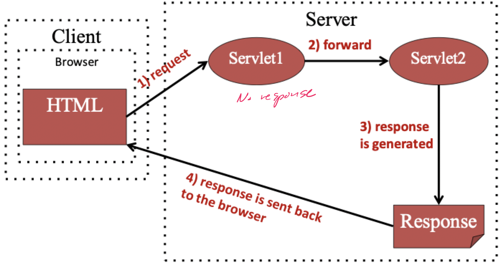
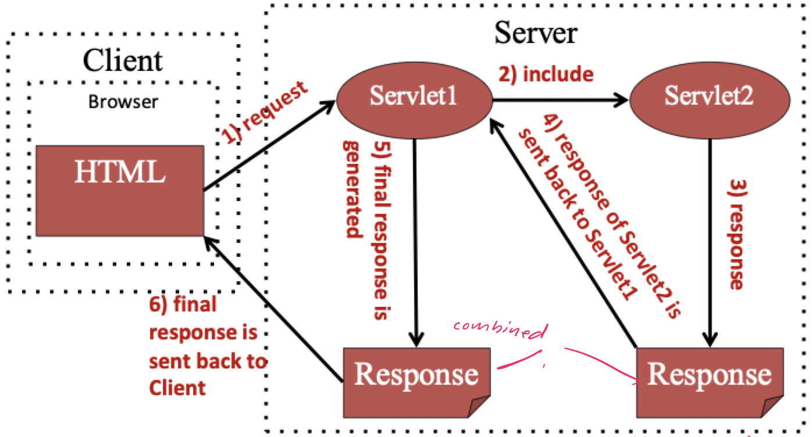
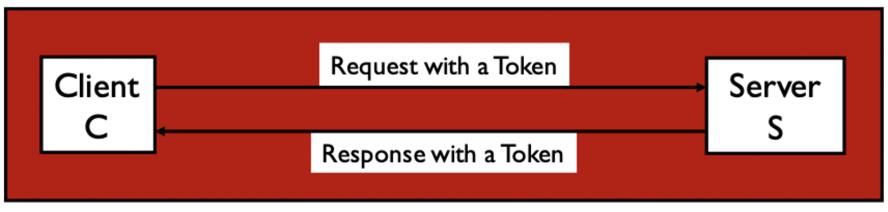
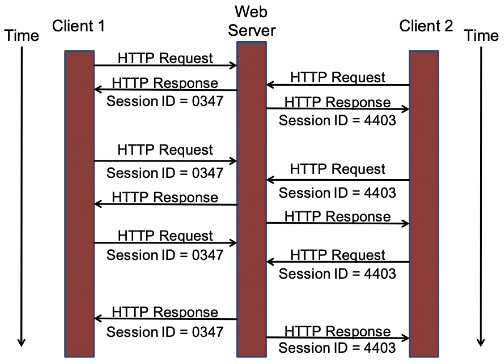
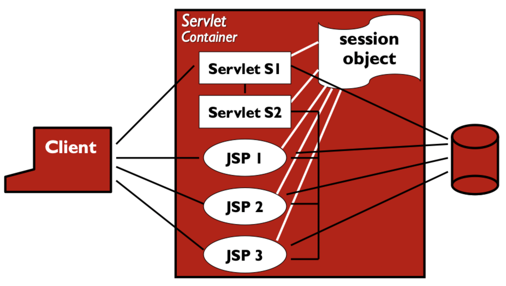
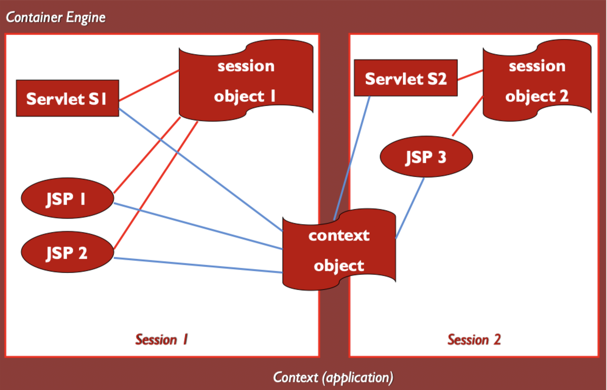

# Advanced servlets

## Control flow

- Servlets usually generate an HTML file as a response, but sometimes you may want to
    - Send the client to a **different servlet**, depending on the type of request, load on the server, etc.
    - *Compose* the final output from the output of several servlets
- Allow for multiple servlets to invoke one another and **collaborate** in responding to a client request
- A container's `HttpServletRequest` object provides a method to access the `RequestDispatcher` object
- `RequestDispatcher` can be used to forward requests and include responses

```Java
public void doPost(HttpServletRequest req, HttpServletResponse res) throws ServletException, IOException {
    String url = "AnotherServletURLPattern";

    // Use to call other servlet resources
    RequestDispatcher rd = req.getRequestDispatcher(url); 
    rd.forward(request, response);
    
}
```

### Forwarding requests

> Sometimes we would like to have a request forwarded to another servlet



### Including responses

> Sometimes we would like the response to be a combination of output from multiple servlets



### Redirecting from servlets

- An alternative approach to forward is `redirect`
- Call `sendRedirect` method of `HttpServletResponse`
- The client will be sent to the specified URL
    - Server tells the client to **generate another request** to the new URL
    - Browser then **repeats request** to the new URL
    - Not seen by users, but both requests are logged in history
- The request can be redirected to both within and outside of server

```Java
import java.io.IOException;
import javax.servlet.ServletException;
import javax.servlet.http.HttpServlet;
import javax.servlet.http.HttpServletRequest;
import javax.servlet.http.HttpServletResponse;

public class MySearcher extends HttpServlet {
    protected void doGet(HttpServletRequest req, HttpServletResponse res) throws ServletException, IOException {
        String query = req.getParameter("query");
        res.sendRedirect("https://www.google.com?q="+query);
    }
}
```

### Forward vs. Redirect

| Forward | Redirect |
|:-------:|:--------:|
| The `forward()` method works at the server side | The `sendDirect()` method works at client side |
| It sends the same request and response object to another servlet | It always sends a new request |
| It can work within the server only | It can be used within and outside the server | 
| Works off the `HttpServletRequest` object | Works off the `HttpServletResponse` object |

### Benefits

- Promote *separation of concerns*
- Increase the potential for *reuse*
- Make it easier to *understand* and *maintain* the system
- Enable *novel designs and architectures* for web applications

## State representations

### Session state information

- The initial versions of web apps suffered from a lack of state
- If a web app needed multiple screens, there was **no way** for state to be accumulated or stored

### Session tracking

- There are many applications that require user state to be maintained
- This is called *session tracking*

> Session: a series of related interactions between a client and a web server

- Session tracking refers to *keeping data* between multiple HTTP request
- This problem is essential to *maintaining state*, which we understand quite well in the context of **procedural** programming and **object-oriented** programming
- The web brings in **unique constraints**
    - HTTP is a connectionless protocol
    - Web apps are distributed

### Handling state

#### Procedural languages

- The C programming language has simple ways to handle state

```C
char name[25]; // global variable
void main() {
    int x, y, z; // local variable
}
```

#### Object-oriented languages

- Several layers of scope are added
    - Non-locals
    - Package
    - Protected
    - Default
- Data sharing in OO languages
    - Two components can share data if they are in the **same scope**
    - Two components can share data by **passing parameters**
- OO languages are also based on the concept of *objects*, which are instances of classes
    - Classes define types, which are global
    - Objects can be defined at multiple scopes

### State on the web

- These schemes have two simple, subtle assumptions
    1) The software components share physical memory
    2) The program runs to completion with active memory
- But these assumptions are **violated** in web applications
    1) Software components are *distributed*
    2) HTTP is a connectionless protocol
- To keep state in web applications, we need different ways to store and access variables and objects

> Public access and parameter passing are **not enough** for web applications

### Session tracking methods

- Session tracking refers to **passing data** from one HTTP request to another
- A web application is comprised of several software components
- The characteristics of a web applications means the components **do not communicate** directly
    - Independent processes (threads)
    - Connectionless protocol
    - Client-server or n-tier architecture
    - Execution flow always goes through a client

> Session tracking involves exchanging a *token* between the client and server



#### URL rewriting

- Forms usually add parameters
- Parameters can be added to URL by the client

```HTML
<form action="URL?userid=...">
</form>
```

- This can be used as a key to find the saved information about a particular user
- This can work, but 
    - It is messy and clumsy
    - URLs may get too long
    - Information on URL is *public*
    - *ALL* HTML pages must be created dynamically

#### Hidden form fields

- Flows of control go *through the client*
- Data that must be passed from one software component to another can be stored in *hidden form fields* in the HTML

```HTML
<form>
    <input type="hidden" name="user" value="...">
    <!-- other form fields -->
</form>
```

- Problems
    - Insecure -> user can see data with browser dev-tools
    - Unreliable -> user can modify data with browser dev-tools
    - Undependable -> users can use the back button, direct URL entry, and URL rewriting to *skip some* hidden form fields
- Still useful, but only in limited situations

#### Cookies

- *Cookies* are small files or text strings
- Usually set by the server
- Allows arbitrary strings to be stored on the client
- From the server's perspective, they are simple `key:value` pairs

```Java
Cookie c = new Cookie("user", "...");
c.setMaxAge(5*24*60*60); // expires in 5 days
response.addCookie(c); // send cookie to client
// Cookies will always be included in subseqent requests to the server
```

- Cookies are very useful and simple
- Not visible as part of the HTML content
- Convenient way to solve real problems
- Problems
    - Like asking to store my files on your hard drive
    - Can go way beyond session tracking, such as **behavior and user tracking**

#### Servlet sessions

> The servlet API uses cookies to provide a simple, safe, flexible method for session tracking

- Cookies are handled automatically
- `HttpSession` stores data in the current active object while browser stores a unique session ID
- Data disappears when the object is destroyed
- Object is destroyed after the session ends, usually 30 minutes after the last request



1) Server returns a new unique session ID when the request has none
2) Client stores the ID and sends it to the server in each subsequent request
3) Server recognizes all requests as being from the same client and can differentiate request sent from a different client

### Servlet sessions API

| Method | Purpose |
|:------:| ------- |
| `void setAttribute(String name, Object attribute)` | Adds an item (name) with its value (attribute) to the session |
| `Object getAttribute(String name)` | Returns the value stored for the given name |
| `void removeAttribute(String name)` | Removes an item from the session |
| `Enumeration getAttributeNames()` | Returns an enumeration of all the value names that are stored for this session |
| `String getID()` | Returns the session ID |
| `void invalidate()` | Removes the current session |

- These methods are **not** synchronized
- Multiple servlets can access the *same session object* at the same time
- If this can happen and if this can be harmful to your application, your program should synchronize the code that modifies the shared session attributes

#### Using `HttpSession` objects

- Get a session object

```Java
HttpSession s = req.getSession(true);
// true creates the session if it does not exists, returns null otherwise
```

- Put object into the session object (not primitive types)

```Java
s.setAttribute("answer", 42); // does not work
s.setAttribute("anser", new Integer(42));
```

- Get primitive values from session objects

```Java
Integer ansobj = (Integer) s.getAttribute("answer");
int ans = asbobj.intValue();
```

- Deleting a session

```Java
s.invalidate(); // Information is thrown away
```

#### Sharing data between servlets

- One program component can *store* a value in the session object
- Another component can *retrieve and modify* the value



### Servlet context API

- Session data can be shared among multiple clients
- This can be achieved with `ServletContext` objects

#### Using `ServletContext` objects

- Get a `ServletContext` object

```Java
ServletContext  servContext = getServletContext();
```

- Information sharing is accomplished with **context attributes**

```Java
servContext.getAttribute();
servContext.setAttribute();
servContext.removeAttribute();
```

- Can provide information about the servlet's environment
    - Server name
    - MIME type
- `ServletContext` provides the `log()` method to write to a log file

#### Context scope and warnings



- The servlet context object supports resources that can be shared by groups of users
- If the application is marked as distributed in the deployment descriptor, you may not be able to use the `ServletContext` object as a location to share global information
- In this case, you should use resources that are external to the JVM (such as databases) to share the information of your application