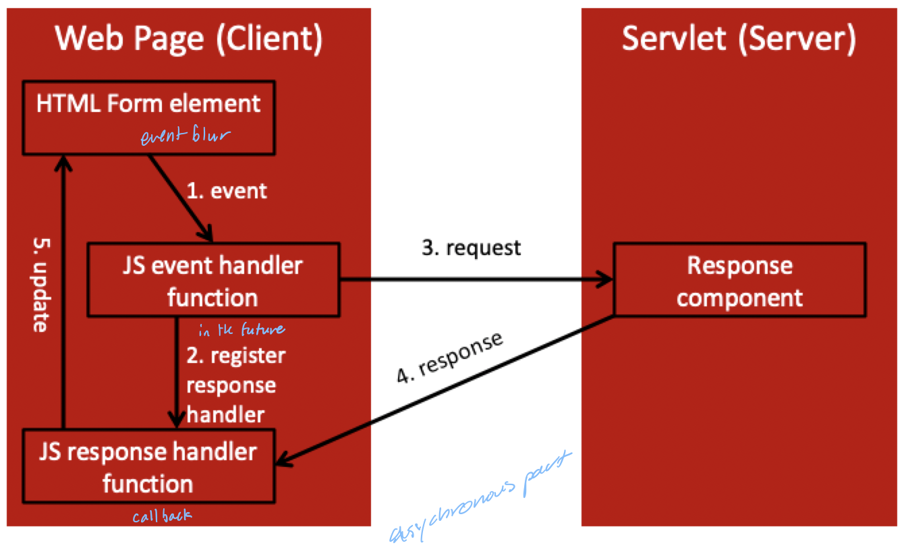

# AJAX

## What is it?

- Two important characteristics
    1) Client requests are handled *asynchronously*
    2) Modification is needed in only a **small part** of the current document (no reload)
- AJAX stands for **A**sychronous **Ja**vascript and **X**ML
    - Client uses JavaScript, XML, CSS and DOM
    - Server uses any enabling technology
- AJAX uses the `XMLHttpRequest` object, which is provided by the browser

### Motivation

- Synchronous vs. asynchronous
    - A phone call is *synchronous* -- both parties have to be on the phone at the same time
    - A text message is *asynchronous* -- one party sends a message and the other can retrieve it later
- The web has potential for fully distributed application
    - Pro: applications can run faster through parallel execution
    - Con: network delays can slow down the application

> The **request/response** cycle used in traditional web applications makes all communication synchronous, eliminating one of the benefits of distributed processing

### History

- AJAX uses JavaScript to allow asynchronous interaction between client and server
    - Users do *not* need to click `submit`
    - Often used to *respond to events* in the UI
- Historically
    - HTML `<iframe>`, since NetScape 4 and IE4, can send asynchronous requests
    - Microsoft introduced `XMLDocument` in 1999 to make asynchronous requests for the Outlook web application
    - Early major uses include [Google Maps](https://maps.google.com) and [Gmail](https://mail.google.com)

> AJAX improves usability by allowing web applications to feel more like desktop applications

### Architectural diagrams

- AJAX request lifecycle



- AJAX programming components


## AJAX example

### The HTML

- Reference the JavaScript source file performing the AJAX request in `<head>`
- Must register the `onblur` event handler 
- JavaScript must have a *blur handler* and a *response handler*

```HTML
<html>
    <head>
        <script type="text/javascript" src="popcornA.js"></script>
    </head>
    <body>
        <table>
            <tr> <td> Zip Code: </td>
            <tr> <input type="text" name="zip" size="10" onblur="getPlace(this.value)" />
            </tr>
        </table>
    </body>
</html>
```

### Request phase

- Client communicates to the server with the `XMLHttpRequest` object
- Registers a **response function**
    - Done by setting the `onreadystatechange` property of the `XMLHttpRequest` object

```JavaScript
function getPlace(zip) {
    var xhr = new XMLHttpRequest();
    xhr.onreadystatechange = function() { ... }
    xhr.open("GET", "getCityState?zip=" + zip, true);
    xhr.send();
}
```

- The client calls the `open` method of the `xhr` object
    - Takes a HTTP method as the first parameter
    - The URL of the **response component** is the second parameter
    - A boolean literal indicates if the request is *asynchronous* (true) or *synchronous* (false)
- The **form data** must be attached to the URL manually if `GET` is used
- The `Content-Type` header must be specified if `POST` is used
- The response component should be **on the same server** as the original HTML
    - This can be overridden with an appropriate CORS policy
- The request is sent when the `send` method is called

### Response component

- Response component returns data in response to the request form the JavaScript
- Response data is produced any kind of enabling technology

```Java
String zip = request.getParameter("zip");
response.setContentType("text/html;charset=UTF-8");
try (PrintWriter out = responser.getWriter()) {
    if (map.contains(zip)) {
        out.write(map.get(zip));
    }
    else {
        out.write(" , ");
    }
}
```

### Receive phase

- When the response component on the server finishes
    1) Sends the response object to the client
    2) Invokes the specified callback function
- The callback function is a JavaScript function that take *no* parameters
    - It needs to access the `XMLHttpRequest` object
    - If the object is global, simultaneous requests and responses could cause concurrency issues
- Server returns a sequence of notices to the client
    - 0: request not initialized
    - 1: server connection established
    - 2: request received
    - 3: processing request
    - 4: request finished and response received

```JavaScript
xhr.onreadystatechange = function() {
    // 4 mean ready and 200 means okay
    if (xhr.readyState == 4 && xhr.status == 200) {
        var result = xhr.resultText;
        var place = result.split(', ');
        if (document.getElementById("city").value == "") {
            document.getElementById("city").value = place[0];
        }
        if (document.getElementById("state").value == "") {
            document.getElementById("state").value = place[1];
        }
    }
}
```

### Return document options

AJAX sever software components can return

- XHTML
- JavaScript
- XML
- JSON
- Plaintext

> XML or even plaintext are superior to JSON if the response is integrated into displayed document more or less intact. JSON is preferred if data needs to be manipulated significantly on the client side before being displayed

### Security concerns

- AJAX applications may have many small server-side programs, *increasing the attack surface* of the entire application
- Servers that provide JavaScript as a response open the application to *cross-site scripting attacks*
- If you have security checks in the JavaScript and HTML, remember that users can modify the code

> Security measures should be **duplicated** on the client and server programs
