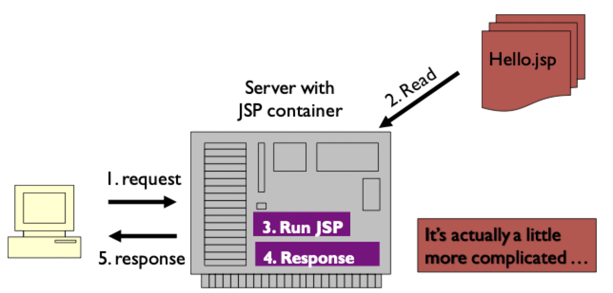
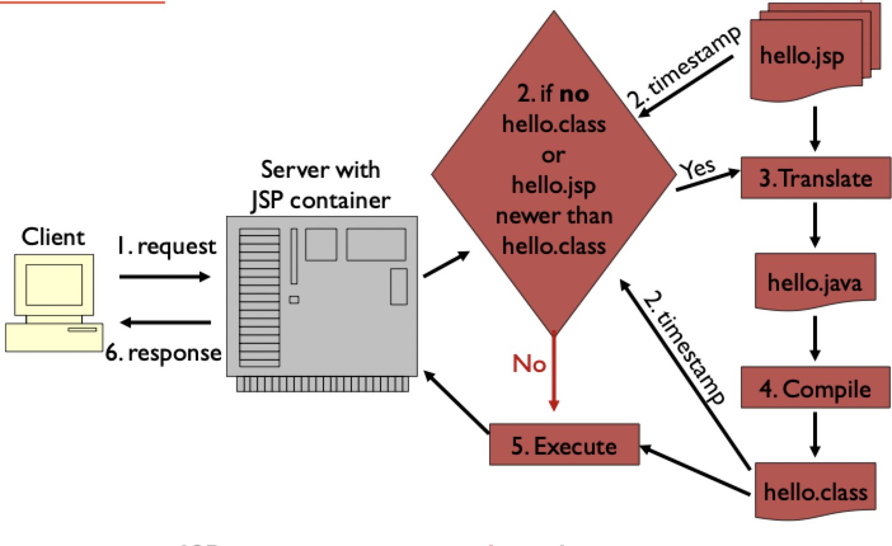

# Java server pages

## Enabling technologies

### Web server plugins

- A **plugin** is an extension to a web server that allows a different program to handle certain types of request
    - Compiled module applications: conventional languages used to generate HTML/JS
    - Scripted page applications: HTML and logic are mixed together
- Plugins typically keep an *active process* as long as the web server is active

### Scripted pages

- **Scripted pages** look like HTML pages that happen to process business logic
- Execution is on the server, not on the client
- They have **HTML with program statements** that get and process data
- Some common scripted pages technologies
    - Adobe's ColdFusion
    - Microsoft's Active Server Pages
    - PHP
    - Java Server Pages (compiled and run as servlets)
- Scripted pages are generally easy to develop and deploy
- The mix logic with HTML, so can be difficult to *read* and *maintain*
- Not as effective for heavy-duty engineering

### Scripted pages vs. servlets

| Scripted pages | Java servlets |
| -------------- | ------------- |
| Translated to servlets, compiled and then executed | Compiled, portable, and robust |
| Instead of HTML in Java, Java is injected into HTML | Not integrated with HTML; Java *creates* HTML |
| Encourages separation of tasks | Mixes static (layout) with dynamic (business logic) content |

## First look as JSPs

```JSP
<%@page import = "java.util.Date"%>
<HTML><BODY>
<CENTER>
    <H1>Java Server Page Example</H1>
    The current time is <%= new Date() %>
</CENTER>
</BODY></HTML>
```

### Processing

> Mental model of JSP execution



> Actual lifecycle of JSP execution



### Servlet methods

| Method | Purpose |
|:------:| ------- |
| `jspInit()` | Can be defined in JSP declarations; called when generated servlet starts |
| `jspDestroy()` | Can be defined in JSP declarations; called when generated servlet ends |
| `_jspService()` | Generates `Servlet.service()` automatically by the JSP translator |

### Counter example

```JSP
<BODY>
    <!-- Set global information for the page -->
    <% page language="java" %>
    <!-- Declare the variable -->
    <%! int count = 0; %>
    <!-- Scriptlet - Java Code -->
    <%
        for (int i = 0; i < 10; i++) {
            count = count + 1;
    %>
    <BR/>
    The counter value is <%= count %>
    <% } %>
</BODY>
```

## JSP elements

### Directives

- Page attributes are listed [here](https://www.tutorialspoint.com/jsp/jsp_directives.html)
- You will usually use the defaults

```JSP
<%@ page attribute=value %>
```

- Files can be inserted into a JSP before it is compiled

```JSP
<%@ include <filename> %>
```

- Allow for definition of additional JSP tags that can be used as `tagPrefix:tagFromLibURI`

```JSP
<%@ taglib uri="tagLibURI" prefix="tagPrefix" %>
```

### Java code

#### Declarations

- Use `<%! ... %>` to use Java code and define class-level variables and methods
- `jspInit()` and `jspDestroy()` can also be defined here to initialize and clean up

```JSP
<%!
   int Sum = 0;
   // To be called from a scriptlet
   private void AddToCount(int X) {
       Sum = Sum + X;
   } 
%>
```

#### Scriptlets

- Blocks of general Java code
- Placed into `_jspService()` by the JSP translator
- Can access variables from JSP declarations
- Implicit objects allow scriptlets to access servlet variables

```JSP
<%
    String nameVal = request.getParameter("LASTNAME");
    out.println(nameVal);
%>
```

| Implicit variable | Implicit object |
|:-----------------:| --------------- |
| `request` | The `HttpServletRequest` object |
| `response` | The `HttpServletResponse` object |
| `out` | `PrintWriter` object |
| `session` | `HttpSession` object |
| `application` | `ServletContext` object |
| `config` | `ServletConfig` object |
| `page` | Synonym with the `this` keyword in Java, and used to call methods defined by the translated servlet class |
| `exception` | `Exception` object; allows exception data to be accessed using JSP |

#### Expressions

- Abbreviated scriptlet print statements
- Expressions are evaluated and turned into strings

```JSP
<P>
    The user's last name is <%= nameVal %>
</P>
```

### Actions

#### Include

- `<jsp:include>` can be used to include either a static or dynamic resource
- A static file is loaded inline into the JSP before translation and compilation
    - The **same content** is included every time
    - `<jsp:include page="copyright.html"/>`
- A dynamic resource is a web software component is run and the results are included as part of the resource
    - Can result in **different content** being included each time
    - `<jsp:include page="myjsp.jsp" flush="true" />`
    - `myjsp.jsp` is compiled and executed
    - Output of `myjsp.jsp` is included in the current JSP
    - Current output is flushed before `myjsp.jsp` is included

#### Forward

- `<jsp:forward page="anotherPage.jsp" />` sends a request to another JSP on the same server
    - Similar to a method call, but does not return
    - When statement reached, execution will jump to the JSP listed
- Useful as a frontend when we need to decide which JSP to execute based on some input data

#### Java beans

- A Java bean is a Java class with 3 characteristics
    1) A public class
    2) Has a public constructor with no arguments
    3) Has public `get*()` and `set*()` methods for attributes
- Java beans represent simple data objects 
- It is **not** a language feature; it is a *design convention* (pattern)
- `<jsp:useBean> id="name" class="JavaClass" scope="page" />`
    - Causes a Java bean object to be instantiated
    - Gives a name to the new object based on the `id` attribute
    - Defines the scope of the bean object

```JSP
<%@ page import="jsexamples.*" %>
<jsp:useBean id="letterColor" class="AlphabetCode" scope="page" />
```

##### JSP bean example (`Converter.java`)

```Java
package org.converters;

public class Converter {
    private String celsius;
    private String fahrenheit;

    public void setCelsius(String celsius) {
        this.celsius = celsius;
    }

    public String getCelsius(String celsius) {
        return celsius;
    }

    public void setFahrenheit(String fahrenheit) {
        this.fahrenheit = fahrenheit;
    }

    public String getFahrenheit() {
        this.fahrenheit = Float.toString(1.8f * Integer.parseInt(celsius) + 32.0f);
        return fahrenheit;
    }
}
```

#### Properties

- `setProperty` gives a value to a property in a bean

```JSP
<jsp:setProperty name="langBean" property="language" value="Java" />
<!-- Equivalent to langBean.setLanguage("Java"); -->
```

- `getProperty` retrieves the value of a property

```JSP
<jsp:getProperty name="langBean" property="language" />
<!-- Equivalent to langBean.getLanguage(); -->
```

> Case of property name is very important
>     - Property must begin with a *lower case* letter
>     - Getters and setters must have the *property name* start with a capital letter

##### JSP bean example (`index.jsp`)

```JSP
<%@page contentType="text/html" pageEncoding="UTF-8"%>
<!DOCTYPE html>
<html>
    <head> 
        <title> index.jsp for tempConvert </title>
        <meta http-equiv="Content-Type" content="text/html; charset=UTF=8">
    </head>
    <body>
        <h2> Welcome to the temperature conversion service </h2>
        <form name="Temperature input form" action="response.jsp" method="POST">
            Enter a temperature in celsius:
            <input type="text" name="celsius" value="" size="4" />
            <p></p>
            <input type="submit" value="Convert to fahrenheit" />
        </form>
    </body>
</html>
```

##### JSP bean example (`response.jsp`)

```JSP
<%@page contentType="text/html" pageEncoding="UTF-8" %>
<%@page import="org.converters.*" %>
<!DOCTYPE html>
<html>
    <head>
        <title> Response document </title>
        <meta http-equiv="Content-Type" content="text/html; charset=UTF-8">
    </head>
    <body>
        <!-- Converter myBean = new Converter() -->
        <jsp:useBean id="myBean" scope="session" class="org.converters.Converter" /> 
        <!-- myBean.setCelsius(request.getParameter("celcius")) -->
        <jsp:setProperty name="myBean" property="celsius" />
        Given temperature is: 
        <!-- myBean.getCelsius() --> 
        <jsp:getProperty name="myBean" property="celsius" />
        <br/>Equivalent temperature in fahrenheit is:
        <!-- myBean.getFahrenheit() -->
        <jsp:getProperty name="myBean" property="fahrenheit" /> 
    </body>
</html>
```
