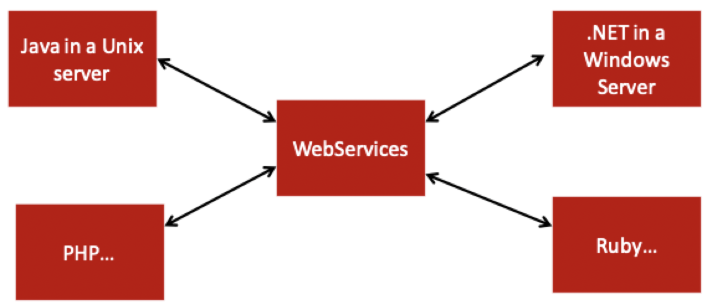
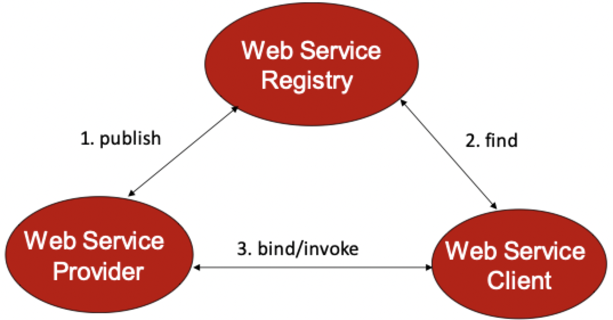
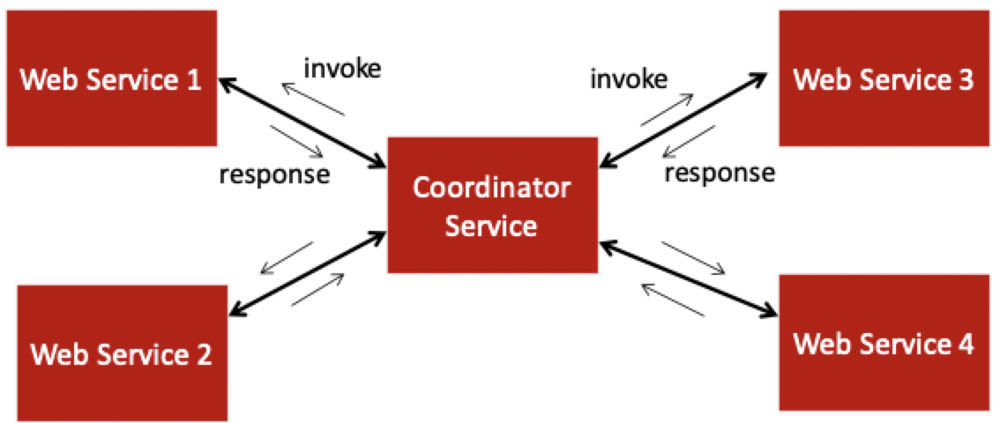
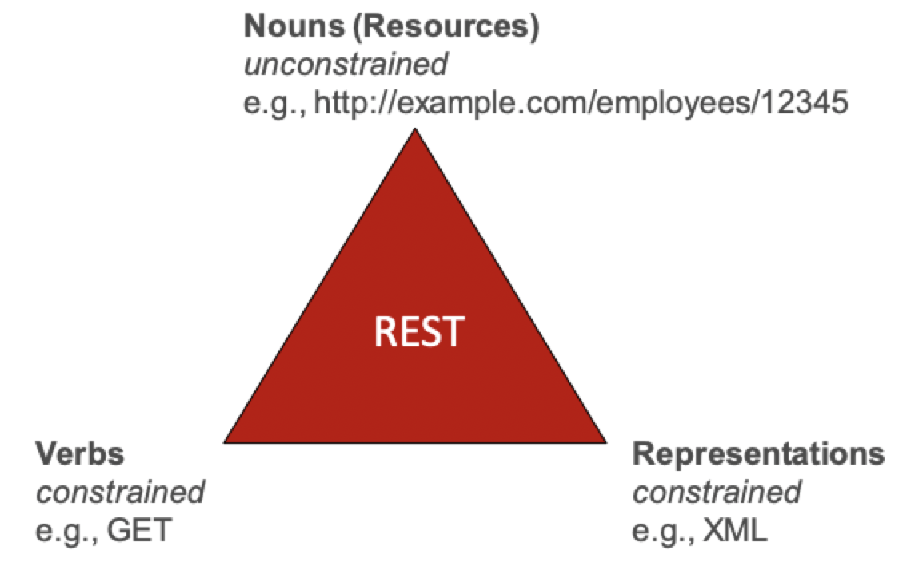

# RESTful services

## Emergence of web applications

- The web was initially designed for sharing information (documents)
- It soon became clear that applications can be deployed and made accessible using the web
- This created an immense opportunities for business to business interactions
- Businesses could access and make use of applications provided by other businesses through the web

### What is a web service?

> A software system designed to support interoperable machine-to-machine interactions over a network



- Available over a network
- Use standard messaging and are self-describing
- Independent of the operating system or programming language used

### Implementing web services

- SOAP-based approach
    - First attempt at realizing web services
    - Violated some of the basic stylistic rules of the WWW's architecture
    - Nevertheless, was very popular in the early 2000's
- REST-based approach
    - The second attempt at realizing web services
    - Aimed to be compliant with the stylistic rules of the WWW's architecture
    - Very popular in the current web application landscape

## SOAP web services

### The model

- SOAP stands for **S**imple **O**bject **A**ccess **P**rotocol
- SOAP web services implement the *service oriented architecture style*
- Service oriented architecture is based upon the interactions between 3 roles
    1) Service provider
    2) Service registry
    3) Service requester
- Service oriented architecture is based on 3 types of interactions
    1) Publish operation
    2) Find operation
    3) Bind operation



- Essentially creates a marketplace of services
- The can be invoked as through they are function calls

### Service composition and coordination

> A special service coordinates the invocation of other services to achieve the functionality required by the system



### Criticisms

- SOAP tends to have a complex architecture and use a complex message format like XML
- A custom interface requires a custom client for every service
- Concerns about performance due to XML and SOAP/HTTP in enveloping and transport

## REST web services

- REST stands for **RE**presenational **S**tate **T**ransfer
    - A style of software architecture for distributed hypermedia systems such as the World Wide Web
- Introduced in the doctoral dissertation of **Roy Fielding**
    - A UCI alumnus!
    - One of the principal authors of the HTTP specification
- A collection of network architecture principles which outline how resources are defined and addressed

### Motivation

- The motivation for REST was to capture the characteristics of the web 
    - Resource based (URI) rather than action based
    - Actions on resources are specified using HTTP operations
    - Based on stateless communication protocol
- Exploits the use of the HTTP protocol beyond `GET` and `POST`
- REST is *not* a standard, is already existed in some from in the HTTP specification

### Main concepts



#### Resources

- The key abstraction of information in REST is a resource
- A resource is a conceptual mapping to a set of entities
    - Any information that can be named can be a resource
    - A document on image file
    - A temporal service
- They are represented with a global identifier and locator

#### Verbs

> Represent the action to be performed on resources

| HTTP verb | Action to perform |
|:---------:| ----------------- |
| `GET` | Retrieve a specific resource from a server |
| `POST` | Create a new resource on the server |
| `PUT` | Update a resource, provide the entire resource as the response |
| `PATCH` | Update a resource, provide only the changed attributes in the response |
| `DELETE` | Remove a resource from the server |
| `OPTIONS` | Retrieve information about what the consumer is allowed to do with a resource |
| `HEAD` | Retrieve metadata about a resource |

```
// Retrieve all books
GET http://localhost/books

// Retrieve the book with a specific ISBN
GET http://localhost/books/ISBN-0011021

// Retrieve the authors for a book identified by a specific ISBN
GET http://localhost/books/ISBN-0011021/authors

// Create a new book with the given properties
POST http://localhost/books
{
    "isbn": 111,
    "title": "title",
    "authors": [
        "author1",
        "author2"
    ]
}

// Update the book identified by a specific ISBN with submitted properties
PUT http://localhost/books/isbn-111
{
    "isbn": 111,
    "title": "different title",
    "authors": [
        "author1",
        "author2",
        "newAuthor"
    ]
}

// Delete the book identified by a specific ISBN
DELETE http://localhost/books/ISBN-0011
```

#### Representations

- How data is represented or returned to the client for presentation
- The two main formats are JSON and XML

```XML
<COURSE>
    <ID>CS137</ID>
    <NAME>Internet App Engineering</NAME>
</COURSE>
```

```JSON
{
    "course": {
        "id": "CS137",
        "name": "Internet App Engineering"
    }
}
```

### Why is it called REST?

- The client references a web resource using a URL
- A representation of the resource is returned, placing the client in a state
- The client can traverse hyperlinks in the current resource to access other resources
- New representations place the client into yet another state

## Building a RESTful web service

### Helpful tools

- Jersey is an open source framework for developing RESTful services with Java
- RESTeasy is another framework for building RESTful services JAX-RS
- JAX-RS provides certain annotations to aid in the representation of resources and their URIs

### Defining a resource

- Resources are the primary objects of concern for a RESTful service
- They are analogous to object instances in object-oriented programming
- It is common to provide CRUD operations for such resources

```Java
@Path("/todos")
public class TodoResource {

    @Path("{id}")
    @GET
    @Produces( {MediaType.APPLICATION_XML, MediaType.APPLICATION_JSON} )
    public Response getTodoById(@PathParam("id") int id) {
        Todo todo = TodoService.getTodoById(id);
        if (todo == null) {
            return Response.status(Response.Status.NOT_FOUND).build();
        }
        return Response.ok(todo).build();
    }

    @POST
    @Consumes( {MediaType.APPLICATION_JSON} )
    public Response addTodo(Todo todo) {
        if (TodoService.addTodo(todo)) {
            return Response.ok().entity("TODO Added Successfully").build();
        }
        return Response.status(Response.Status.INTERNAL_SERVER_ERROR).build();
    }
}
```

- We could also add `@PUT` and `@DELETE` methods to respond to these requests
- The `TodoService` would provide the CRUD operations for the database used to store `Todo` objects

### Consuming a RESTful web service

- We consume web service when we invoke them through REST actions and use their responses

#### POSTMAN

- A versatile application that provides developers a set of tools for testing, monitoring, and documenting APIs
- It is cross-platform and also available as a chrome extension
- Postman can be used to create all types of HTTP request and look at their responses
- Can specify header parameters, request bodies, form parameters, and query parameters

#### Java REST client

- We can create another project that can programmatically invoke the RESTful web service and process the received response
- Create a `Todo` POJO (plain old java object) to represent the TODO resource

```Java
public class Todo {
    private String summary;
    private String description;
    private int id;

    public String getSummary() {
        return summary;
    }

    public void setSummary(String summary) {
        this.summary = summary;
    }

    public String getDescription() {
        return description;
    }

    public void setDescription(String description) {
        this.description = description;
    }

    public int getId() {
        return id;
    }

    public void setId() {
        this.id = id;
    }
}
```

- We will use `jersey` to invoke the RESTful service and `jackson-asl-mapper` to convert between JSON and Java objects

```Java
public class RESTClient {
    public static void main(String[] args) throws IOException {
        ClientConfig config = new ClientConfig();
        Client client = ClientBuilder.newClient(config);
        WebTarget target = client.target(getBaseURI());
        String jsonResponse = target
                                .path("v1")
                                .path("api")
                                .path("todos")
                                .request()
                                .accept(MediaType.APPLICATION_JSON)
                                .get(String.class);
        System.out.println(jsonResponse);
        ObjectMapper objectMapper = new ObjectMapper();
        List<Todo> todoList = objectMapper.readValue(
                                            jsonResponse,
                                            new TypeReference<List<Todo>>()
                                            );
        System.out.println(todoList);
    }

    private static URI getBaseURI() {
        return UriBuilder.fromUri("http://localhost:8080/TodoRestService").build();
    }
}
```

- We use `ClientBuilder` to initialize the REST client
- Using the `WebTarget` object, we specify the REST URL path and other request parameters
- Using `ObjectMapper`, we map the received the JSON response string to the `Todo` Java object