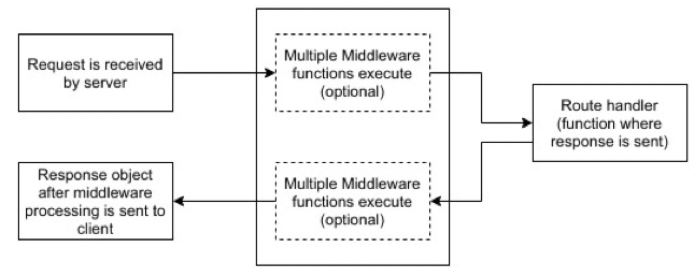

# Express.js and sequelize.js

## Express.js

- It is a backend framework for building web applications on top of node.js
    - Configures nodes HTTP modules
    - Results in fast and minimalist web server

### Installation

- Can be installed using NPM
- `npm init`
    - Creates the `package.json` file in the directory where you would like to develop your application
    - `package.json` handles the dependencies of the application
- `npm install --save express`
    - Installs express for the application and adds it to `package.json` as a dependencies
- `node index.js`
    - Runs the express application defined in `index.js`

### Building a RESTful service

#### `hello world` example

```JavaScript
var express = require('express');
var app = express();

app.get('/', function(req, res) {
    res.send("hello world");
});

app.listen(3000);
```

#### Routing

Endpoints are define using `app.method(path, handler)`

- `method` is an HTTP verb
- `path` is the route (relative URL) at which the request will run
- `handler` is a callback function that executes in case of a match

```JavaScript
var express = require('express');
var app = express();

app.get('/hello', function(req, res) {
    res.send("hello world");
});

app.post('/hello', function(req, res) {
    res.send("You just called the post method at '/hello'!\n");
})

app.listen(3000);
```

#### Dynamic routes

- Can use `:` in the URL to create dynamic routes
- It indicates a parameter that is being passed

```JavaScript
var express = require('express');
var app = express();

app.get('/:id', function(req, res) {
    res.send(`The id you specified is ${req.params.id}`);
});

app.listen(3000);
```


#### Invalid URLs

- Express matches routes from start to end of the `index.js` file
- As a matter of good practice, this should be placed after all *valid* routes

```JavaScript
var express = require('express');
var app = express();

// Other routes here

app.get('*', function(req, res) {
    res.send("Sorry, this is an invalid URL.");
});

app.listen(3000);
```

### Middleware

- Middleware refers to modifications you may want to make to `req` and `res` objects for tasks like parsing request bodies, adding response headers, etc.
- It basically corresponds to additional functions that are executed before or after the route callback function is called



#### Using middleware

- The `use` method indicate using middleware
- Execution order of middleware functions is determined based on the *order* in which they appear in `index.js`

```JavaScript
var express = require('express');
var app = express();

// First middleware before response is sent
app.use(function(req, res, next) {
    console.log("Start");
    next();
});

// Route handler
app.get('/', function(req, res, next) {
    res.send("Middle");
    next();
});

// Second middleware after response is sent
app.use('/', function(req, res) {
    console.log("End");
});

app.listen(3000);
```

#### `body-parser` middleware

- The `body-parser` module is used for parsing JSON and url-encoded data
- Make sure the route handler is defined *after* the middleware functions for parsing the data

```JavaScript
var express = require('express');
var app = express();

app.get('/', function(req, res) {
    console.log(req.body);
    res.type("text/html");
    res.send("<h1>Welcome!</h1>");
});

app.use(express.json());
app.use(express.urlencoded({extended: true}));
// You generally don't use both simultaneously, 
// pick the one that is appropriate for your use case

app.use(express.static('public'));

app.post('/', function(req, res) {
    console.log(req.body);
    res.type("text/html");
    res.send(`<p>Your first name is ${req.body.fname} and your last name is ${req.body.lname}. </p>`);
});

app.listen(3000);
```

### Preserving state

#### Cookies

- Cookies are small files/data that are sent to the client with a server response and stored on the client
- Used mostly for session management and user tracking
- To send a cookie: 

```JavaScript
var express = require("express");
var cookieParse = require("cookie-parser");
var app = express();

app.use(cookieParser());

app.get('/', function(req, res) {
    res.cookie('name': 'value').send('cookie set');
});
app.listen(3000);
```

- The client browser sends back the cookie every time it sends a request to the server
- To read a cookie:

```JavaScript
app.get('/', function(req, res) {
    var cookie = getcookie(req);
    console.log(cookie);
});

function getcookie(req) {
    var cookie = req.headers.cookie;
    return cookie.split('; ');
}
```

#### Sessions

- HTTP is a stateless protocol, making it difficult to associate one request of a client with another request of the same client
- Cookies and URL parameters are both readable and stored on the client side
- Sessions aims to solve theses problems

```JavaScript
var express = require('express');
var cookieParser = require('cookie-parser');
var session = require('express-session');

var app = express();

app.use(cookieParser());
app.use(session({secret: "Shh, it's a secret!"}));

app.get('/', function(req, res) {
    if (req.session.page_views) {
        req.session.page_views++;
        res.send(`You visited this page ${req.session.page_views} times.`);
    }
    else {
        req.session.page_views = 1;
        req.send("Welcome to this page for the first time!");
    }
});

app.listen(3000);
```

## Sequelize.js

#### Installation

- Install sequelize: `npm install --save sequelize`
- Install support to interface with MySQL: `npm install --save mysql2`

### Connecting to a database

#### Configure the connection

- Configure connections by specifying connection parameters in JavaScript

```JavaScript
module.exports = {
    HOST: "localhost",
    USER: "root",
    PASSWORD: "supersecretpassword",
    DB: "dbname",
    dialect: "mysql",
    pool: {
        max: 5,
        min: 0,
        acquire: 30000,
        idle: 10000
    }
};
```

#### Instantiate the connection

- Instantiate a connection with the exported database config

```JavaScript
const dbConfig = require("../config/db.config.js");
const Sequelize = require("sequelize");

const sequelize = new Sequelize(
    dbConfig.DB,
    dbConfig.USER,
    dbConfig.PASSWORD,
    {
        host: dbConfig.HOST,
        dialect: dbConfig.dialect,
        operatorsAliases: false,
        pool: {
            max: dbConfig.pool.max,
            min: dbConfig.pool.min,
            acquire: dbConfig.pool.acquire,
            idle: dbConfig.pool.idle
        }
});
```

### Interacting with the database

#### Raw SQL

- Use the `sequelize.query` function and pass it the SQL strings you'd like executed

```JavaScript
sequelize.query("SELECT * FROM USERS").then(myTableRows => {
    console.log(myTableRows);
});
```

#### Object mapping

- Create object to table mappings for easier interaction with the database
- This is called *object relational mapping* and the module/library that supports this is called an **object relational mapper** (ORM)
- We start by modeling our tables as objects

```JavaScript
const User = sequelize.define("user", {
    firstName: {type: Sequelize.STRING},
    lastName: {type: Sequelize.STRING},
    email: {type: Sequelize.STRING}
});
```

- Then we define `create` and `finder` methods to insert and query the table
- They return model instances

```JavaScript
// Create a user
const user = {
    firstName: "Tom",
    lastName: "Jones",
    email: "jones@uci.edu"
};

// Save to the database
User.create(user).then(data => {
    console.log(`Added ${data.firstName} ${data.lastName} to the database`);
}).catch(err => {
    console.log(err.message || "Some error occurred while creating the user");
});

var condition = {firstName: { [Sequelize.Op.like]: `%Sam%`} };

// Retrieves all users that have a first name containing "Sam"
User.findall({where: condition}).then(data => {
    console.log(`Found ${data.firstName} ${data.lastName} in the database`);
}).catch(err => {
    console.log(err.message || "Some error occurred while creating the user");
});
```

> This eliminates the need for raw SQL strings to litter the codebase