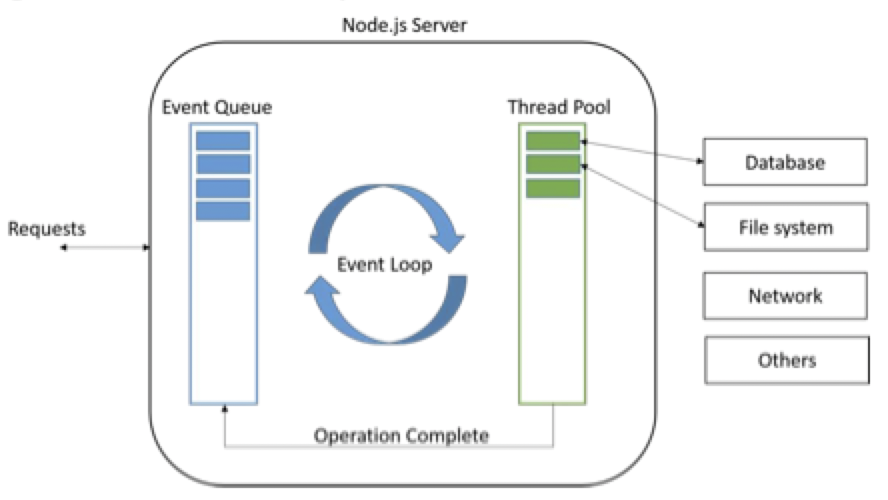

# Node.js

## What is it?

- A JavaScript runtime environment running Google Chrome's JS engine
    - A server-side solution for JS
- Runs over the command line
- Designed for high concurrency
    - Without threads or new processes
    - Makes it really fast
- Never blocks, not even for I/O
- Node.js is a *platform* (not a framework)
    - Similar to Apache or Tomcat
    - Supports a number of frameworks
- Aims to provide an easy way to build scalable web applications
- Enables client-and-server side programs to be written in the same language
- Node is a platform for writing JavaScript applications outside of web browsers
    - No document object model built into node
    - No other browser capability
- Node is written in C, making it exceptionally fast

## Asynchronous and event-based model

- Recall, in the browser, asynchronous AJAX request using `XMLHttpRequest`
    - I/O does not block execution
    - Callback function runs after request in complete

```JavaScript
$.post('/resource.json'), function(data) {
    console.log(data);
})
// script execution continues
```

## Event loop

- Instead of threads, node uses an event loop with a stack
    - Alleviates the overhead of context switching
    - It processes each request as events
    - To avoid blocking, it makes use of the event driven nature of JavaScript by attaching callbacks to I/O objects



## Why use it?

- Node is faster
- Node can handle concurrent requests
- Can use the same language on both client and server side

### Node.js vs Apache

| Platform | Number of request per second |
|:--------:|:----------------------------:|
| Apache | 2966 |
| Node.js | 5569 |

### DIRTy applications

- DIRTy applications
    - **D**ata-**I**ntensive **R**eal-**T**ime application
    - Node.js *is* suitable for dirty applications
- Node.js includes a core set of modules for many types of network and file I/O
    - Provides the building blocks for I/O based applications
    - The core is intentionally small, low-level, and uncomplicated
    - Third-party modules build upon these blocks to offer great abstractions for common problems

## Using node.js

### A `hello world` HTTP server

- An HTTP server simply responds to any request with `"hello world"`

```JavaScript
var http = require('http'); // like an import statement
http.createServer(function(req, res) {
    res.writeHead(200, {'Content-Type': 'text/plain'});
    res.send('hello world\n');
}).listen(3000); // listen on port 3000
console.log('Server running at http://localhost:3000/');
```

- Alternatively, make the request event specific

```JavaScript
var http = require('http');
var server = http.createServer();
server.on('request', function(req, res) {
    res.writeHead(200, {'Content-Type': 'text/plain'});
    res.send('hello world\n');
});
server.listen(3000);
console.log('Server running at http://localhost:3000/')
```

### Starting and stopping the server

- Run the server

```sh
$ cd <project-directory>
$ node server.js
```

- Kill the server (frees the port)

```sh
$ node server.js
Server running at http://localhost:3000/
^C
```

- Stop the server (does *not* frees the port)

```sh
$ node server.js
Server running at http://localhost:3000/
^Z
```

- Find and kill the server process to free the port

```sh
$ node server.js&
Server running at http://localhost:3000/
$ kill -9 $(ps aux | grep node)
```

### The node package manager

- Node.js by itself does not provide a lot of functionality
- Node.js comes bundled with the **N**ode **P**ackage **M**anager (NPM)
- It is a command line utility to install packages and modules

```sh
$ npm install express
```

- Once installed, the module code be used in the project

```JavaScript
var express = require('express')
```

- For large projects, many packages may be needed to run the project
- Node provides a mechanism to store configuration/installation information for the application
    - It is a file called `package.json`
    - It is stored in the root directory of a node application
    - Need not be created manually, can be created with `npm init`
- Attributes of `package.json`
    - Name of the package
    - Version of the package
    - Description of the package
    - Home page of the package
    - Author of the package
    - Contributors of the package
    - Dependencies of the package, installed in `node_modules` folder of the package
    - Repository URL of the package
    - Entry point of the package
    - Keywords relevant to the package

