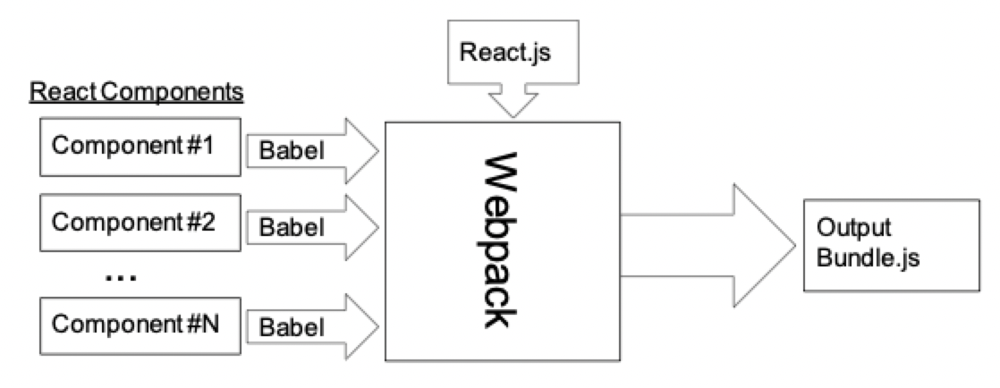
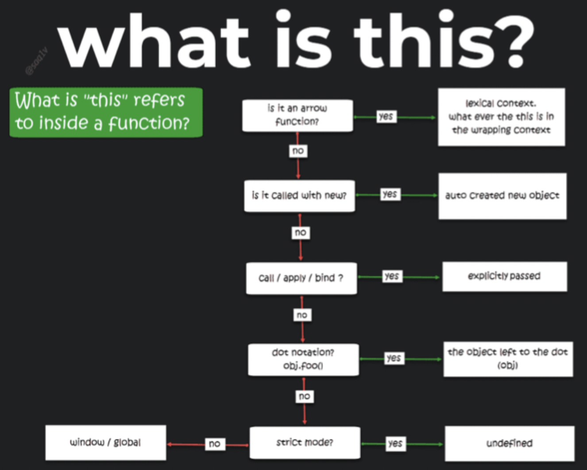

# React.js

## What is it?

- A JavaScript *framework* for writing web applications
    - Snappy response from running in the browser
- Focus on support for single page applications
- Uses the model-view-controller (MVC) pattern
    - View constructed from components using a pattern
    - UI components can be conveniently reused
- Minimal server-side support dictated

### Installation and setup

1) Make sure you have NPM and node.js installed on your computer
2) Setup a React environment on your computer

```sh
$ npm install -g create-react-app
```

3) Create your first React app

```sh
$ npx create-react-app helloworld
```

4) Run the React app

```sh
$ cd helloworld
$ npm start
```

### What we are given

- The HTML is a barebones webpage
- ReactJS applications come as a **JavaScript blob** that will use the DOM interface to write the view into the top-level `<div>` element

```HTML
<html>
    <head>
        <title>INF 124 Example</title>
    </head>
    <body>
        <div id="reactapp"></div>
        <script src="./webpackOutput/reactApp.bundle.js"></script>
    </body>
</html>
```

### What we are working with

- **Babel**: a transpiler that converts language features like ECMAScript and JSX to basic JS
- **Webpack**: a bundler that bundles JS modules and static resources (stylesheets and images)



> Output is loadable with a single `<script>` tag in *any* browser

## Making an app

### The `render()` function

- `ReactDOM.render()` takes two arguments
    1) The HTML code that you would like to render
    2) The HTML element within

```JavaScript
ReactDOM.render(myelement, document.getElementById('root'));
```

### JavaScript XML (JSX)

- JSX allows you to write HTML elements in JavaScript

```JSX
const myelement = <h1>I Love JSX!</h1>
```

- Line breaks are allowed if the JSX snippet is surrounded by parenthesis

```JSX
const myelement = (
    <ul>
        <li>Apples</li>
        <li>Bananas</li>
        <li>Cherries</li>
    </ul>
);
```

- Without JSX, you would need to use `React.createElement()`

```JavaScript
const myelement = React.createElement('h1', {}, 'I do not use JSX!');
```

### Components

- React promotes component-based development
- You define a component by creating a class that extends `React.Component`
- A component returns HTML code from the `render` function that can be reused in different parts of your web app

```JSX
// Car.js
import React from 'react';
import ReactDOM from 'react-dom';

class Car extends React.Component {
    render() {
        return <h2>Hi, I am a Car!</h2>;
    }
}

export default Car;
```

```JSX
// index.js
import React from 'react';
import ReactDOM from 'react-dom';
import Car from './Car.js';

// Components are specified like any other HTML tag
ReactDOM.render(<Car />, document.getElementById('root'));
```

#### React `props`

- Props are arguments passed into React components

```JSX
// Car.js
import React from 'react';
import ReactDOM from 'react-dom';

class Car extends React.Component {
    render() {
        // Components have a props attribute that can be accessed
        return <h2>Hi, I am a {this.props.brand}!</h2>;
    }
}

export default Car;
```

```JSX
// index.js
import React from 'react';
import ReactDOM from 'react-dom';
import Car from './Car.js';

// Components are specified like any other HTML tag
// Properties are specified like HTML tag attributes
ReactDOM.render(<Car brand="ford"/>, document.getElementById('root'));
```

- Props can also be used to pass data from one component to another

```JSX
class Car extends React.Component {
    render() {
        // Components have a props attribute that can be accessed
        return <h2>Hi, I am a {this.props.brand}!</h2>;
    }
}

class Garage extends React.Component {
    render() {
        return (
            <div>
                <h1>Who lives in my garage?</h1>
                <Car brand="ford" />
            </div>
        );
    }
}

ReactDOM.render(<Garage />, document.getElementById('root'));
```

- Props can be used to pass variables to a component when wrapped in brackets

```JSX
class Car extends React.Component {
    render() {
        // Components have a props attribute that can be accessed
        return <h2>Hi, I am a {this.props.brand}!</h2>;
    }
}

class Garage extends React.Component {
    render() {
        const carname = "ford";
        return (
            <div>
                <h1>Who lives in my garage?</h1>
                <Car brand={carname} />
            </div>
        );
    }
}

ReactDOM.render(<Garage />, document.getElementById('root'));
```

#### React state

- React components have a built-in `state` object
- The `state` object represents the component's property values
- When the `state` object changes, the component re-renders

```JSX
class Car extends React.Component {
    constructor(props) {
        super(props);
        this.state = {
            brand: "Ford",
            model: "Mustang",
            color: "red",
            year: 1964
        };
    }

    render() {
        return (
            <div>
                <h1>My {this.state.brand}</h1>
                <p>
                    It is a {this.state.color} {this.state.model} from {this.state.year}.
                </p>
            </div>
        );
    }
}
```

#### Changing state

- The `setState()` method is used to change the value of a `state` object, causing a component to re-render

```JSX
class Car extends React.Component {
    constructor(props) {
        super(props);
        this.state = {
            brand: "Ford",
            model: "Mustang",
            color: "red",
            year: 1964
        };
    }

    changeColor () => {
        this.setState({color: "blue"});
    }

    render() {
        return (
            <div>
                <h1>My {this.state.brand}</h1>
                <p>
                    It is a {this.state.color} {this.state.model} from {this.state.year}.
                </p>
                <button type="button" onClick={this.changeColor}>
                    Change color
                </button>
            </div>
        );
    }
}
```

## Lifecycle of a component

- Each component in React has 3 phases
    - *Mounting*: putting elements into the DOM
    - *Updating*: a component is updated when there is a change in its `state` or `props`
    - *Unmounting*: when a component is removed from the DOM
- During each phase, React calls severals methods in a particular order
    - You can monitor and manipulate components using these methods

### Mounting

React calls the following 4 methods in this order. All can be overridden and only `render` is required to be implemented

1) `constructor(props)`
    - Called before anything else
    - Sets up the initial `state` object
2) `getDerivedStateFromProps(props, state)`
    - Called right before rendering the elements in the DOM
    - Set the `state` object based on the `props`
3) `render()`
    - The only required method
    - Outputs the HTML to the DOM
4) `componentDidMount()`
    - Called after the component is rendered
    - Run statements that require certain elements to be in the DOM

### Updating

React calls the following 5 methods in this order

1) `getDerivedStateFromProps(props, state)`
    - First method called to update the `state` object based on `props`
2) `shouldComponentUpdate()`
    - Returns a boolean value that specifies whether React should continue with rendering or not
    - By default, returns `true`
3) `render()`
    - Called to re-render the component
    - Only called if `shouldComponentUpdate()` returns `true`
4) `getSnapshotBeforeUpdate(prevProps, prevState)`
    - Gives you access to the `props` and `state` before the update
5) `componentDidUpdate()`
    - Called after the component is updated in the DOM

### Unmounting

React calls only 1 method during this phase

1) `componentWillUnmount()`
    - Called when the component is about to be removed from the DOM

## Event handling

### React events

- React has the **same events** as HTML
- React events are written in camel case syntax
    - `onClick` instead of `onclick`
- React events are written inside of curly braces

```HTML
<button onclick="shoot()">Take the shot!</button>
```

```JSX
<button onClick={shoot}>Take the shot!</button>
```

- Important to understand what `this` refers to in JS in certain contexts



### Using anonymous functions

```JSX
class AnonFuncNoParams extends React.Component {
    constructor(props) {
        super(props);
        this.state = {yourName: ""};
    }

    handleClick() {
        this.setState({yourName: "Sam Malek"});
    }

    // Defines an anonymous function to handle the onClick event
    render() {
        return (
            <div>
                <button onClick={() => this.handleClick()}>
                    Anonymous Function, No Parameters
                </button>
                <h1>Hello {this.state.yourName}!</h1>
            </div>
        );
    }
}
```

```JSX
class AnonFuncWithParams extends React.Component {
    constructor(props) {
        super(props);
        this.state = {yourName: ""};
    }

    handleClick(name) {
        this.setState({yourName: name});
    }

    // Event handler can accept parameters
    render() {
        return (
            <div>
                <button onClick={() => this.handleClick("Sam Malek")}>
                    Anonymous Function, With Parameters
                </button>
                <h1>Hello {this.state.yourName}!</h1>
            </div>
        );
    }
}
```

```JSX
class AnonFuncWithEvent extends React.Component {
    constructor(props) {
        super(props);
        this.state = {yourName: ""};
    }

    handleChange(event) {
        this.setState({yourName: event.target.value});
    }

    // More common to pass the event object itself
    render() {
        return (
            <div>
                <label>Name: </label>
                <input onChange={(event) => this.handleClick(event)} />
                <h1>Hello {this.state.yourName}!</h1>
            </div>
        );
    }
}
```

### Using binds

```JSX
class BindNoParam extends React.Component {
    constructor(props) {
        super(props);
        this.state = {yourName: ""};
    }

    handleClick() {
        // In class components, this is not defined in regular functions
        // Has to be manually bind it
        this.setState({yourName: "Sam Malek"});
    }

    render() {
        // Event listener needs to remind JS what this is by binding it
        return (
            <div>
                <button onClick={this.handleClick.bind(this)}>
                    Bind, No Parameters
                </button>
                <h1>Hello {this.state.yourName}!</h1>
            </div>
        );
    }
}
```

```JSX
class BindWithParam extends React.Component {
    constructor(props) {
        super(props);
        this.state = {yourName: ""};
    }

    handleClick(name) {
        // In class components, this is not defined in regular functions
        // Has to be manually bind it
        this.setState({yourName: name});
    }

    render() {
        // Event listener needs to remind JS what this is by binding it
        return (
            <div>
                <button onClick={this.handleClick.bind(this, "Sam Malek")}>
                    Bind, With Parameters
                </button>
                <h1>Hello {this.state.yourName}!</h1>
            </div>
        );
    }
}
```

```JSX
class BindWithEvent extends React.Component {
    constructor(props) {
        super(props);
        this.state = {yourName: ""};
    }

    handleChange(event) {
        this.setState({yourName: event.target.value});
    }

    render() {
        // Interestingly, events do not need to be passed in when binding
        // It is automatically made available in the handling function
        return (
            <div>
                <label>Name: </label>
                <input onChange={this.handleChange.bind(this)} />
                <h1>Hello {this.state.yourName}!</h1>
            </div>
        );
    }
}
```

### Using arrow functions

```JSX
class ArrowFuncNoParam extends React.Component {
    constructor(props) {
        super(props);
        this.state = {yourName: ""};
    }

    handleClick = () => {
        this.setState({yourName: "Sam Malek"});
    }

    render() {
        // No need to bind with arrow functions
        // this already refers to the current object
        return (
            <div>
                <button onClick={this.handleClick}>
                    Arrow Function, No Parameter
                </button>
                <h1>Hello {this.state.yourName}!</h1>
            </div>
        );
    }
}
```

```JSX
class ArrowFuncWithParam extends React.Component {
    constructor(props) {
        super(props);
        this.state = {yourName: ""};
    }

    handleClick = (name) => {
        this.setState({yourName: name});
    }

    render() {
        // Arrow function with parameters still require binds though
        return (
            <div>
                <button onClick={this.handleClick.bind(this, "Sam Malek")}>
                    Arrow Function, With Parameter
                </button>
                <h1>Hello {this.state.yourName}!</h1>
            </div>
        );
    }
}
```

```JSX
class ArrowFuncWithEvent extends React.Component {
    constructor(props) {
        super(props);
        this.state = {yourName: ""};
    }

    handleChange = (event) => {
        this.setState({yourName: event.target.value});
    }

    render() {
        // Events no not require binds
        // Automatically passed into the event handler function
        return (
            <div>
                <label>Name: </label>
                <input onChange={this.handleChange} />
                <h1>Hello {this.state.yourName}!</h1>
            </div>
        );
    }
}
```