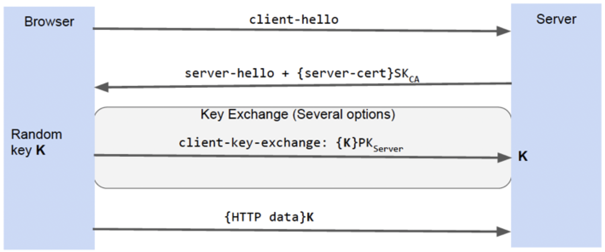
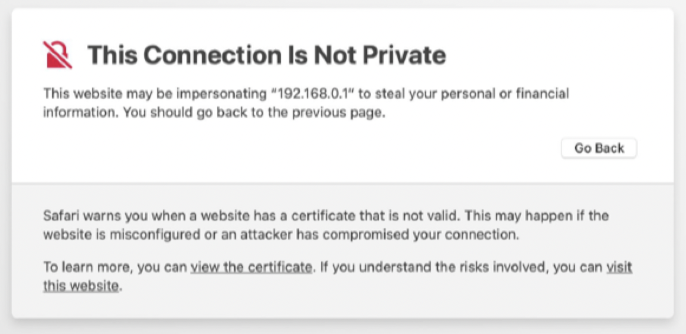

# Data validation and security

## Input data validation

### Validating inputs

- **Input validation** is the process of deciding if input values can be processed by the software
- Before starting to process the inputs, properly written programs check that **inputs are valid**
- Programs should be able to *recognize* invalid inputs and know what to do with such inputs
- It is fairly easy to write input validators -- but it is also easy to make mistakes

### Representing input domains

- Goal domains are often irregular
- Consider the goal domain for a *credit card*
    - First digit is the major industry identifier
    - First 6 digit and length specify the issuer
    - Final digit is a "check digit"
    - Other digits specify a specific account
- The **common specified** domain for credit card fields is
    - First digit is in $\{ 3,\, 4,\, 5,\, 6 \}$ 
    - Length is between 13 and 16
- The **common implemented** domain
    - All characters are numeric

### Bypassing client validation

- Client side HTML and JavaScript can impose and enforce constraints
    - JS can check input values
    - HTML can impose restriction such as `maxLength`
    - Implicit restrictions can be represented by different input fields
- Users can **violate constraints** (either accidentally or intentionally)
    - Client can disable JavaScript
    - Use browser tools to modify the HTML and/or JavaScript
    - Fuzzing your web application's input interface

### SQL injection

- Say a client sends a login request with the following body

```JSON
{
    username: "turing",
    password: "enigma"
}
```

- The resulting backend SQL query that would run to log the user in might look like

```SQL
SELECT username, password
FROM users
WHERE username='turing' AND password = 'enigma'
```

- If such credentials are taken directly from a form, a malicious user might submit the following data

```JSON
{
    username: "turing' OR '1'='1",
    password: "enigma' OR '1'='1"
}
```

- Such input could result in the following SQL query being executed which *changes* the intended action

```SQL
SELECT username, password
FROM users
WHERE username='turing' OR '1' = '1' AND password = 'enigma'  OR '1' = '1'
```

- To avoid SQL injection attacks, whenever user input becomes part of the SQL statement, used **prepared statements**
- A prepared statement forces the user input to be treated as content of a parameter, not as a SQL statement

### Code injection

- Say a web application has a message board component that lets users submit messages, which are stored in a database and displayed to other users like this

```HTML
<p>Hello, this is my message!</p>
```

- A malicious user can provide the message with embedded JavaScript code
- This particularly easy to attempt if messages can be written in a markup language

```HTML
<p>Hello, this is my message!</p>
<script> /* Bad stuff goes here */ </script>
```

- All users loading your message board are compromised

### Mitigation

- Treated user-provided input as strings only -- do not directly embed in HTML
- Modern JavaScript frameworks, such as React, escape embedded HTML automatically

```JSX
function App() {
    const userInput = "Hi, ";
    return (
        <div> {userInput} </div>
    );
}
```

- The output in browser will only be `Hi ` (the `` tag is escaped)

> Do not trust user input -- *always* apply input validation to all user inputs

## Security

- Personal identifiable information protection
- Privacy
- Legal liability
- Theft prevention (money and intellectual property)
- Malicious damage

### Security requirements for web applications

1) Authentication
    - Verify the *identity* of the parties involved
    - Who is it?
2) Authorization
    - Only allowed users are granted *access* to resources
    - Are you allowed?
3) Confidentiality
    - Ensure the *information* is given only to authenticated parties
    - Can you see it?
4) Integrity
    - Ensure that information is *not changed* or tampered with
    - Can you change it?

### Network attacks

- [Man-in-the-Middle](https://en.wikipedia.org/wiki/Man-in-the-middle_attack) threats
    - Attacker has access to network communication between browser and server
    - It is a passive attack, allowing eavesdropping on network traffic
- Active attacks manipulate the intended communication
    - Inject network packets
    - Modification of packets
    - Reorder, or replay packets
    - Blocking of packets

### Cryptography

- Solution: use encryption to prevent eavesdropping and detect active attacks
    - Old idea: scramble the information before transmitting it, unscramble when received
    - Encryption algorithms and keys guide the scramble/unscramble process
- There are two general cryptography algorithms
    - **Symmetric** key algorithms
        - Same key on both ends
        - Key distribution problem: how to exchange keys without meeting in person?
    - **Asymmetric** key algorithms
        - Each entity has two encryption keys: 1 public and 1 private
        - Information encrypted with one can *only* be decrypted with the other
        - Client encrypts data with server's public key: only the server can decrypt it
        - Server encrypts data with server's private key: clients are certain of authenticity if it can be decrypted with the public key

#### Public keys

How can we obtain the server's public key?

- Cannot just ask for it as we don't know if who we are asking is who they claim to be
- Instead, a **certificate authority** vouches for a server's public key
- A **certificate** is a document encrypted with the secret key of the certificate authority
    - Browsers are hard-coded to accept certificates from dozens of authorities

#### SSL/TLS based authentication

- Introduced by Netscape in the mid 1990's
- *Authenticates* the website (server) with the client browser, not the other way around
- Browser uses certificate to verify a server's identity
- Every HTTP message is **encrypted** to and from the server
- Has become the de-facto standard used for secure web-based transactions
- Usage is indicated by `https` in the URL and used the default port number of `443`



#### Problems

##### SSL stripping

- Common use pattern: users browse site with an HTTP connection and connection is upgraded to HTTPS for checkout
- Active network attacker interposes on communication
    - When server returns pages with HTTPS links, attacker can change them to HTTP
    - When browser follows those links, attacker intercepts requests, creates its own HTTPS to the origin server and forwards the request
    - As a result, the attacker sees all client packets
- Browser should provide feedback to user about whether HTTPS is in use, but most users won't notice a difference

##### Mixed content

- The main page might be loaded with HTTPS, but some internal content might be loaded with HTTP

```HTML
<script src="http://.../script.js"></script>
```

##### Bad certificates

- If a certificate is bad/unknown, browser should issue warning dialog
    - Most users cannot understand, so they just click OK
    - Even with repeated warnings, most users just ignore it



##### Too easy to obtain certificates

- It is too easy to obtain certificates that look like legitimate sites
    - Pressure on certificate authorities to issue certificates quickly
    - Certificate authorities only verify that an applicant has the right to a particular domain name and does not verify legal status of an organization
- Has been a push towards extended validation certificates

### Session attacks

- Session state is used to control access in web servers
- Typically derived from cookies in the request header
- Consider what would happen if an attacker could guess or steal this cookie

#### Hijacking

- If an attacker guesses or steals the cookie associated with your session, then he/she can impersonate you
- To prevent this, session IDs must be unpredictable

#### Protecting cookies

- Even if a session ID is chosen carefully, network attackers can read cookies from unencrypted connections
    - Sessions not using HTTPS are inherently vulnerable to network attacks
- The HTTP/HTTPS upgrade problem
    - Suppose session starts out with HTTP, converts to HTTPS after login
    - Network attacker can read session ID during HTTP portion of session
    - Once logging is complete, attacker can use the ID to hijack the logged in session
- Solution: change the session ID after any change in privilege or security level

### Service attacks

#### Denial of service (DoS)

- An attack that causes a service to fail by using up resources
- Makes the service unavailable and can be used to extort the service provider
- Resources could be at different layers of the stack
    - Use all bandwidth of the network coming to the web server
    - Use all network sockets on the web server
    - Overwhelm the CPU on the web server
    - Cause the device to run out of memory/storage

#### Distributed denial of service (DDoS)

- A denial of service attack that uses multiple attacking machines
- **Botnets** -- collection of compromised machines under control

#### Mitigation

- No perfect solution -- a really difficult problem
- Resource quotas: track resource consumption per user and provide way of cutting off users
- Make resources cost money: raise the cost or hassle for an attacker
- Use **CAPTCHA** (**C**ompletely **A**utomated **P**ublic **T**uring test to tell **C**omputers and **H**umans **A**part)
    - A type of web challenge to differentiate between computers and humans
    - Effective against DDoS attacks

### Social attacks

#### Phishing attacks

- Basic idea
    - Get unsuspecting users to visit an evil website
    - Convince them that the evil website is actually a legitimate site (such as a bank)
    - Trick the user into disclosing personal information (password, banking info, etc.)
    - Use the personal information for evil purposes
- Challenge: how to attract users?

#### Spoofing legitimate sites

- Copy the HTML of the real site
- Include images from the real site
- Many links refer back to the real site
- After collecting login info, log user into real site
- User has no idea that password has been stolen

#### Visual indicators

- URL
    - Can be obviously illegitimate
    - Can be more subtle: `www.thewest.com` vs `www.thevvest.com`
- Picture in picture
    - Illegitimate site uses `<iframe>` to show legitimate site
    - The legitimate site is a child element of the illegitimate site in some way
- Counter-measures
    - Help users identify legitimate sites
        - Use a lock symbol to indicate a HTTPS connection
        - Use a different color to indicate a HTTPS connection

