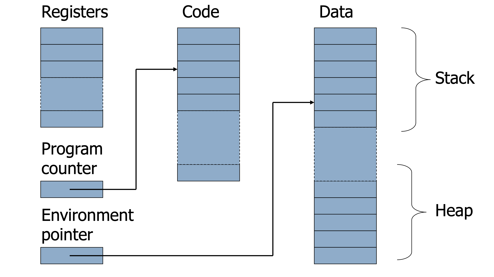

# Lecture 1

## Turing machines

### Alan Turing

- One of the founding fathers of computer science
- Created the Turing Machine computer model
	- Inspiration/premonition of the electronic computer
	- Predicted two decades beforehand
- Helped to track Nazi Enigma crypto system in WW2
- Invented the "Turing test" used in AI
- Legacy lives on in the Turing Award

### A thinking machine

- Goal: Model something that can compute anything a human could
	- As a philosophical endeavor, it could not be proven
	- Turing's thesis: any "algorithm" can be carried out by one of this machines
- Goal #2: Model something so simple that it can prove interesting epistemological results
	- Programs for cracking the Enigma showed Turing to be a true hacker
	- The machine is easily programmable, even if not practically useful
- Difficult to believe *any* algorithm could be carried out by such a device

### Turing machines

> A device with a finite amount of *read-only* memory (states), 
> and an unbounded amount of read/write tape-memory.
> There is no separate input. Rather, the input is assumed to reside
> on the tape at the time when the TM starts running

> Just as with automata, TM's can either be input/output
> machines (compare with Finite State Transducers), or yes/no
> decision machines. Start with yes/no machines.

### The successor program

#### Rules

- If read `1`, write `0`, go right repeat
- If read `0`, write `1`, HALT!
- If read `/`, write `1`, HALT!

#### Execution

- Carried out on a tape with the *reverse* binary representation of 47.

```
[1, 1, 1, 1, 0, 1, /, /, /, /]
[0, 1, 1, 1, 0, 1, /, /, /, /]
[0, 0, 1, 1, 0, 1, /, /, /, /]
[0, 0, 0, 1, 0, 1, /, /, /, /]
[0, 0, 0, 0, 1, 1, /, /, /, /]
HALT!
```

- The output on `111101` was `000011`
- This is the reverse binary representation of `48`
- Similarly, the successor of `127` should be `128`

```
[1, 1, 1, 1, 1, 1, 1, /]
[0, 1, 1, 1, 1, 1, 1, /]
[0, 0, 1, 1, 1, 1, 1, /]
[0, 0, 0, 1, 1, 1, 1, /]
[0, 0, 0, 0, 1, 1, 1, /]
[0, 0, 0, 0, 0, 1, 1, /]
[0, 0, 0, 0, 0, 0, 1, /]
[0, 0, 0, 0, 0, 0, 0, /]
[0, 0, 0, 0, 0, 0, 0, 1]
HALT!
```

## Imperative

### Imperative programming style

- Control flow statements
	- Conditional branches `if`
	- Unconditional branches `goto`
	- Loops
- Key operation: **assignment**
	- Side effect: updating state of the machine
- Oldest and most popular paradigm
	- Fortran
	- Algol
	- C/C++
	- Java
- Mirrors computer architecture
	- In a von Neumann machine, memory holds instructions and data



### Memory management

- Registers, code segment, program counter
- Data segment
	- **Stack** contains data related to block entry/exit
	- **Heap** contains data of varying lifetime
	- Environment pointer points to current stack position
		- Block entry: add new *activation record* to stack
		- Block exit: remove most recent activation record

### Control flow

- Flow is designed to be sequential
	- Instructions executed in order they are written
	- Some also support concurrent execution
- With branching and looping instructions
	- **If** something is true do this **else** do that
	- **Case** x is value 1 do this, x is value 2 do that, x is value 3 do that other thing
	- **While** something is true do this
	- Do this $n$ times

#### Branching originally (Fortran)

```Fortran
C AREA OF A TRIANGLE - HERON'S FORMULA  
C INPUT - CARD READER UNIT 5, INTEGER INPUT, ONE BLANK CARD FOR END-OF-DATA
C OUTPUT - LINE PRINTER UNIT 6, REAL OUTPUT  
C INPUT ERROR DISPAY ERROR MESSAGE ON OUTPUT

501 FORMAT(3I5)  
601 FORMAT(4H A= ,I5,5H B= ,I5,5H C= ,I5,8H AREA= ,F10.2,12HSQUARE UNIT 
602 FORMAT(10HNORMAL END)  
603 FORMAT(23HINPUT ERROR, ZERO VALUE)
      INTEGER A,B,C   
      10 READ(5,501) A,B,C
	  IF(A.EQ.0 .AND. B.EQ.0 .AND. C.EQ.0) GO TO 50 
	  IF(A.EQ.0 .OR. B.EQ.0 .OR. C.EQ.0) GO TO 90 
	  S = (A + B + C) / 2.0  
      AREA = SQRT( S * (S - A) * (S - B) * (S - C)) 
      WRITE(6,601) A,B,C,AREA
      GO TO 10
	  50 WRITE(6,602)
	  STOP   
	  90 WRITE(6,603)
      STOP 
      END
```

#### Goto in C

```C
# include <stdio.h>
int main(){
	float num,average,sum;
	int i,n;
	printf("Maximum no. of inputs: ");
	scanf("%d",&n);
	for(i=1;i<=n;++i){
		printf("Enter n%d: ",i);
		scanf("%f",&num);
		if(num<0.0)
			goto jump; 
		sum=sum+num;
	} 

	jump:
		average=sum/(i-1); 
		printf("Average: %.2f",average); 
		return 0;
}
```

#### Structured control flow

- Program is **structured** if control flow is evident from syntactic (static) structure of program text
- **Hope**: programmers can reason about dynamic execution of a program by just analyzing program text
- Eliminate complexity by creating language constructs for common control-flow patterns

#### Historial debate

- Dijkstra considered `goto` statement harmful
- Knuth believed `goto` is usable, but do so in a structured way
- General questions
	- Do syntactic rules force good programming style?
	- Can the help?

#### Structured programming

- Standard constructs that structure jumps
	- if ... then ... else ... end
	- while ... do ... end
	- for ... { ... }
	- case ...
- Group code in logical blocks
- Avoid explicit jumps (except function return)
- Cannot jump **into** the middle of a block or function body

### Assignment

#### What you thought you knew

```python
x = 3
x = y + 1
x = x + 1
```

- Informally
	- Set x to 3
	- Set x to the value of y plus 1
	- Add 1 to x
- Formally
	- On the RHS of an assignment, use the variables R-value
	- On the LHS of an assignment, use the variables L-value
	- So `x = x + 1` would mean: get R-value of x, add 1, store the result into the L-value of x
	- An expression without an L-value cannot appear of the LHS of an assignment

#### Locations and values in imperative style

- When a name is used
	- It is bound to some **memory location**
	- It becomes its identifier
- L-value: memory location (address)
- R-value: value stored at the memory location identified by an L-value
- Assignment is a *destructive* update
	- Overwrites the memory location identified by LHS with value of expression on RHS

#### L-values and R-values

- Any expression or assignment statement in an imperative language can be understood in terms of L-values and R-values of variables involved
- Literal constants have R-values, but no L-values
- Variables have both R-values and L-values
- Pointer variables
	- Their R-values are L-values of another variable
	- Intuition: the value of a pointer is an address
- Overriding R-value and L-value computation in C
	- `&x` always returns the L-value of x
	- `*p` always returns the R-value of p

#### Copy vs. reference semantics

- **Copy semantics**: expression is evaluated to a value, which is copied to the target
	- Used by imperative languages
- **Reference semantics**: expression is evaluated to an object, whose pointer is copied to the target
	- Used by object oriented languages


#### Type variable declarations

- Typed variables declarations restrict the values that a variable may assume during program execution
	- Built in types or user defined
	- Initialization
- Variable size
	- How much space needed to hold values of this variable

#### Variables vs. names

- Variables: pieces of memory that hold values of a certain type; bound to names
- **Names don't have types; values do**

### Assignment vs. construction

- Unconstrained use of assignment -> more imperative

```
int x;
x = 3;
mylst = []
for n in range(10):
	mylst[n] = n
```

- Constrained use of assignment (construction of object only) -> less imperative

```
int x = 3;

mylst = [n for n in range(10)]
```

#### The problems with stateful code

- Harder to trace than stateless code
- Does not play well with concurrency