# Lecture 17

## Historical languages

### Good old times

- Flat memory
- No names

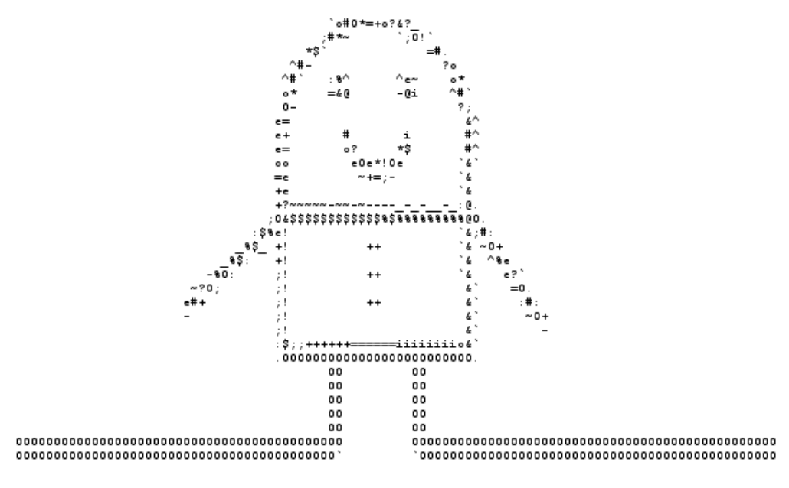

### Go forth

- Stack machine

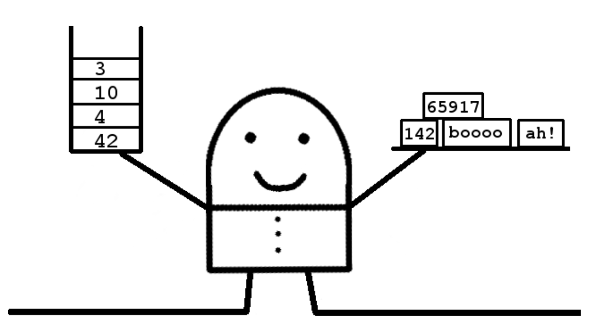

## Basics of PLs

### Monolithic

- NO definition of abstractions
- NO use of abstractions

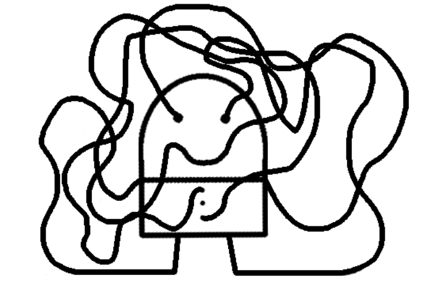

### Cookbook

- Shared state
- Steps

### Candy factory

- No shared state
- Pipeline of functions

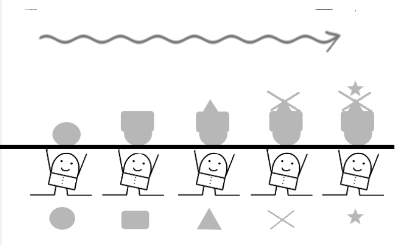

### Code golf

- As few lines of code as possible

## Function composition

### Infinite mirror

- Induction
- AKA recursion

### Kick teammate forward

- Extra function parameter(callback)
- That function called at the end

### The one

- Universal object wraps around values
- Chains functions via bind

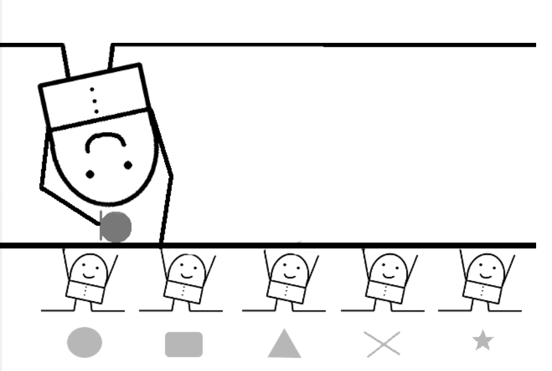

## Objects and object interactions

### Things

- Capsules of data exposing procedures

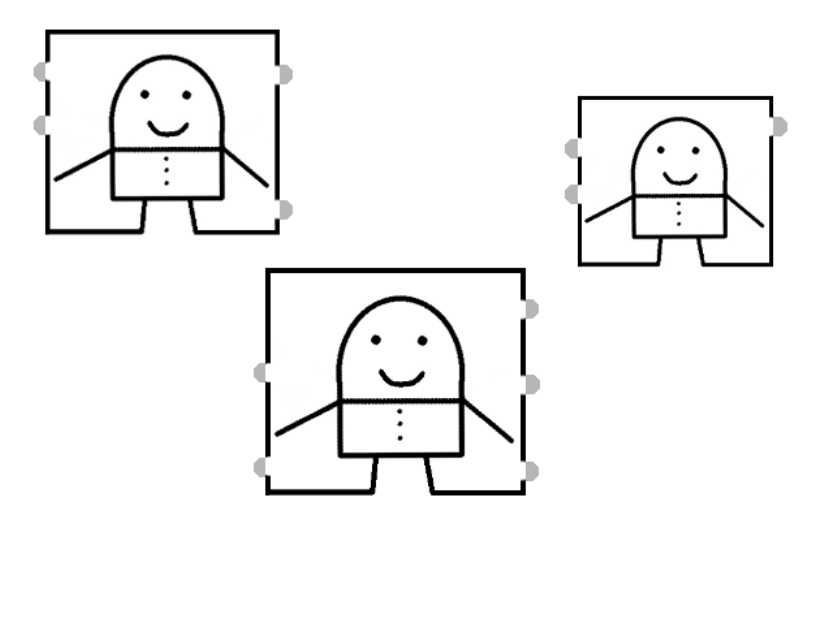

### Letterbox

- Single procedure: receive message

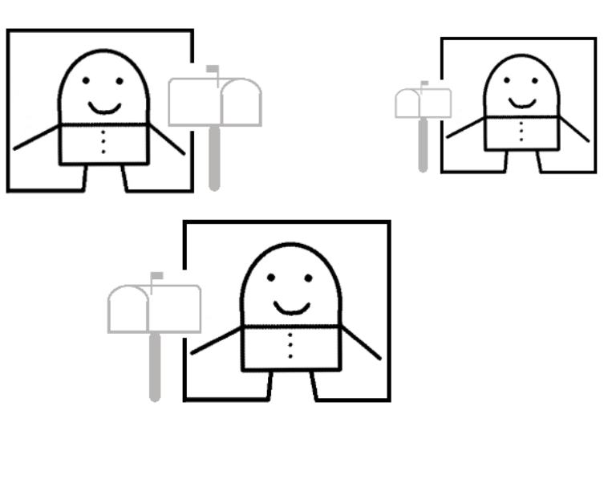

### Closed maps

- Hashes mapping keys to data or procedures

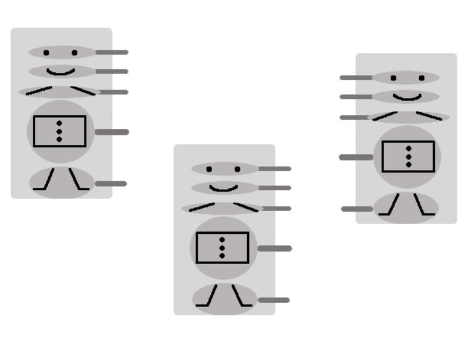

### ADTs

- Abstract interfaces to things

### Hollywood

- "Don't call me, I'll call you"

### Bulletin board

- Publish events
- Subscribe to events

## Reflection and metaprogramming

### Introspection

- The program sees itself

### Reflection

- The program changes itself

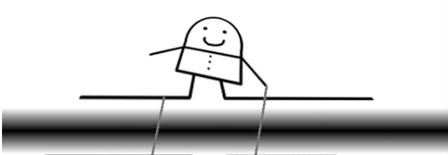

### Asides

- A separate piece of code affects base functions

### Plugins

- Alternatives loaded dynamically

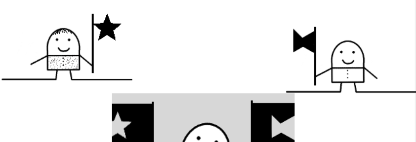

## Adversity: dealing with the outside world

### Constructivist

- Just fix it
- Hope for the best

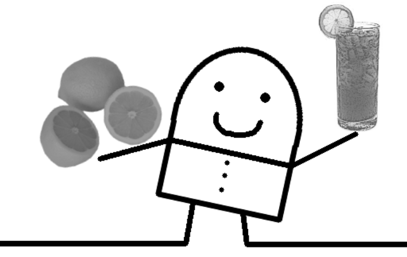

### Tantrum

- NO GO!

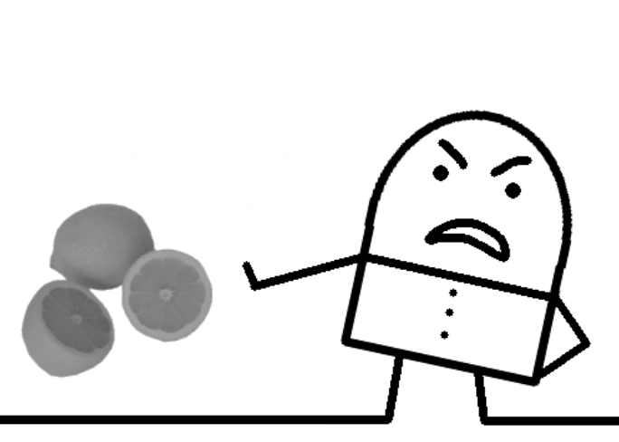

### Passive-aggressive

- No go, but
- I don't want to deal with it

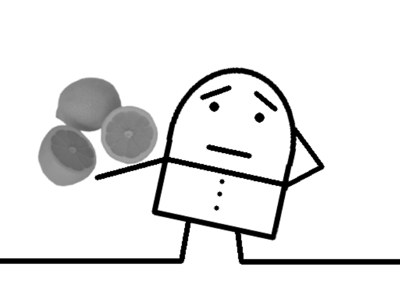

### Declared intentions

- Good types or else

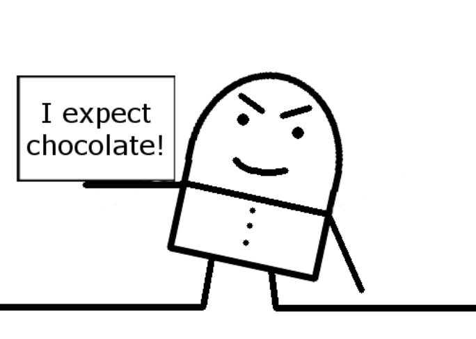

### Quarantine

- IO: eeeeewww!
- Isolate IO functions

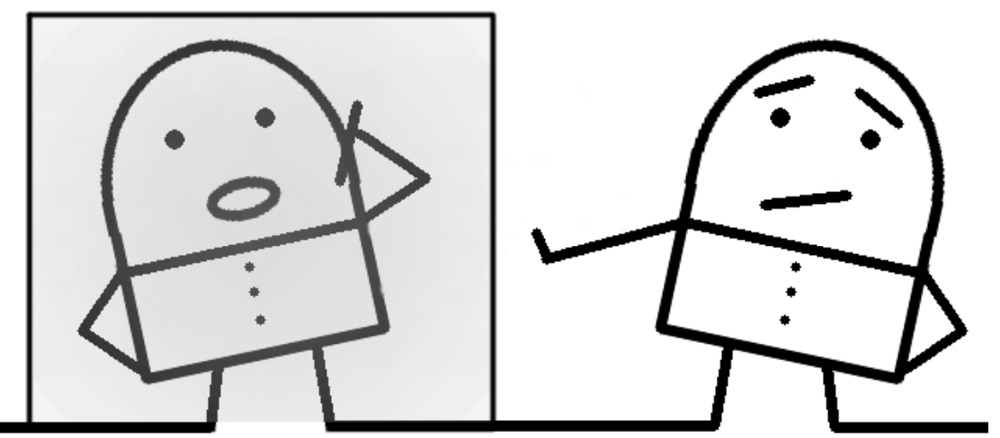

## Data-centric concepts

### Persistent tables

- Relational data
- Queries over data

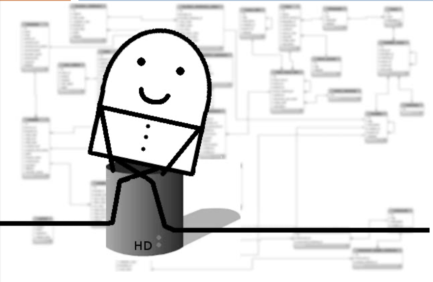

### Spreadsheet

- Data with associated update functions
- Functions invoked when data changes

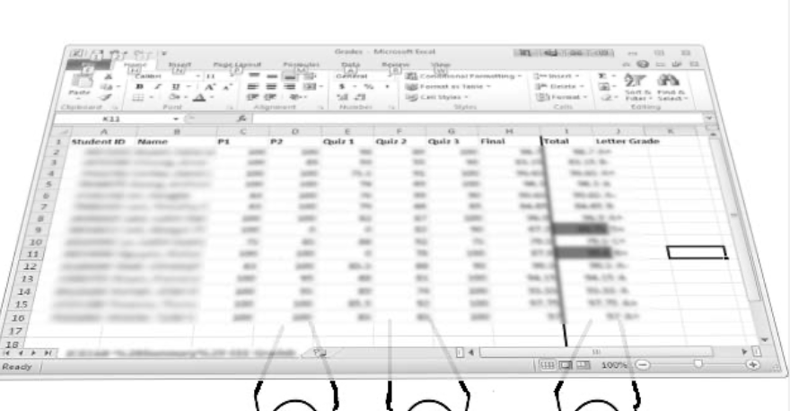

### Lazy rivers

- Iterators
- Generators

## Concurrency

### Free agents

- Things with threads
- Message passing
- Thread-safe queues

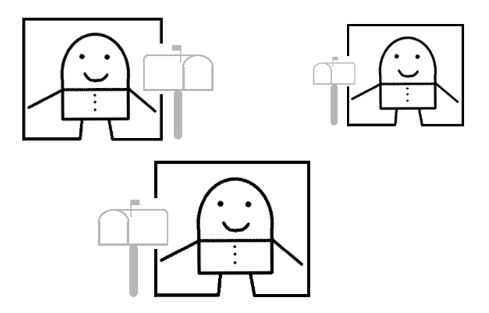

### Dataspaces

- Thread-safe data spaces
- Workers get/put data in them

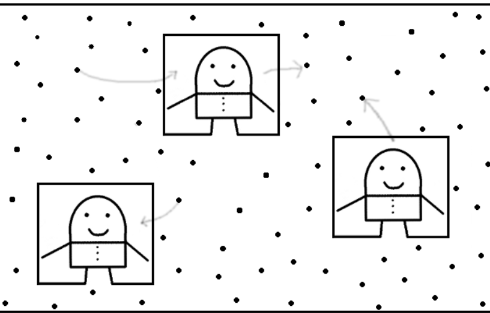

### Map reduce

- Data is partitioned in independent chunks
- Chunks given to workers (mappers)
- Partial results given to workers (reducers)

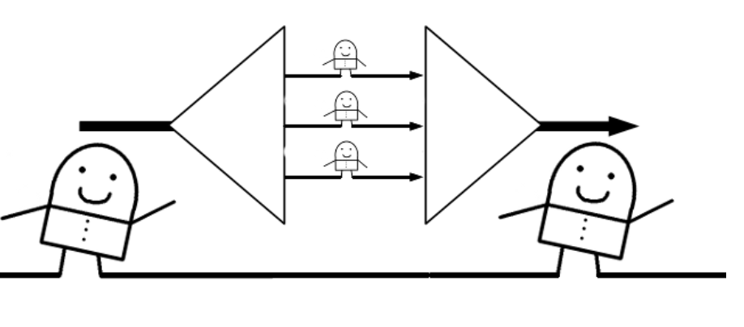

## Interactivity

### Trinity model/view/controller

- 3 categories of code elements

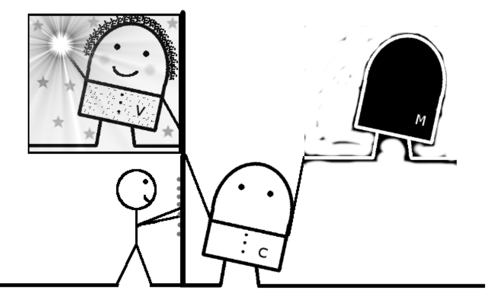

### RESTful/forgetful

- Request-Response interaction
- Resources
- Uniform interfaces
- Hypermedia as engine of app state

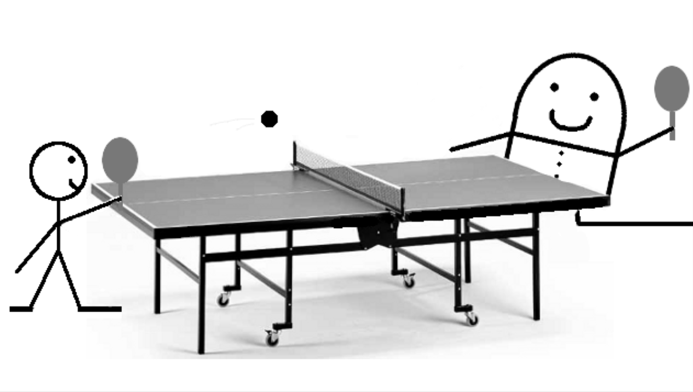
