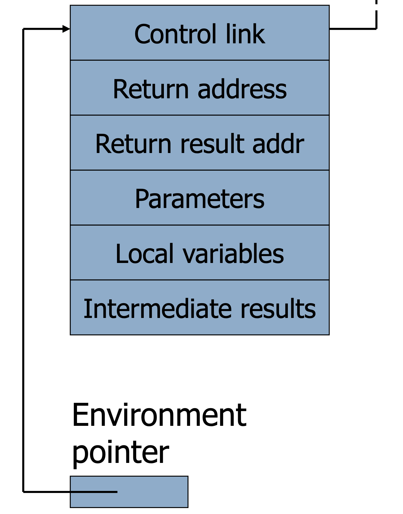
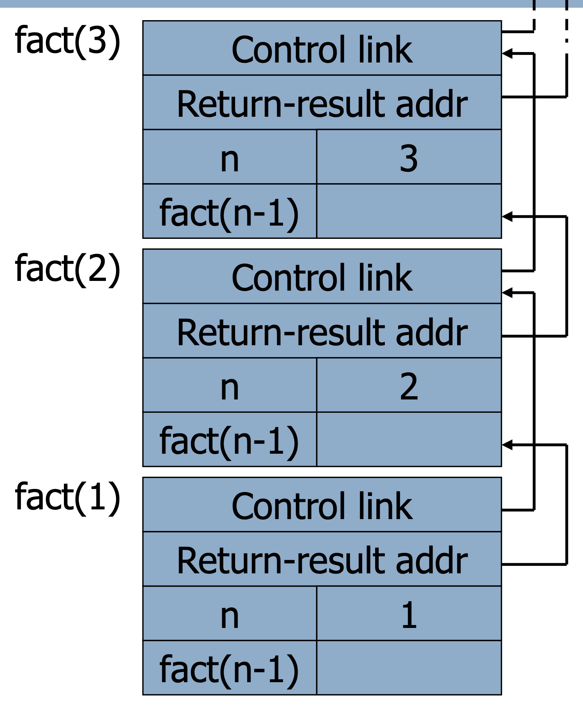

# Lecture 2

## Functions and procedures

### Subroutines (aka procedures)

- Historically: block of instructions executed several times during program execution
- May have 0 or more input arguments
- May have 0 or more output arguments
- May perform IO, side effects

### Functions

- Take 0 or more input arguments
- Return **one** value
- Used as *expressions*
- Constraint for **pure** functions: has no side effects

### Procedures vs. functions

- Distinction existed as early as 1958 (FORTRAN)
- Distinction lost of some point, mainstream PLs merged the two concepts into one

#### Subroutine

```FORTRAN
subroutine square_cube(i,isquare,icube) 
	integer, intent(in) :: i ! input 
	integer, intent(out) :: isquare,icube ! output 
	isquare = i**2  
	icube = i**3
end subroutine square_cube
```

```Fortran
program xx
	implicit none
	integer :: i,isq,icub
	i = 4
	call square_cube(i, isq, ,icub)
	print*, "i, i^2, i^3=", i, isq, icub
end program xx
```

#### Function

```Fortran
function func(i) result(j)
	integer, intent(in) :: i ! input
	integer             :: j ! output
	j = i ** 2 + i ** 3
end function func
```

```Fortran
program xfunc
	inplicit none
	integer :: i
	integer :: func
	i = 3
	print*, "sum of the square and cube of", i, " is", func(i)
end program xfunc
```

### Pure functional programming

- Mathematical functions
	- No side effects
	- No IO (other than at the beginning and the end)
- Higher order functions
	- Functions can take functions as arguments
	- Functions can return functions as values

## Functions and procedure calls

### Function definition

```
def: fact(n) if n<=1 then 1 else n * fact(n - 1)
```

### Activation records for functions

- Block of information associated with each function call
	- Parameters
	- Local variables
	- Return address
	- Location to put return value when function exits
	- Control link to the caller's activation record
	- Saved registers
	- Temporary variables and intermediate results
	- Access link to the function's static parent
- Layout
	- return address: location of code to execute on function return
	- return-result address: address in activation record of calling block to receive returned value
	- parameters: locations to contain data from calling block



### Runtime stack

- Activation records are kept on the **stack**
	- Each new call pushes an activation record
	- Each completing call pops the topmost one
	- Stack has all records of all active calls at any moment during execution (topmost record is the most recent call)
- Example: `fact(3)`
	- Pushes one activation record on the stack, calls `fact(2)`
	- This call pushes another record calls `fact(1)`
	- This call pushes another record resulting in three activation records on the stack



### Takeaways

- Functions are ephemeral
	- The execute and go away
- Pure functions are the most ephemeral of all
	- They don't leave traces of their execution
	- Good for concurrency, testing, etc.

## Lambda calculus

### History

- Formal mathematical system
- Simplest programming language
- Intended for studying functions, recursion
- Invented in **1936** by Alonzo Church (1903 - 1995) 
	- Same year as Turing's paper

### Warning

- May seem trivial and/or irrelevant **now**
- May remind you of [Brainf\*ck](https://en.wikipedia.org/wiki/Brainfuck)
- Had a tremendous influence in PLs
	- $\lambda$ calculus -> Lisp -> everything else
- Context in the early 60s
	- Assembly languages
	- Cobol
	- Unstructured programming

### What is Calculus?

> Calculus is a branch of mathematics that deals with limits and the differentiation and integration of functions of one or more variables

### Real definition

- A *calculus* is just a bunch of rules for manipulating symbols.
- People can give meaning to those symbols, but that's not part of the calculus
- Differential calculus is a bunch of rules for manipulating symbols. There is an interpretation of those symbols corresponds with physics, slopes, etc.

### Syntax

- Rules
	- $M ::= x \, \vert \, \lambda x.M \, \vert \, MM$ 
	- $M$ can be an expression of
		- a variable
		- an abstraction
		- an application
- Nothing else!
	- No numbers
	- No arithmetic operations
	- No loops
	- No etc.
- Symbolic computation
	- $\lambda x.M$ -> `functions(x) { M }`
	- $\lambda x.N \, y$ -> apply $L$ to $M$ where $L = \lambda x.N$ and $M = y$

### Terminology

- The *binding operator* $\lambda$ **binds** the variable `x` in the $\lambda$ term $x.M$
	- $M$ is the called the scope of `x`
	- $x$ is said to be a *bound variable*
- Free variables are all symbols that aren't bound
	- $FV(x) = \{x\}$
	- $FV(MN) = FV(M) \cup FV(N)$ 
	- $FV(x.M) = FV(M) − x$
- Renaming of bound variables is a $\alpha$ conversion
	- $\lambda x.M = \lambda y.([y/x]M)$
	- if `y` not in `FV(M)`

### Operational semantics

- Evaluation function application: $(\lambda x.e_{1}) e_{2}$
	- Replace every $x$ in $e_{1}$ with $e_{2}$
	- Evaluate the resulting term
	- Return the result of the evaluation
- Formally: $\beta$-reduction (aka "substitution")
	- $(\lambda x.e_{1})e_{2} \to_{\beta} e_{1}[e_{2}/x]$
	- A term that can be $\beta$-reduced is a *redex* (reducible expressions)
	- We omit $\beta$ when obvious

### Scoping

- Scope of $\lambda$ extends as far to the right as possible
	- $\lambda x.\lambda y.xy$ is $\lambda x.(\lambda y.(x ))$
- Functions application is left-associative
	- $xyz$ means $(xy)z$
- Possible syntactic sugar for declarations
	- $(\lambda x.N)M$ is `let x = M in N`
	- $(\lambda x.(x + 1))10$ is `let x=10 in (x + 1)`

### Multiple arguments

- $\lambda (x, y).e$
	- Doesn't exist
- Solution: $\lambda x.\lambda y.e$
	- A function that takes $x$ and returns another function that takes $y$ and returns $e$
	- $(\lambda x.\lambda y.e) \, a \, b \to (\lambda y.e[a/x]) \to e[a/x][b/y]$
	- "Currying" after Curry: transformation of multi-arg functions into hight order functions

> Multiple argument functions are nothing but syntactic sugar


### Numbers

- Numbers are counts of things, any things.
- Like function applications
- Church numerals: all functions of two arguments
	- $0 = \lambda f.\lambda x.x$
	- $1 = \lambda f.\lambda x. (f \, x)$
	- $\dots$
	- $N = \lambda f.\lambda x. (f^{N} \, x)$

### Successor function in lambda calculus

$$
	succ = \lambda n. \lambda f. \lambda x. f(n \, f \, x)
$$

- Try `succ(1)`
	- $\lambda n. \lambda f. \lambda x.f(n \, f \ x)(\lambda g.\lambda y.(g \, y)$
	- $\lambda f.\lambda x.f(\lambda g.\lambda y.(g \, y) \, f \, x)$
	- $\lambda f. \lambda x. f( \lambda y. (f \, y) \, x)$
	- $\lambda f. \lambda x. f(f \, x)$ <-- That is 2 in the church numerals