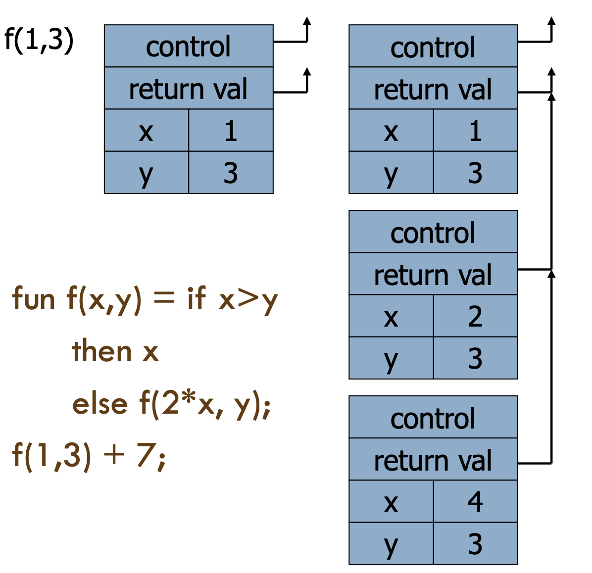

# Lecture 4

## Function composition

### Recursion

#### Prototypical example

```Python
def fact(n):
	if n <= 1: return 1
	else: n * fact(n-1)
```

#### Thinking recursively

- Add numbers in a list
- Print a list of numbers
- Check if a number is in a list

#### Tail recursion

- Function `g` make a **tail call** to function `f` if return value of `f` *is* the return value of `g`

```Python
def g(x):
	if x > 0: return f(x)  # a tail call
	else: return f(x) * 2  # not a tail call
```

- Optimization
	- Can pop current activation record on a tail call
	- Useful for recursive tail call because next activation record has exactly same form
	- Tail recursive function is equivalent to iterative loop



#### Tail recursion and iteration


### Higher-order functions

#### What are they?

- Function passed as argument
	- Need pointer to activation record "higher up" in the stack
- Function returned as the result of function call
	- Need to keep activation record of the returning function
- Functions that take function(s) and input and return functions as output are known as **functionals**

#### Return function as result

- Language feature
- Function that return *new* functions
- Function is "created" dynamically
	- Expression with free variables
	- Values determined at runtime
- Function value is closure = $\langle \, env, \, code \rangle$

```Python
def compose(f, g):
	return lambda x: g(f(x))
```

#### Named vs. anonymous functions

- The two functions below do the same thing

```Python

# This has a name
def add(x, y):
	return x + y


# This does not have a name
lambda x, y: x + y
```

#### Lambdas

- Functions with no name
- Names can be given like any other variable assignment
- Why?
	- Sometimes a name is too much overhead
	- In OOP, sometimes we just need a plain old function and not a method

#### Closures

- Function value is pair **closure** = $\langle \, env, \, code \rangle$
	- Statically scoped function must carry a link to its static environment with it
	- Only needed if function is defined in a nested block
- When a function represented by a closure is called
	- Allocate activation record for call (as always)
	- Set the access link in the activation record using the environment pointer from the closure
- Function with free variables that are bound to values in the enclosing environment

```Python
(lambda (x) (lambda (y) x + y))

def makeInc(x):
	# x is "closed" in the definition of inc
	def inc(y):
		return y + x
	return inc
```

- Why?
	- For changing your mind later
	- Replaces constants and variables with functions
	- Replaces conditionals

### Continuations

#### What are they?

- Representation of the control state of a program
	- Data structure available to the programmer instead of hidden
	- Contains the current stack and point in the computation
- Can be later used to return to that point
- Provide elegant concept for arbitrary flow control

#### What are they good for?

- Everything control flow!
	- Co-routines
	- Exceptions
	- Preserving flow in non-blocking I/O

#### Continuation nature of exceptions

```javascript
function fact (n) {
  if (n < 0)

    throw "n < 0" ;
  else if (n == 0)

    return 1 ;
  else

    return n * fact(n-1) ;
}

function total_fact (n) {
  try {

    return fact(n) ;
  } catch (ex) {

    return false ;
  }

}

document.write("total_fact(10): " + total_fact(10));
document.write("total_fact(-1): " + total_fact(-1)) ;
```

```javascript
function fact (n,r,t) {
 if (n < 0)
   t ("n < 0")
 else if (n == 0)
	r(1)
 else
   fact(n-1,
        function (t0) {
			r (n*t0) ;
        },
        t)

}

function total_fact (n,ret) {
  fact (n,ret,
    function (ex) {
      ret(false);

	}); 
}
```

#### I/O and continuations

```javascript
contents = fs.ReadFile(path); // Blocks here until we have the retult

fs.ReadFileAysnc(path, lambda(contents) {
				 with contents do blah
});
```

- It's a call back!
- **It's the "current continuation" of the blocking form**
- JavaScript is FULL of this, so are jquery and node.js

### Monads

#### What's the problem?

- How to affect the world?
- Problem is more prevalent in pure functional programming style
	- No side-effects
	- That's right: no side-effects!
- But you've all seen it too!

#### Why no side effects?

- Easier to test: **idempotent** functions
- Easier to parallelize
- But the world is *ALL* about side-effects
	- Storage, network, UI
	- Programs affect and control objects and activities in the real world

#### A tracing monad

```python
def hypotenuse(x, y):  
	return math.sqrt(math.pow(x, 2) + math.pow(y, 2))

# Now we want to trace it, or affect the world in it

def hypotenuse(x, y):
	h = math.sqrt(math.pow(x, 2) + moth.pow(y, 2))
	print("In hypontenuse " + h)
	return h
```

```python
def hypotenuse(x, y):  
	h = math.sqrt(math.pow(x, 2) + math.pow(y, 2))
	return h, “In hypotenuse” + h
```

- Signature was: `float, float -> float`
- Signature now is: `float, float -? float, string`

#### What is a monad?

- It's a container
- An active container ... it has behavior to
	- Wrap itself around a `[typed]` value
	- Bind *functions* together
- `[A type constructor, m`
- A function that builds values of that type
	- `a -> m a`
	- What you'd normally call a constructor in OOP
- A function. (bind) that combines values `[of that type]` with computations that product values `[of that type]`
	- `m a -> (a -> m b) -> m b`
- An unwrap function that shows "what's inside"