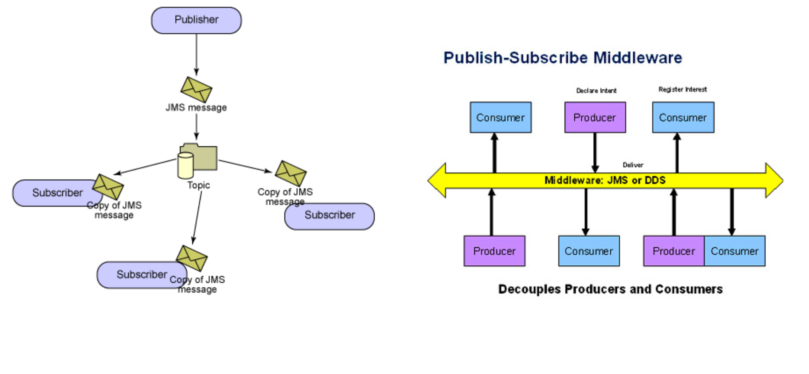

# Lecture 8

## Inversion of control

### What is it?

- Usually, your code calls library code
- With inversion of control, library code calls your code
- Accumulation of callbacks to be called at specific times
- Popularized in OOP frameworks in the 80s
- Posts on the internet usually describe dependency injection

### Enablers

- Higher-order functions
- Objects
- Abstract data types
- Inheritance

### Callbacks

- Pass another function as a parameter when calling a function
- The called function will eventually call the function passed to it

### Frameworks

- More than a library, a generic component or even application
- Parts of it are customized by user's code via inversion of control
- Allows developers to build complete components/applications, with small customizations on deployment sites

## Event driven

### Basic idea

1) Register for event
2) Event occurs
3) Call back happens

### Event driven frameworks

- Popularized by GUI's
- Popularized by OOP
- Typically OO< but OO not necessary
	- In functional programming, higher order functions are the handlers

## Publish and subscribe



- Producers: publish events
- Consumers: register for events
- Decouples components

## Adversity

### Approaches to failure

- Let it fail
	- Good in development: understand failure mode
- Defend against the possible and the impossible
	- Good in production. Detect and ...
		- Correct?
		- Ignore?
		- Report?
		- Pass up?
		  Stop?
- Prevent
	- Ideal(ist)

### Obliviousness

- Failure is an option
	- Especially when you learn from it to avoid it in the future
- Obliviousness exposes problems
	- Better than hiding them
	- Shows you failure conditions you might not have considered
- Fix as you go, during development
- Avoid in production

### Defensive

- Detect every possible failure
- Paranoid: detect unlikely failure too

### Reaction to failures

#### Overreaction is bad

```Java
public class Person {
    private String name = null;

	public void setName(String name) {
		this.name = name;
	}

	public String getName() {
		return name;
	 } 
}

public Person newPerson(String name) { 
	Person person = new Person();  
	if (name != null) {  // If name is null, name is not set
		person.setName(name);
	}
    return person;
}
```

#### Laziness is bad

```Java
void addFriendToList(List<Friend> friends, Friend newFriend) {
	if (friends != null && newFriend != null) {
		friends.add(newFriend); // Fails silently
	}
}
```

```Java
void addFriendToList(List<Friend> friends, Friend newFriend) {
	friends.add(newFriend); // Fails loudly, but might be generic or vague
}
```

```Java
void addFriendToList(List<Friend> friends, Friend newFriend) {
	if (friends != null && newFriend != null) {
		friends.add(newFriend); 
	}
	else {
		throw new Exception("Specific error message") // Fail loudly and specifically
	}
}
```

### Spectrum of reactions

#### Recover

```Java
public class Person {
	private String name = "Unknown User";

	public void setName(String name) {
		this.name = name;
	}

	public String getName() {
		return name;
	}
}

public Person(String name) {
	Person person = new Person();
	if (name != null) {
		person.setName(name);
	}
	// otherwise, use default
	return person;
}
```

#### Report and proceed

```Java
public class Person {
	private String name = "Unknown User";

	public void setName(String name) {
		this.name = name;
	}

	public String getName() {
		return name;
	}
}

public Person(String name) {
	Person person = new Person();
	if (name == null) {
		log.Warn("Person constructor given null name arg")
	}
	person.setName(name);
	// otherwise, use default
	return person;
}
```

#### Pass up

```Java
public class Person {
	private String name = "Unknown User";

	public void setName(String name) {
		this.name = name;
	}

	public String getName() {
		return name;
	}
}

public Person(String name) {
	Person person = new Person();
	if (name == null) {
		throw new Exception("null name")
	}
	person.setName(name);
	// otherwise, use default
	return person;
}
```

#### Fail fast

```Java
public class Person {
	private String name = "Unknown User";

	public void setName(String name) {
		this.name = name;
	}

	public String getName() {
		return name;
	}
}

public Person(String name) {
	Person person = new Person();
	if (name == null) {
		log.Warn("Person constructor given null name arg")
		System.exit(1);
	}
	person.setName(name);
	// otherwise, use default
	return person;
}
```

### Preventing failures

- Quarantine vulnerable code
- Type checking
- Testing

#### Vulnerable code

- Anything that deals with IO
	- From users
	- From network
	- From database

#### SQL injection attacks

> SQL injection is a security vulnerability that occurs in the database layer of an application. Its source is the incorrect escaping of dynamically-generated string literals embedded in SQL statements

##### Impact

- At best: leak information
- Depending on your configuration
	- Delete, alter or create data
	- Grand direct access to DB
	- Escalate privileges and event take over the OS

##### Example

- Login attack
	- Hacker puts SQL code in your forms. Potentially changing the meaning of the SQL statement

```SQL
SELECT *
FROM users
WHERE login = userName + and password=password
```

- The dynamically build SQL string can become this if login is `'' or '' = ''; --' and password=''`

```SQL
SELECT * FROM
users WHERE login = '' or '' = ''; --' and password=''
```

- Statement is always true, logins get dumped

#### Preventing SQL injection

- Use prepared statements (aka parameterized queries)
	- `$id = 1234`
	- `SELECT * FROM accounts WHERE id = $id`
- Validate input
	- Strong typing
	- Business logic validation
- Escape questionable characters (ticks, --, semi-colon, brackets, etc.)

#### More than SQL

- Injection flaw is a blanket term
- SQL injection is most prevalent
- Other forms
	- XPath injection
	- Command injection
	- LDAP injection
	- DOM injection
	- JSON injection
	- Log spoofing

### IO Monad

- An explicit reminder that you can't trust IO
- Promote IO-bound functions to higher-order
- Don't run until you make an effort