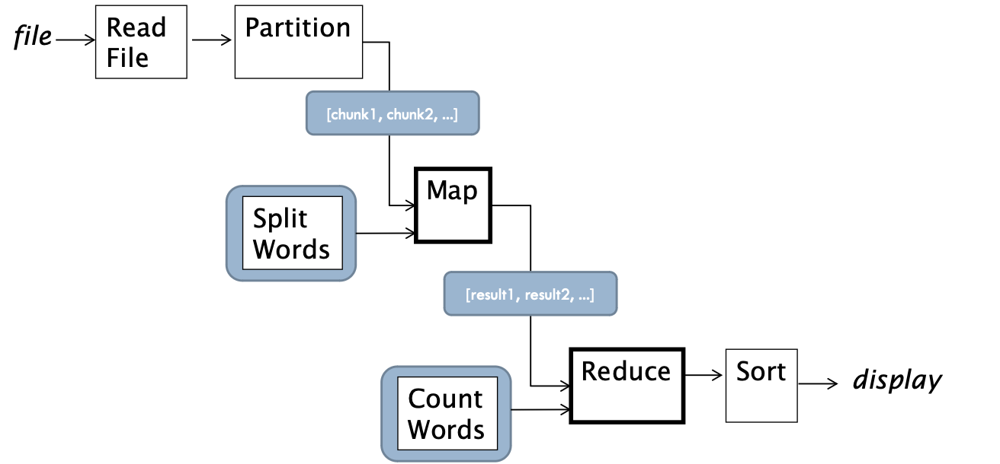
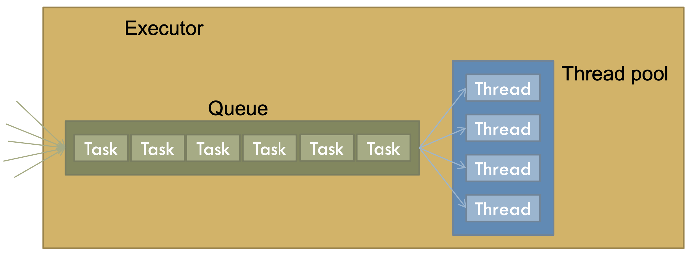

# Lecture 15

## Threads

- Cute and furry beasts
- Must be restrained

## Actors

### Model

- An actor is an object with its own thread
- Actors send messages to each other
	- Avoids shared memory
- Messages are placed in actors' queues
	- Queues must be "thread-safe"
	- Sender places message and moves on (asynchronous request)
- Concurrency constrained by
	- Associating (certain) objects with threads
	- Using message queues in each actor
	- Having threads on a loop
- Programmer needs to refrain from passing shared mutable objects around or else...

### Active object

```Python
class ActiveWFObject(Thread):
	def __init__(self):
		Thread.__init__(self)
		self.name = str(type(self))
		self.queue = Queue() # Thread-safe queue
		self._stop = False
		self.start()

	def run(self):
		while not self._stop:
			message = self.queue.get() # Blocks until msg recvd
			self._dispatch(message)
			if message[0] == 'die':
				self._stop = True

# Utility (could be a method)
def send(receiver, message):
	receiver.queue.put(message)
```

### Queues

- Put / enqueue / send
- Get / dequeue / receive
- Operations must be thread safe
	- No items can be lost
- Thread-safe queues
	- Java: `ArrayBlockingQueue`
	- C#: `ConcurrentQueue`
	- C++: `message_queue` from boost
	- Other: search for it or do it yourself

## Tuple spaces

### Model

- Concurrent threads
	- Consumers and producers of data items
- Shared data structures
	- Must be thread safe
- Producers add items and move on
	- Asynchronous deposit
- Consumer take items and process them
- Similar to actors, but queues are **outside** the objects/functions
- Can be function or OOP style
	- OOP style: worker functions are threaded objects
- Best fit: data processing parallelization
- Concurrency constrained by
	- Having shared, thread-safe collections of items
	- Having producers/consumer of items in those collections
	- No further communication between threaded code
- Programmer needs to refrain from passing shared mutable objects around or else...

### Data spaces

```Python
word_space = Queue.Queue()
freq_space = Queue.Queue()
```

### Producer

```Python
for word in re.findall('[a-z]{2,}', open(sys.argv[1]).read().lower()):
	word_space.put(word)
```

### Consumer

```Python
def process_words():
	word_freqs = {}
	while True:
		try:
			word = word_space.get(timeout=1)
		except Queue.Empty:
			break
		if not word in stopwords
			if word in word_freqs:
				word_freqs[word] += 1
			else:
				word_freqs[word] = 1
	freq_space.put(word_freqs)
```

### Starting workers

```Python
workers = []
for _ in range(5):
	workers.append(threading.Thread(target = process_words))
[t.start() for t in workers]
```

## Map-reduce

### Model

- Big data situations
	- Problem at hand must be data-parallelizable
- Data is split into chunks
- Chunks are processed independently, produce partial results
	- A function is "mapped" to the chunks of data, **potentially in parallel**
- Partial results are then "reduced" to final result
	- This step is sequential
- Concurrency constrained by
	- Having worker threads work on mutually exclusive chunks of data
	- No communication between threaded code



### Data partitioning

```Python
def partition(data_str, nlines):
	"""
	Partitions the input data_str (a big string)
	into chunks of nlines
	"""
	lines = data_str.split('\n')
	for i in xrange(0, len(lines), nlines):
		yield '\n'.join(lines[i:i+nlines])
```

### Mapper

```Python
def split_words(data_str):
	"""
	Takes a string, returns a list of pairs (word, 1),
	one for each word in the input, so
	[(w1, 1), (w2, 1), ..., (wn, 1)]
	"""
	def _scan(str_data):
		pattern = re.compile('[\W_]+')
		return pattern.sub(' ', str_data).lower().split()

	def _remove_stop_words(word_list):
		with open('../stop_words.txt') as f:
			stop_words = f.read().split(',')
		stop_words.extend(list(string.ascii_lowercase))
		return [w for w in word_list if not w in stop_words]

	# The actual work of splitting the input into words
	result = []
	words = _remove_stop_words(_scan(data_str))
	for w in words:
		result.append((w, 1))
	return result
```

### Reducer

```Python
def count_words(pairs_list_1, pairs_list_2):
	"""
	Takes a two lists of pairs of the form
	[(w1, 1), ...]
	and returns a list of pairs [(w1, frequency), ...],
	where frequency is the sum of all the reported occurrences
	"""
	mapping = dict((k,v) for k, v in pairs_list_1)
	for p in pairs_list_2:
		if p[0] in mapping:
			mapping[p[0]] += p[0]
		else:
			mapping[p[0]] = 1
	return mapping.items()
```

### Regroup

```Python
def regroup(pairs_list):
	"""
	Takes a list of lists of pairs of the form
	[[(w1, 1), (w2, 1), ..., (wn, 1)], [(w1, 1), (w2, 1), ..., (wn, 1)]]
	and returns a dictionary mapping each unique word to the corresponding list of pairs
	{
		w1: [(w1, 1), (w1, 1), ...],
		w2: [(w2, 1), (w2, 1), ...],
		...
	}
	"""
	mapping = {}
	for pairs in pairs_list:
		for p in pairs:
			if p[0] in mapping:
				mapping[p[0]].append(p)
			else:
				mapping[p[0]] = [p]
	return mapping
```

## Thread pools/executors

### Problem with threads

- Costly to create them
	- Allocation and initialization of a large block of memory
	- System calls to use native OS threads
	- Creation of bookkeeping structures in virtual memory

### Solution: thread pools + executor

- A pool of threads is created at the very beginning and never killed
- Work tasks are assigned to threads in that pool in some way. When work is done, the worker thread becomes available for other tasks
- A queue is typically used to place work tasks as they come
- Executor: the object that drives the allocation of tasks to threads



