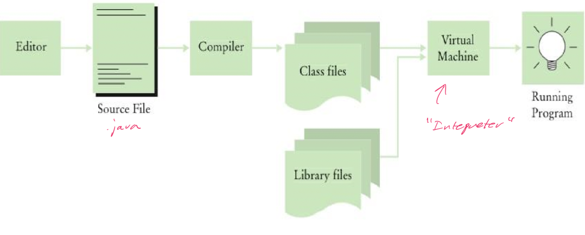

# Course Introduction

## Logistics

### Components

- Recorded lectures (with participation quizzes)
- Live lectures / Q&A
- Weekly quizzes
- Weekly labs

### Grading

| Component | Grade |
|:-----------:|:------:|
| Labs | 55% |
| Weekly quizzes | 35% |
| Attendence & participation | 10% |
| Course evaluation | 0.5% Extra Credit |

## Introduction to java

### History

- Introduced in 1995
- Object-oriented
- Originally designed for the internet
- Portable / platform independent
- Statically typed
- Interpreted **and** compiled
- Verbose
- Uses automatic garbage collection
- Ignores whitespace
- Similar to C++, but easier to use

### Why java?

- Widely used for
    - Web backend development
    - Android apps

### Compilation and interpretation



### First java program

```Java
public class HelloPrinter 
{
    public static void main(String[] args)
    {
        System.out.println("Hello, World!");
    }
}
```

- Every program contains at least one class
- Every program has a `main` method with the `public static void main` header
- Statements inside main are executed when the program runs
- Match opening and closing braces for readability
- All statements end with a semicolon

### Analyzing the first program

#### Class declaration

- Classes are the fundamental building blocks of java
- Declaration of class: `public class HelloPrinter`
- Every source file contains, at most, one *public* class
- The name of the *public* class must be the same as the file name

#### Methods

- Classes contain declarations of methods
- Each method contains a collection of programming instructions
- Methods are called by specifying its name and its arguments
- Methods are attached to objects

#### The `main` method

- Every java application contains a class with a `main` method
- It is the starting point/ entry point to the java program

#### Method call

- `System.out.println("Hello, World!");`
- Requires
    - The name of the method you want to use
    - Any arguments the method needs to carry out its class

#### Strings

- A sequence of characters enclosed in **double** quotes

#### Printing

- `System.out.println`: Prints numbers or strings **and** starts a new line
- `System.out.print`: Prints numbers or strings **but** does not start a new line

### Errors

- Compile time errors: Violation of language rules detected by the compiler
- Run time errors:  Causes a program to perform an action that was not intended
- Exceptions:  a type of run time error that signifies failure with an error message