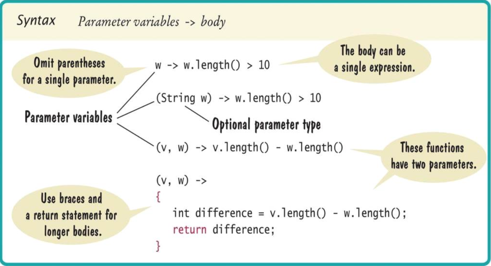

# Streams (part 1)

## The stream concept

### Overview

- Streams process data by specifying actions
- Library implements the actions using lazy execution
- Can skip steps that aren't needed
- Can split work over multiple processors
- You tell *what* you want to achieve
- You don't dwell on the *how*
- "What, not how" is powerful
	- Operations can occur in parallel
	- The data can be anywhere

### Facts about streams

- Streams are similar to collections, but...
- They don't store their own data
	- The data comes from elsewhere
	- From a collection, a file, a database, data from the internet
- Streams were designed to work well with lambda expressions

```Java
stream.filter(w -> w.length() > 10)
```

- Streams are immutable
	- Methods such as `filter` produce new streams
- Streams processing is *lazy*

### Lazy processing

- Suppose you ask for only five long words (not all)
- Here is how to get the first five

```Java
Stream<String> fiveLongWords = words
	.filter(w -> w.length() > 10)
	.limit(5);
```

- Bad approach first generate all long words, then throw most of them away
- Fortunately, stream processing is not bad, but *lazy*
	- Works "backwards" and only computes what is necessary
- `limit(5)` needs an element...
- ... and `filter(...)` examines element until it finds one
- That repeats four times
- And then ... nothing
- The other stream elements never get examined

## Producing streams

- In order to process streams, you first need to have one
- Simples way: the `of` method

```Java
Stream<String> words = Stream.of("Mary", "had", "a", "little", "lamb");
Stream<Integer> digits = Stream.of(3, 1, 4, 1, 5, 9);
```

- Also works for arrays

```Java
Integer[] digitArray = { 3, 1, 4, 1, 5, 9 };
Stream<Integer> digitStream = Stream.of(digitArray);
```

- This is a stream of `Integer` objects
- Any collection can be turned into a stream

```Java
List<String> wordList = new ArrayList<>();
Stream<String> words = wordList.stream();
```

- Several utility methods yield streams

```Java
String filename = ...;
try (Stream<String> lineStream = Files.lines(Paths.get(filename))) {
	...
} // File is closed here
```

- You can make infinite streams

```Java
Stream<Integer> integers = Stream.iterate(0, n -> n + 1);
```

- You can turn any stream into a *parallel stream*
	- Causes operations to be distributed over the available processors

```Java
Stream<String> parStream = lineStream.parallel();
```

## Collecting results

- When you are done transforming a stream, you want to harvest results
- Some methods yield a single value, others yield a collection
- To collect into an array

```Java
String[] result = stream.toArray(String[]::new);
```

- `String[]::new` is a constructor reference(to the array constructor)
- To collect into a `List` or `Set`, use collect

```Java
List<String> result = stream.collect(Collectors.toList());
Set<String> result = stream.collect(Collectors.toSet());
```

- A stream of strings can be collected into a single string

```Java
String result = words.collect(Collectors.joining(", "));
// Stream elements separated with commas
```

## Stream transformations

### Lifecycle of a stream

1) Create stream
2) Transform stream (possibly multiple times)
3) Collect results

### `map`

- `map` transforms a stream by applying a function to each element
- Turn all words into lowercase

```Java
Stream<String> words = Stream.of("A", "Tale", "of", "Two", "Cities");
Stream<String> lowerCaseWords = words.map(w -> w.toLowerCase());
```

- Remove vowels from all words

```Java
Stream<String> consonantsOnly = lowerCaseWords.map(
	w -> w.replaceAll("[aeiou]", "")
);
```

- Get the length of each element

```Java
Stream<Integer> consonantCount = consonantOnly.map(
	w -> w.length()
);
```

### More transformations

- Applying `map` yields a stream with the same number of elements
- `filter` only retains matching elements

```Java
Stream<String> aWords = words.filter(w -> w.substring(0, 1).equals("a"));
// Only the words starting with "a"
```

- `limit` takes the first `n`

```Java
Stream<String> first100aWords = aWords.limit(100);
```

- `skip` takes all but the first `n`

```Java
Stream<String> allButFirst100aWords = aWords.skip(100);
```

- `distinct` yields a stream with duplicates removed

```Java
Stream<String> words = Stream.of(
	"how much wood could a wood chuck chuck".split(" ")
);
Stream<String> distinctWords = words.distinct();
// "how", "much", "wood", "could", "a", "chuck"
```

- `sorted` yields a new stream in which the elements are sorted

```Java
Stream<String> sortedWords = distinctWords.sorted();
// "a", "chuck", "could", "how", "much", "wood"
```

- Elements type must be `Comparable`
- Or supply a comparator

```Java
distinctWords.sorted((s, t) -> s.length() - t.length());
```

### Common error: don't use a terminated stream

- Once you apply a terminal operation, a stream is "used up"
	- Can no longer apply any stream operations
- Easy mistake if you have a reference to an intermediate stream

```Java
Stream<String> stream = list.stream();
List<String> result1 = stream.limit(50).collect(Collectors.toList()); // Save the first fifty
stream = stream.skip(50); // Error: the stream can no longer be used
```

- Instead, you would need two streams

```Java
List<String> result1 = list.stream()
	.limit(50)
	.collect(Collectors.toList()); // This stream can no longer be used

List<String> result2 - list.stream() // Create another stream
	.skip(50)
	.limit(50)
	.collect(Collectors.toList());
```

## Lambda expressions

- You have seen lambda expressions in `filter` and `map` methods such such as

```Java
w -> w.length() > 10
```

- Like a static function
- Left side of `->` operator is a parameter variable
- Right side is code to operate on the parameter and compute a result
- When used with a type like `Stream<String>`, compiler can determine type
- Otherwise , you can specify the type

```Java
(String w) -> w.length() > 10
```

- Multiple parameters are enclosed in parentheses

```Java
(v, w) -> v.length() - w.length()
```

- To use the `sorted` method in the `Stream` class to sort string by length

```Java
Stream<String> sortedWords = distinctWords.sorted(
	(v, w) -> v.length() - w.length()
);
```



## The `Optional` type

- In java, it is common to use `null` to denote the absence of result
- Drawback: `NullPointerException` when programmer forgets to check

```Java
String result = oldFashionedMethod(searchParameters); // Returns null if no match
int length = result.length(); // Throws a NullPointerException when result is null
```

- Stream library uses `Optional` type when a result may not be present
- Example: First string of length > 10

```Java
words.filter(w -> w.length() > 10).findFirst()
```

- What if there is none? An `Optional<String>` either contains a string or an indication that no value is present

```Java
Optional<String> optResult = words
	.filter(w -> w.length() > 10)
	.findFirst();
```

### Working with `Optional`

- Work with it, not against it (That is don't treat it like a potentially `null` reference)
- `orElse` extracts the value or an alternative if there is none

```Java
int length = optResult.orElse("").length();
```

- `ifPresent` passes on the value to a function and does nothing if there is none

```Java
optResult.ifPresent(v -> result.add(v));
```

- If neither of these works, use `ifPresent` to test if there is a value and `get` to get it

```Java
if (optResult.isPresent()) {
	System.out.println(optResult.get());
}
else {
	System.out.println("No element");
}
```

### Returning `Optional`

- Declare return type as `Optional<T>`
- If there is a result, return `Optional.of(result)`
- Otherwise return `Optional.empty()`

```Java
public static Optional<Double> squareRoot(double x) {
	if (x >= 0) {
		return Optional.of(Math.squrt(x));
	}
	else {
		return Optional.empty();
	}
}
```