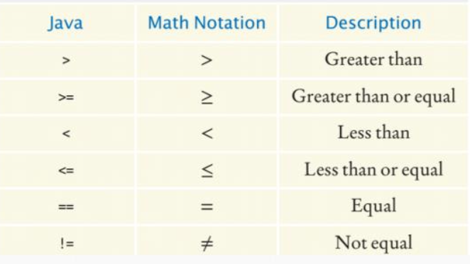

# Decisions

## The `if` statement

```Java
if (condition) {
	statements
}
else {
	statements
}
```

### The conditional operator

- `condition ? value_1 : value_2;`
- The value of that expression is either `value_1` if the test passes of `value_2` if it fails
- Usable anywhere that a value is expected

### Avoiding duplicate branches

```Java
if (floor > 13) {
	actualFloor = floor - 1;
	System.out.println("Actual floow: " + actualFloor);
}
else {
	actualFloor = floor;
	System.out.println("Actual floor: " + actualFloor);
}
```

- If you have duplicate code in each branch, move it out of the `if` statement

```Java
if (floor > 13) {
	actualFloor = floor - 1;
}
else {
	actualFloor = floor;
}
System.out.println("Actual floor: " + actualFloor);
```

## Comparing values

### Relational operators



### Comparing strings

- To test whether two strings are equal to each other, use the `equals` method
	- Tests for **equal contents**
- Don't use `==` for strings
	- Tests if two strings are stored in the same **memory location**
- The `compareTo` method compares strings lexicographically
	- `< 0`: this string comes before that string
	- `> 0`: this string comes after that string
	- `== 0`: this string and that string are the same
- Differences between dictionary ordering and java ordering
	- All uppercase letters come before lowercase letters
	- The space character comes before *all* printable characters
	- Numbers come before letters

### Comparing objects

- The `==` operator tests whether two object references are identical
- Use `equals` method to test if two objects have the same content
- Caveat: `equals` must be defined for the class

### Testing for `null`

- `null` reference refers to no object
- Can be used in tests
- Use `==` for null checks
- `null` is not the same as the empty string

## Multiple alternatives

### `else if`

- Multiple if statement can be combined to evaluate complex decisions
- First one true is run, the rest are skipped
- Tip: tests general conditions *after* specific conditions

### `switch case`

```Java
int day = 4;
switch(day) {
	case 6:
		System.out.println("Today is Saturday");
		break;
	case 7:
		System.out.println("Today is Sunday");
		break;
	default:
		System.out.println("Looking forward to the weekend");
}
```

## Nested branches

- Nested decisions are required for problems that have two levels of decision making
- They will be evaluated from the outside to inside

## Boolean variables and operators

- The `boolean` data type has exactly two values
	- `true`
	- `false`
- Boolean operators
	- and: `&&`
	- or: `||`
	- not: `!`
- `&&` and `||` are computed using short-circuit evaluation