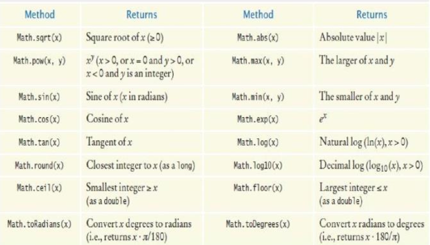

# Fundamental data types

## Primitive types, numbers, and constants

### Primitive types

> Every value in Java is either a **reference to an object** or **one of the eight primitive types**

- `boolean`: true or false values
- `byte`: 8 bit two's complement integer
- `char`: unicode character
- `short`: 16 bit two's complement integer
- `int`: 32 bit two's complement integer
- `long`: 64 bit two's complement integer
- `float`: IEEE 754 floating point number (32 bits)
- `double`: IEEE 754 floating point number (64 bits)

### Number literals

- Any number that appears *directly* in code
- Low precision values can be assigned to a higher precision type

### Constants

#### `final`

- A `final` variable is a constant
	- Once its value is set, it cannot be changed
- Named constants make programs easier to read and maintain
- Convention: use all uppercase names for constants

#### `static final`

- If constant values are needed in several methods
	- Declare them together with the **instance variables* of a class
	- Tag them as `static` *and* `final`
	- The `static` reserved word means that the constant belongs to the class
- Give `static final` constants `public` access to enable other classes to use them
- Declaration of constants in the `Math` class

```Java
public class Math {
	...
	public static final double E = 2.718281828459045;
	public static final double PI = 3.141592653589793;
}
```

- Using a constant

```Java
double circumference = Math.PI * diameter
```

## Arithmetic operators

- `+`, `-`, `*`, `/`, `%`
- Mixing integers and floating point values in an arithmetic expression yields a floating point value
- When a value cannot be represented exactly, it is rounded to the nearest match
- Rounding errors occur when an exact representation of a floating point number is not possible

### Increment and decrement operators

- The `++` operator adds 1 to a variable (increments)
- The `--` operator subtracts 1 from a variable (decrements)

### Integer division

- Division works as you would expect, as long as at least one of the numbers is a floating point number
- If both numbers are integers, the result is an integer. The remainder is discarded
- So as a general rule
	- Use the `int` type for numbers that should not have a fractional part
	- Use the `double` type for floating point numbers

### `Math` class



### Converting

- The compiler disallows the assignment of a `double` to an `int` because it is potentially dangerous
	- The fractional part is lost
	- The magnitude may be too large
- Use the cast operator `(int)` to convert a floating point value to an integer
	- Cast discards the fractional part
- `Math.round` converts a floating-point number to the nearest integer

### Generating random numbers

- `Math.random()` generates a random number between $[0,\, 1)$
- Typecasting is required to convert the number to an integer
- Use the form
	- `(int) (Math.random() * range) + min`
	- `range = max - min + 1`
	- Parentheses need to be in the right place, otherwise typecasting will happen too soon, resulting in a not so random number

## Input and output

### Reading input

```Java
// Include this line so you can use the Scanner class
import java.util.Scanner;

// Create a scanner object to read keyboard input
Scanner in = new Scanner(System.in);

// Display a prompt in the console window
System.out.println("Please enter the number of bottles: ");

// Define a variable to hold the input value
// The program waits for use input, then places the input into the variable
int bottles = in.nextInt();
```

### Formatting output

- Use the `printf` method to specify how values should be formatted
- `printf` lets you print this
	- Price per liter: 1.22
- Instead of this
	- Price per liter: 1.215962441314554
- This command displays the price with two digits after the decimal point
	- `System.out.printf("%.2f", price);`
- You can also specify a field width
	- `System.out.printf("Price per liter:%10.2f", price);`

## Strings

- String literals are character sequence enclosed in **double** quotes
	- `"H" != 'H';`
- The `length` method yields the number of characters in a string
- The `charAt` method returns a `char` value from a `String`

```Java
String name = "Harry";
char start = name.charAt(0); // 'H'
char last = name.charAt(4); // 'y'
```

- Use the `substring` method to extract part of a String

```Java
String greeting = "Hello, World!";
String sub = gretting.substring(0, 5); // "Hello"
String tail = greeting.substring(7); // "World!"
```

### String concatenation

- Use the `+` operator to concatenate strings
- If one of the arguments is a string, the other is forced to become a string

### String input

- Use the `next` method of the `Scanner` class to read a string containing a single word
- Only one word is read
- Use a second call to `next` to get a second word