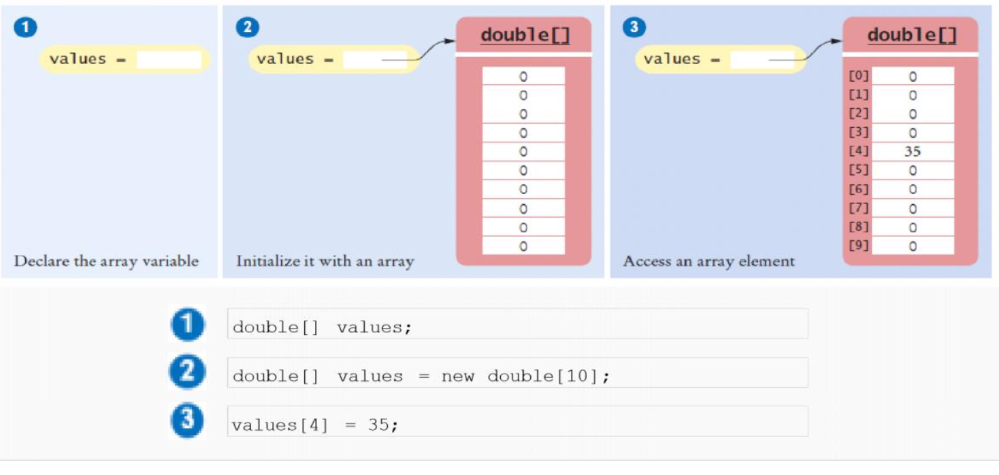
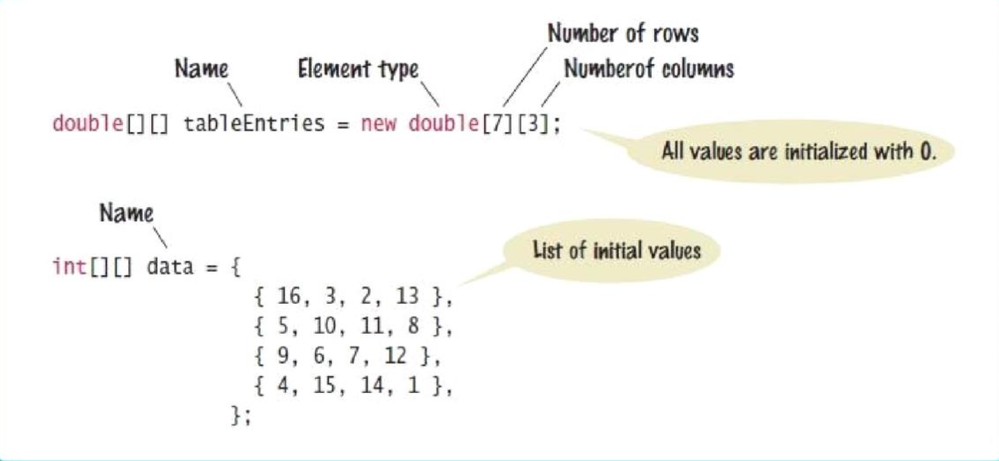
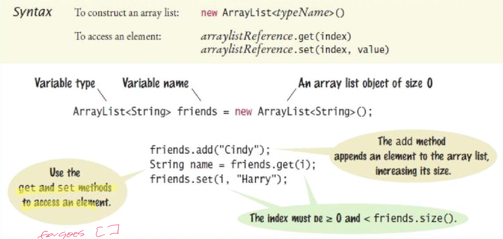

# Arrays and lists

## Arrays

- An array collects a sequence of values of the same type
- The type of an array variable is the type of the element to be stored, followed by `[]`
- The size can be specified in between the brackets


### Initializing

- By default, each number in a numerical array is $0$
- You can specify the initial values when creating the array

```Java
double[] values = {
	32,
	54,
	67.5,
	29,
	35,
	80,
	115,
	44.5,
	100,
	65
};
```

### Accessing elements

- To access a value in an array, specify which "slot" (index) you want to use
- Use the `[]` operator
- An array element can be used like any variable

### Memory



### Bounds checking

- A bounds error occurs if you supply an invalid array index
- `Array.length` yields the length of the array
- Array lengths are fixed

### References

- An array reference specifies the location of an array
- Copying the reference yields a second reference to the same array
- Modifying one will modify the other

### Copying

- To make a true copy of an array, call the `Arrays.copyOf` method

```Java
import java.util.Arrays;
double[] prices = Arrays.copyOf(values, values.length);
```

## The enhanced `for` loop

- You can use the enhanced `for` loop to visit all elements of an array
- Not suitable for all array algorithms
- Does not allow you to modify the contents of an array
- Use when you do not need to index values in the loop body


## Two dimensional arrays

- An arrangement consisting of rows and columns of values
	- Also called a matrix
	- Use to store tabular data
- You can declare and initialize the array by grouping each row

```Java
int[][] counts = {
	{0, 3, 0},
	{0, 0, 1},
	{0, 0, 1},
	{1, 0, 0},
	{0, 0, 1},
	{3, 1, 1},
	{0, 1, 0},
	{1, 0, 1}
};
```

- Just like a one-dimensional array, you cannot change the size of a two-dimensional array once it has been declared



### Accessing elements

- Access elements by using two index values, `array[i][j]`
- Number of rows: `arr.length`
- Number of columns: `arr[0].length`
- Use nested loops to access all elements in a two-dimensional array

```Java
for (int i = 0; i < arr.length; i++) {
	for (int j = 0; j < arr[0].length; j++) {
		System.out.printf("%8d", arr[i][j]);
	}
	System.out.println();
}
```

## `ArrayList`

- An array list
	- Stores a sequence of values
	- Can grow and shrink as needed
	- Expands to hold as many elements as needed
- The `ArrayList` class supplies methods for many common tasks, such as inserting and removing elements

### Syntax



### Using `ArrayList`

- `ArrayList` is a **generic class**
- Angle brackets denote a **type parameter**

### Wrapper classes

- You cannot directly insert a primitive type value into an array list
- It must be placed in a wrapper first
- Called **auto-boxing**
	- Special classes that reflect primitive types as objects
	- Values switch back and forth automatically

## Arrays vs Array lists

- For most programming tasks, array lists are easier to use than arrays
	- Array lists can grow and shrink
	- Arrays have a nicer syntax
- Recommendations
	- If the size of a collection never changes, use an array
	- If you collect a long sequence of primitive types values and you are concerned about efficiency, use an array
	- Otherwise, use an array list

