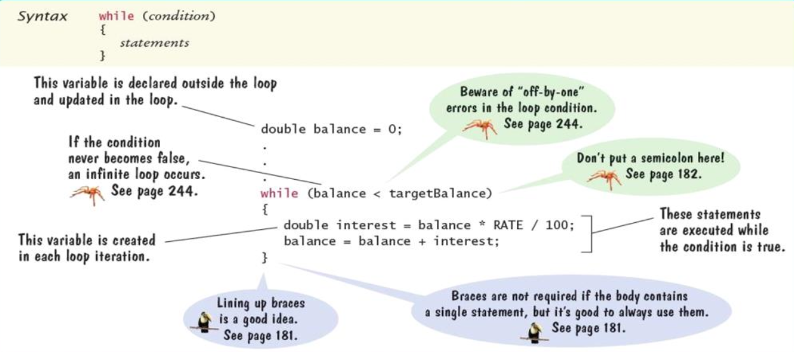

# Loops

## `while` loops

### Syntax



### Scope

- For a variable declare inside a loop body
	- Variable is created for each iteration of the loop
	- And removed after the end of each iteration
- Variable is **not** accessible outside of the loop body

### Common error: infinite loops

- Forgetting to update the variable that controls the loop

```Java
int i = 1;
while (i <= 10) {
	int j = i * 2;
	System.out.println(i);
}
```

- Decrementing instead of incrementing (or vice-versa)

```Java
int i = 1;
while (i <= 10) {
	int j = i * 2;
	System.out.println(i);
	i--;
}
```

### Common error: off-by-one errors

- **Off-by-one error**: a loop executes one too few, or one too many times

```Java
int i = 1;
while (i <= 10) {
	int j = i * 2;
	System.out.println(i);
	i++;
}
// Should i start and 0 or 1?
// Should the test be <= 10, < 10, < 11, <= 11?
```

## `do` loops

- Executes the body of a loop **at least once** and performs the loop tests *after* the body is executed
- Often used for input validation

```Java
int value;
do {
	System.out.print("Enter an integer < 100: ");
	value = in.nextInt();
} while (value >= 100);
```

## `for` loops

### Syntax


### Execution

- The initialization is executed once, before the loop is entered
- The condition is checked before each iteration
- The update is executed after each iteration

## Nested loops

- When the body of a loop contains another loop, the loops are nested
- Helpful for iterating 2-dimensional things

### Demo 1

> Print the following using nested loops

```
*****
*****
*****
```

```Java
for (int i = 0; i < 3; i++) {
	for (int j = 0; j < 5; j++) {
		System.out.print("*");
	}
	System.out.println();
}
```

### Demo 2

> Print the following using nested loops

```
*
**
***
****
```

```Java
for (int i = 0; i < 4; i++) {
	for (int j = 0; j < i + 1; j++) {
		System.out.print("*");
	}
	System.out.println();
}
```