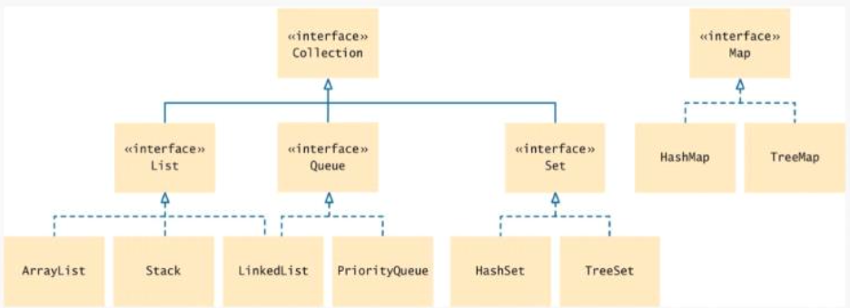

# The java collections framework

## Collections overview

- A collection groups together elements and allows them to be retrieved later
- Java collections framework: a hierarchy of interface types and classes for collecting objects



- The `Collection` interfaces is at the root
	- All `Collection` classes implement this interface
	- So all have a common set of methods

### `List` interface

- A list is a collection that remembers the order of its elements
- Two implementing classes
	- `ArrayList`
	- `LinkedList`

### `Set` interface

- A set is an **unordered** collection of *unique* elements
- Arranges its elements so that finding, adding, and removing elements is more efficient
- Two mechanisms to do this
	- Hash tables
	- Binary search trees

### Stacks, queues, and priority queues

- Stacks
	- Remembers the order of elements
	- But you can only add and remove at the top
	- Last in, first out container
- Queue
	- Add items to one end (the tail) and removes them from the other end (the head)
	- First in, first out
- Priority queue
	- An unordered collection
	- Has an efficient operation for removing the element with the highest priority

### Maps

- Keeps associations between key and value objects
- Every key in the map has an associated value
- The map stores the keys, values, and the association s between them

## Linked lists

- A data structure used for collecting a sequence of objects
	- Allows efficient addition and removal of elements in the middle of the sequence
- A linked list consists of a number of nodes
	- Each node has a reference to the next node
- A node is an object that stores an element and references to the neighboring nodes
- Each node in a linked list is connected to the neighboring nodes

### Efficiency

- Adding and removing elements in the middle of a linked list is efficient
- Visiting the elements of a linked list in sequential order is efficient
- Random access is **not** efficient

### Insertion and removal

- When inserting or removing a node
	- Only the neighboring node references need to be updated

### When to use

- When you are concerned about the efficiency of inserting or removing elements
- When you rarely need element access in "random" order

## List iterators

- Use list iterator to access elements inside a linked list
- Encapsulates a portion anywhere inside the linked list
- Think of an iterator as pointing between two elements much like the cursor in a word processor points between two characters
- To get a list iterator, use the `listIterator` method of the `LinkedList` class

### `next` method

- A list iterator initially points before the first elements
- Move the position with the `next` method

```Java
if (iterator.hasNext()) {
	iterator.next();
}
```

- The `next` method returns the element that the iterator is passing
- The return type of the `next` method matches the list iterator's type parameter

### Traversing

- To traverse all elements in a linked list of string

```Java
while (iterator.hasNext()) {
	String name = iterator.next();
	// Do something with name
}
```

- Can also use the "for each" loop

```Java
for (string name: employeeNames) {
	// Do something with name
}
```

### Moving backwards

- The nodes of the `LinkedList` class store two links
	- One to the next element
	- One to the previous one
	- Called a doubly-linked list
- To move the list position backwards, use:
	- `hasPrevious`
	- `previous`

### `add` method

- The `add` method adds an object after the iterator
- Then moves the iterator position past the new element

### `remove` method

- The `remove` method
- Removes object that was returned by the last call to `next` or `previous`
- To remove all names that fulfill a certain condition

```Java
while (iterator.hasNext()) {
	String name = iterator.next();
	if (/*condition is fulfilled for name*/) {
		iterator.remove()
	}
}
```

- Be careful when calling `remove`
	- It can be called only **once** after calling `next` or `previous`
	- You cannot call it immediately after a call to `add`
	- If you call it improperly, it throws a `IllegalStateException`

## Sets

- A set organizes its values in an order that is optimized for efficiency
- May not be the order in which you add elements
- Inserting and removing elements is more efficient with a set than with a list
- A set does not admit duplicates

### The `Set` interface

- The `Set` interface has the same methods as the `Collection` interface
- Two implementing classes
	- `HashSet` based on hash table
	- `TreeSet` based on binary search tree
- A set implementation arranges the elements so that it can locate them quickly

### `HashSet`

- In a hash table
	- Set elements are grouped into smaller collections of elements that share the same characteristic
	- Grouped by an integer has code that is computed from the element
- Elements in a hash table
	- Must implement the method `hashCode`
	- Must have a properly defined `equals` method
- You can form hash sets holding objects of type `String`, `Integer`, `Double`, `Point`, `Rectangle`, or `Color`

### `TreeSet`

- Elements are kept in sorted order
- Elements are stored in nodes
- The nodes are arranged in a tree shape (not in a linear sequence)
- You can form tree sets for any class that implements the `Comparable` interface

### `TreeSet` vs `HashSet`

- Use a `TreeSet` if you want to visit the set's elements in sorted order
	- Otherwise choose a `HashSet`
	- It is a bit more efficient -- if the hash function is well chosen
- Store the reference to a `TreeSet` of a `HashSet` in a `Set` variable

```Java
Set<String> names = new HashSet<>();
Set<String> names - new TreeSet<>();
```

- After constructing the collection object
	- The implementation no longer matters
	- Only the interface is important

### Working with sets

- Adding and removing elements

```Java
names.add("Romeo");
names.remove("Juliet");
```

- Sets don't have duplicates
	- Adding a duplicate is ignored
- Attempting to remove an element that isn't in the set is ignored
- The `contains` method tests whether an element is contained in the set

```Java
if (names.contains("Juliet")) { ... }
```

- The `contains` method uses the `equals` method of the element type
- To process all elements in the set, get an iterator
- A set iterator visits the elements in the order in which the set implementation kepps them

```Java
Iterator<String> iter - names.iterator();
while (iter.hasNext()) {
	String name = iter.next();
	// Do something with name
}
```

- You can also use the "for each" loop

```Java
for (String name: names) {
	// Do something the name
}
```

- You cannot add an element to a set at an iterator position -- a set is unordered
- You can remove an element at an iterator position
- The iterator interface has no `previous` method

## Maps

- A map allows you to associate elements from a **key set** the elements from a **value collection**
- Use a map when you want to look up objects by using a key
- Two implementations of the `Map` interface
	- `HashMap` -- stored in random order
	- `TreeMap` -- stored in sorted order by keys
- Store the reference to the map object in a `Map` reference

```Java
Map<String, Color> favoriteColors = new HashMap<>();
```

### Map metyhods

- Use the `put` method to add an association
- You can change the value of an existing association by calling `put` again
- The `get` method returns the value associated with a key
	- If no associate value exists, the `get` method returns `null`
- To remove an association, call the `remove` method with the key
- Sometimes you want to enumerate all keys in a map
- The `keySet` method yields the set of keys
- Asks the key set for an iterator and get all keys
- For each key, you can find the associated value with the `get` method
- To print all key/value pairs in a map `m`

```Java
Set<String> keySet = m.keySet();
for (String key: keySet) {
	Color value = m.get(key);
	System.out.println(key + "->" + value);
}
```

## Stacks

- A stack lets you insert and remove elements only at one end
	- Called the top of the stack
	- Removes items in the opposite order than they were added
	- Last-in, first-out
- Add and remove methods are called `push` and `pop`

```Java
Stack<String> s = new Stack<>();
s.push("A");
s.push("B");
s.push("C");
while (s.size() > 0) {
	System.out.print(s.pop() + " "); // Prints C B A
}
```

### Stack applications

- Undo function of a word processor
	- The issued commands are kept in a stack
	- When you select "undo" the **last** command is popped off the stack and undone
- Run-time stack of a processor or virtual machine
	- Stores the values of variables in nester methods
	- When a new method is called, its parameter variables and local variables are pushed onto a stack
	- When the method exits, they are popped off again

## Queues

- Add items to one end of the queue (the tail)
- Remove items from the other end of the queue (the head)
- Items are moved in the same order in which they were added
- First-in, first-out
- Typical application: a print queue

### `Queue` interface

- The `LinkedList` class implements the `Queue` interface
- When you need a queue, initialize a `Queue` variable with a `LinkedList` object

```Java
Queue<String> q = new LinkedList<>();
q.add("A");
q.add("B");
q.add("C");
while (q.size() > 0) {
	System.out.print(q.remove() + " ");
} // Prints A B C
```

## Priority queues

- A priority queue collects elements, each of which has a priority
- Example: a collection of work requests, some of which may be more urgent than others
- Does not maintain a first-in, first-out discipline
- Elements are retrieved according to their priority
	- Priority 1 denotes the most urgent priority
	- Each removal extracts the minimum element
- When you retrieve an item from a priority queue, you always get the most urgent one

### `PriorityQueue` methods

- Example: objects of a class `WorkOrder` into a priority queue

```Java
PriorityQueue<WorkOrder> q = new PriorityQueue<>();
q.add(new WorkOrder(3, "Shampoo carpets"));
q.add(new WorkOrder(1, "Fix broken sink"));
q.add(new WorkOrder(2, "Order cleaning supplies"));
```

- When calling `q.remove()` for the first time, the work order with priority 1 is removed
- Elements should belong to a class that implements the `Comparable` interface