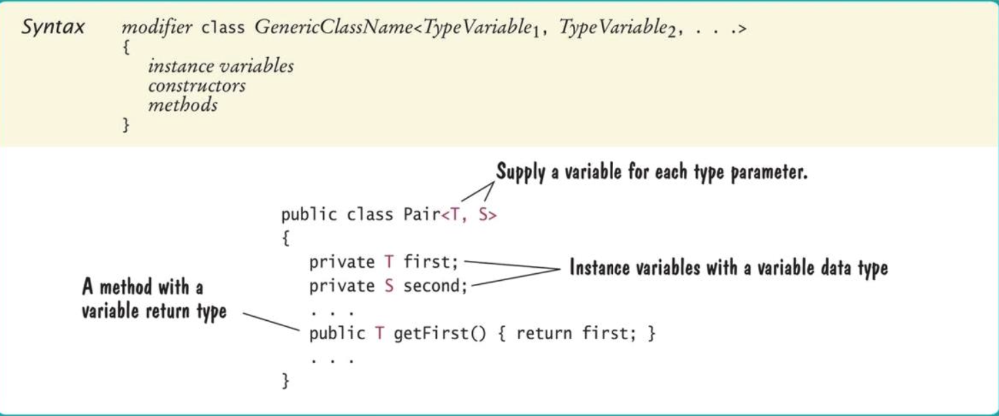
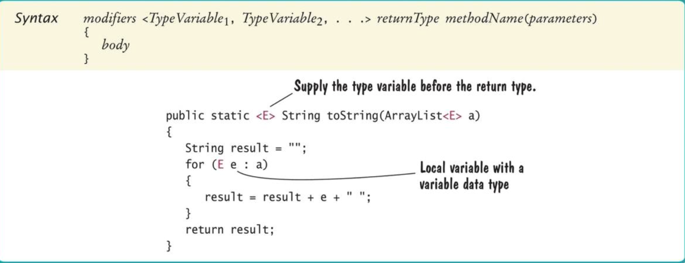

# Generic classes

## Generic classes and type parameters

- **Generic programming**: creating programming constructs that can be used with many different types
	- In java, achieved with type parameters or with inheritance
	- Type parameter example: `ArrayList<String>`
- **Generic class**: has one or more type parameters
- A type parameter for `ArrayList` denotes the element type

```Java
public void add(E element)
public E get(int index)
```

- Can be instantiated with a class or interface type

```Java
ArrayList<BankAccount>
ArrayList<Measurable>
```

- Cannot use a primitive type as a type parameter
	- Use corresponding wrapper class instead

```Java
ArrayList<double> // illegal
ArrayList<Double> // Ok
```

- Supplied type replaces type variable in class interface

```Java
public void add(BankAccount element)
```

- Type parameters make generic code **safer** and **easier to read**
	- Impossible to add a `String` into an `ArrayList<BankAccount>`

## Implementing generic classes and types

- Example: simple generic class that stores *pairs* of arbitrary objects such as

```Java
Pair<String, Integer> result = new Pair<>("Harry Hacker", 1729);
```

- Methods `getFirst` and `getSecond` retrieve first and second values of pir

```Java
String name = result.getFirst();
Integer number = result.getSecond();
```

- Example of use: for a method that computes two values at the same time (method return `Pair<String, Integer>`)
- Generic `Pair` class requires two type parameters, one for each element type enclosed in angle brackets

```Java
public class Pair<T, S> { ... }
```

- Use shot uppercase names for type variables

| Type variable | Meaning |
| :-----------: | ------- |
| `E` | Element type in a collection |
| `K` | Key type in a map |
| `V` | Value type in a map |
| `T` | General type |
| `S, U` | Additional general types |

- Place the type variables for a generic class after the class name, enclosed in angle brackets



## Generic methods

- **Generic method**: method with a type parameter
- Can be declared inside non-generic class
- Example: declare a method that can print an array of any type

```Java
public class ArrayUtil {
	/**
		Prints all elements in an array.
		@param a the array to print
	*/
	public static <T> void print(T[] a) { ... }
}
```

### Implementing

- Often easier to see how to implement a generic method by starting with a concrete example
- Example: print the elements in an array of *strings*

```Java
public class ArrayUtil {
	public static void print(String[] a) {
		for (String e: a) {
			System.out.print(e + " ");
		}
		System.out.println();
	}
}
```

- In order to make the method into a generic method
	- Replace `String` with a type parameter, say `E`, to denote the element type
	- Add the type parameters between the method's modifiers and return type

```Java
public static <E> void print(E[] a) {
	for (E e: a) {
		System.out.print(e + " ");
	}
	System.out.println();
}
```

### Calling

- When calling a generic method, you need not instantiate the type variables

```Java
Rectangle[] rectangles = ...;
ArrayUtil.print(rectangles);
```

- The compiler deduces that `E` is `Rectangle`
- You can also define generic methods that are not static
- You can even have generic methods in generic classes
- Cannot replace type variables with primitive types
	- Cannot use the generic `print` method to print an array of type `int[]`



## Constraining type variables

- Type variables can be constrained with bounds
- A generic method, `average`, needs to be able to measure the objects
- `Measurable` interface

```Java
public interface Measurable {
	double getMeasure();
}
```

- We can constrain the type of the elements passed in to `average` to those that implement the `Measurable` type

```Java
public static <E extends Measurable> double average(ArrayList<E> objects)
```

- This means "`E` or one of its superclasses extends or implements `Measurable`"
- We say the `E` is a subtype of the `Measurable` type

```Java
public static <E extends Measurable> double average(ArrayLIst<E> objects) {
	if (objects.size() == 0) {
		return 0;
	}
	double sum = 0;
	for (E obj: objects) {
		sum = sum + obj.getMeasure();
	}
	return sum / objects.size();
}
```

- In the call `obj.getMeasure()`
	- It is legal to apply the `getMeasure` method to `obj`
	- `obj` has type `E`, and `E` is a subtype of `Measurable`

### Constraining to the `Comparable` interface

- `Comparable` interface is a generic type
- Tye type parameter specifies the type of the parameter variable of the `compareTo` method

```Java
public interface Comparable<T> {
	int compareTo(T other);
}
```

- `String` class implements `Comparable<String>`
	- A `String` can be compared to another `String`
	- But not with objects of a different class
- When writing a generic method `min` to find the smallest element in an array list
	- Require that type parameter `E` implements `Comparable<E>`

```Java
public static <E extends Comparable<E>> E min(ArrayList<E> objects) {
	E smallest = objects.get(0);
	for (int i = 1; i < objects.size(); i++) {
		E obj = objects.get(i);
		if (obj.compareTo(smallest) < 0) {
			smallest = obj
		}
	}
	return smallest;
}
```

- Because of the type constraint `obj` must have a method of this form: `int compareTo(E other)`
- So the following call is valid: `obj.compareTo(smallest)`

### Applying multiple bounds

- Very occasionally, you need to supply two or more type bounds

```Java
<E extends Comparable<E> & Cloneable>
```

- `extends`, when applied to type parameters, actually means "extends or implements"
- The bounds can be either classes or interfaces
- Type parameters can be replaced with a class or interface type

## Type erasure

- The virtual machine erases type parameters, replacing them with their bounds or `Objects`
- For example, generic class `Pair<T, S>` turns into the following raw class

```Java
public class Pair {
	private Object first;
	private Object second;

	public Pair(Object firstElement, Object secondElement) {
		first = firstElement;
		second = secondElement;
	}

	public Object getFirst() { return first; }

	public Object getSecond() { return second; }
}
```

- The same process  is applied to generic methods
- In this generic method

```Java
public static <E extends Measurable> E min(E[] objects) {
	E smallest = objects[0];
	for (int i = 1; i < objects.length; i++) {
		E obj = objects[i];
		if (obj.getMeasure() < smallest.getMeasure()) {
			smallest = obj;
		}
	}
	return smallest;
}
```

- The type parameter is replaced with its bound `Measurable`

```Java
public static Measurable min(Measurable[] objects) {
	Measurable smallest = objects[0];
	for (int i = 1; i < objects.length; i++) {
		Measurable obj = objects[i];
		if (obj.getMeasure() < smallest.getMeasure()) {
			smallest = obj;
		}
	}
	return smallest;
}
```

### Limitations of java generics

- Knowing about type erasure helps you understand limitations of Java generics
- You cannot construct new objects of a generic type
- For example, trying to fill an array with copies of default objects would be wrong

```Java
public static <E> void fillWithDefaults(E[] a) {
	for (int i = 0; i < a.length(); i++) {
		a[i] = new E();
	}
}
```
;
- Type erasure yields

```Java
public static void fillWithDefaults(Object[] a) {
	for (int i = 0; i < a.length(); i++) {
		a[i] new Object(); // Not useful
	}
}
```

- To solve this particular problem, you can supply a default object

```Java
public static <E> void fillWithDefaults(E[] a, E defaultValue) {
	for (int i = 0; i < a.length(); i++) {
		a[i] = defaultValue
	}
}
```

- You cannot construct an array of a generic type

```Java
public class Stack<E> {
	private E[] elements;
	...
	public Stack() {
		elements = new E[MAX_SIZE]; // Error
	}
}
```

- Because the array construction expression `new E[]` would be erased to `new Object[]`
- One remedy is to use an array list instead

```Java
public class Stack<E> {
	private ArrayList<E> elements;
	...
	public Stack() {
		elements = new ArrayList<E>(); //Ok
	}
	...
}
```

- Another solution is to use an array of objects and cast when reading elements from the array

```Java
public class Stack<E> {
	private Object[] elements;
	private int currentSize;
	...
	public Stack() {
		elements = new Object[MAX_SIZE]; // Ok
	}
	public E pop() {
		size--;
		return (E) elements[currentSize];
	}
}
```

- The cast `(E)` generates a warning because it cannot be checked at compile time