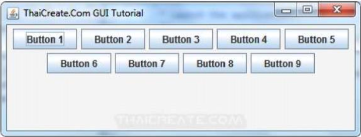
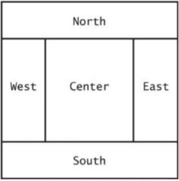
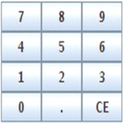

# GUIs

## Frame windows

- A graphical application shows information inside a frame
- To show a frame
	1) Construct an object of the `JFrame` class: `JFrame frame = new JFrame();`
	2) Set the size of the frame: `frame.setSize(300, 400);`
	3) If you'd like, set the title of the frame: `frame.setTitle("An empty Frame");`
	4) Set the "default close operations": `frame.setDefaultCloseOperation(JFrame.EXIT_ON_CLOSE);`
	5) Make the frame visible: `frame.setVisible(true);`

## Event handling

- In an event-driven user interface, the program receives an event whenever the user manipulates an input component
- User interface **events** include key presses, mouse moves, button clicks, etc.
- Since most programs don't want to be flooded by irrelevant events, a program must indicate which events it needs to receive
- **Event listeners**
	- A program indicates which events it needs to receive by installing event listener objects
	- Belongs to a class provided by the application programmer
	- Its methods describe the actions to be taken when an event occurs
	- Notified when event happens
- **Event Source**
	- User interface component that generates a particular event
	- Ad d an event listener object to the appropriate event source
	- When an event occurs, the event source notifies all event listeners
- A program prints a message whenever a button is clicked
- Button listeners must belong to a class that implements the `ActionListener` interface

```Java
public interface ActionListener {
	void actionPerformed(ActionEvent event);
}
```

- Supply a class whose `actionPerformed` method contains the instructions that you want executed whenever the button is clicked

```Java
public class ClickListener implements ActionLIstener {
	public void actionPerformed(ActionEvent event) {
		System.out.println("I was clicked!");
	}
}
```

### Listening for events

- `event` parameter of `actionPerformed` contains details about the event, such as the time at which it occurred
- Construct an object of the listener and add it to the button

```Java
ActionLIstener listener = new ClickListener();
buton.addActionLIstener(listener);
```

- Whenever the button is clicked, it calls: `listener.actionPerformed(event);`
- Use a `JButton` component for the button
- Attach an `ActionListener` to the button

### Inner classes for listeners

- Implement simple listener classes as inner classes like this

```Java
// This inner class is declared in the same method as the button variable
JButton button = new JButton("...");

// THis inner class is declared in the same method as the button variable
class MyLIstener implements ActionListener {
	...
}

ActionListener = listener = new MyLIstener();
button.addActionListener(listener);
```

- Advantages
	- Places the trivial listener class exactly where it is needed, without clutter up the remainder of the project
	- Methods of an inner class can access instance variables and methods of the surrounding class
- Local variables that are accessed by an inner class method must be declared as final

```Java
JButton button = new JButton("Add interset");
frame.add(button);
final BankAccount account - new BankAccount(INITIAL_BALANCE);

class AddInterestListener implements ActionListener {
	public void actionPerformed(ActionEvent event) {
		// The listener method access the account variable
		// from the surrounding block
		double interest = account.getBalance() * INTEREST_RATE / 100;
		account.deposit(interest);
	}
}

ActionListener listener = new AddInterestListener();
button.addActionListener(listener);
```

## Layout management

- In Java, you build user interfaces by adding components into containers
- Use a layout manager to place the components
- `JPanel` uses flow layout by default (left to right)



### Border layout

- Components are placed toward areas of a container
- Specify one when adding components

```Java
panel.setLayout(new BorderLayout());
panel.add(component, BorderLayout.NORTH);
```

- Components expand to fill space



### Grid layout

- Components are placed in boxes in a simple table arrangement
- Specify the size (rows the columns) of the grid
- Then add components which will be placed from the upper left, across, then down

```Java
JPanel = buttonPanel = new JPanel();
buttonPanel.setLayout(new GridLayout(4, 3));
buttonPanel.add(button7);
buttonPanel.add(button8);
buttonPanel.add(button9);
buttonPanel.add(button4);
...
```



### Achieving complex layouts

- Create complex layouts by nesting panels
- Give each panel an appropriate layout manager
- Panels have invisible borders, so you can use as many panels as you need to organize components

```Java
JPanel keypadPanel = new JPanel();
keypadPanel.setLayout(new BorderLayout());
buttonPanel = new JPanel();
buttonPanel.settLayout(new GridLayout(4, 3));
buttonPanel.add(button7);
buttonPanel.add(button8);
// ...
keypadPanel.add(buttonPanel, BorderLayout.CENTER);
JLabel display = new JLabel("0");
keypadPanel.add(display, BorderLayout.NORTH)
```


### Using inheritance for complex frames

- Use inheritance for complex frames
- Design a subclass of `JFrame`
	- Store components as instance variables
	- Initialize them in the constructor of you subclass
- Easy to add helper methods to organize code

## Processing text input

- The `JTextField` class provides a text field
- Specify the width for the text field
- If the user exceeds this width, text will "scroll" left

```Java
final int FIELD_WIDTH = 10;
final JTextField rateField = new JTextField(FIELD_WIDTH);
```

- Add a label to describe the field: `JLabel rateLabel = new JLabel("Interest Rate: ");`
- Add a button for user to indicate input is complete
- `actionPerformed` method can use `getText` to get input as a `String`
- Convert to a numeric value if used for calculations

```Java
class AddInterestListener implements ActionListener {
	public void actionPerformed(ActionEvent event) {
		double rate = Double.parseDouble(rateField.getText());
		double interest = balance * rate / 100;
		balance = balance + interest;
		resultLabel.setText("Balance: " + balance);
	}
}
```

### Text areas

- Create multi-line text areas with a `JTextArea` object
- Set the size in rows and columns

```Java
final int ROWS = 10; // Lines of text
final int COLUMNS = 30; // Characters in each row
JTextArea textArea = new JTextArea(ROWS, COLUMNS);
```

- Use the `setText` or `append` method to set/append to the text of a text field or text area
- Can use the text area for display purposes only

### `TextComponent` class

- `JTextField` and `JTextArea` are subclasses of `JTextComponent`
- `setText` and `setEditable` are declared in the `JTextComponent` class
- `append` method is only declared in `JTextArea`

### Scrolling

- To add scroll bars, use `JScrollPane`

```Java
JScrollPane scrollPane = new JScrollPane(textArea);
```

## Choices

### Radio buttons

- Only one button in a set can be selected
- Selecting a button clears the previous selection
- Create each button individually
- Add all buttons in the set to a `ButtonGroup` object

```Java
JRadioButton smallButton = new JRadioButton("Small");
JRadioButton mediumButton = new JRadioButton("Medium");
JRadioButton largeButton = new JRadioButton("Large");
ButtonGroup group = new ButtonGroup();
group.add(smallButton);
group.add(mediumButton);
group.add(largeButton);
```

- Use `isSelected` to find out whether a button is selected
- Use a panel for each set of radio buttons
- The default border for a panel is invisible (no border)
- You can add a border to a panel to make it visible
- You can also add a title

```Java
JPanel panel = new Panel();
panel.add(smallButton);
paanel.add(mediumButton);
panel.add(largeButton);
panel.setBorder(new TitledBorder(new EtchedBorder(), "Size"));
```

### Check boxes

- A check box has two states: checked and unchecked
- Use for choices that are not mutually exclusive
- Because check box settings do not exclude each other, you do not need to place a set of check boxes inside a button group
- Construct a check box: `JCheckBox italicChekcBox = new JCheckBox("Italic");`
- Use `isSelected` to find out whether a check box is selected

### Combo boxes

- A combo box is a combination of a list and a text field
- Clicking the arrow to the right of the text field opens the list of selections
- Use a combo box a large set of choices
- Use when radio buttons would take up too much space
- A combo box can be either
	- Closed (shows one selection)
	- Open(shows multiple  selections)
- It can also be editable
	- Type a selection into a blank line: `facenameCombo.setEditable();`
- Add text "items" to a combo box that will show n the list

```Java
JComboBox facenameCombo = new JComboBox();
facenameCombo.addItem("Serif");
facenameCombo.addItem("SansSerif");
...
```

- Use the `getSelectedItem` method to return the selected item (asa an `Object`)
- Combo boxes can store other objects in addition to strings, so casting to a `String` may be required

### Handling input events

- Radio buttons, check boxes, and combo boxes generate an `ActionEvent` when selected
- In `FontViewer` program, listener gets all events
- Simply check the state of each component using `isSelected` and `getSelectedItem` methods
- Then redraw the label with the new font

## Menus

- A frame can contain a *menu* bar
- A *menu* bar contains *menus*
- A *menu* contains *submenus* and *menu* items
- Menu items can be added to each menu or submenu
- First, add the menu bar to the frame

```Java
public class MyFrame extends JFrame {
	public MyFrame() {
		JMenuBar menuBar = new JMenuBar();
		setJMenuBar(menuBar);
		...
	}
	...
}
```

- Add menus to the menu bar

```Java
JMenu fileMenu = new JMenu("File");
JMenu fontMenu = new JMenu("Font");
menuBar.add(fileMenu);
menuBar.add(fontMenu);
```

- Add menu items and subitems

```Java
JMenuItem exitItem = new JMenuItem("Exit");
fileMenu.add(exitItem);
JMenu sttyleMenu = new JMenu("Style");
fontMenu.add(styleMenu); // A submenu
```

- Add a listener to each menu item

```Java
ActionListener listener =. new ExitItemListener();
exitItem.addActionListener(listener);
```

### Creating menus

- Use a separate method for each menu or set of related menus

```Java
public JMenu createFaceMenu() {
	JMenu menu = new JMenu("Face");
	menu.add(createFaceItem("Serif"));
	menu.add(createFaceItem("SansSerif"));
	manu.add(createFaceItem("Monospaced"));
	return menu;
}
```

### Adding listeners to menu items

- `createFaceItem` method needs to set the font face
	- Set the current face name
	- Make the new font from the current face, size, and style, and apply it to label
- Create a `FaceItemListener` class to listen for face item name actions

```Java
class FaceItemListener implements ActionListener {
	private String name;
	public FaceiTemListener(String newName) { name = newName; }
	public void actionPerformed(ActionEvent event) {
		faceName = nae; // Sets an instance variable of the frame class
		setLabelfont();
	}
}
```

- Install a listener object with the appropriate name

```Java
public JMenuItem createFaceItem(String name) {
	JMenuItem item = new JMenuItem(name);
	ActionListener listener = new FaceItemListener(name);
	item.addActionListener(listener);
	return item;
}
```

- Better to make a local inner class in the `createFaceItem` method
- `actionPerformed` method can access the name parameter variable directly (rather than passing it)

```Java
public JMenuItem createFaceItem(final String name) {
	// Final variables can be accessed from an inner class method
	class FaceItemListener implements ActionListener {
		public void actionPerformed(ActionEvent event) {
			facename = name; // Accesses the local variable name
			setLabelFont();
		}	
	}
	JMenuItem item = new JMenuItem(name);
	ActionListener listener = new FaceItemListener(name);
	item.addActionListener(listener);
	return item;
}
```

- Some strategy used for the `createSizeItem` and `createSytleItem` methods

## GUI builders

- Drag and drop components onto a panel
- Customize fonts, colors, text, and so on with a dialog box
- Define event handler by picking the event to process and provide the cod snipped for the listener method