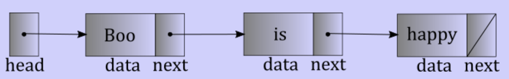
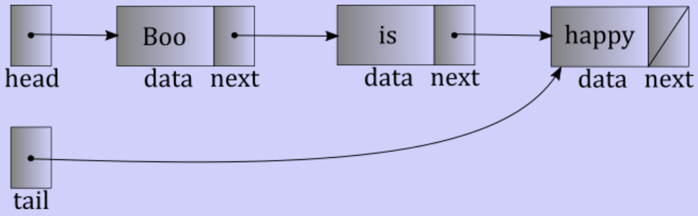
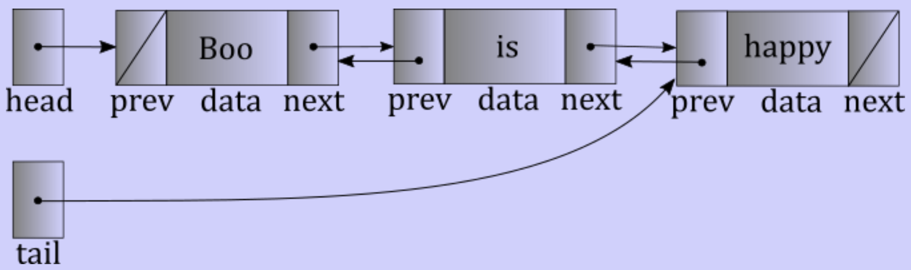

# Linked list variations

## Linked list

- Each element stored separately
- Nodes connected with pointers
	- Consist of data
	- Pointer to next node
	- Each node tells where the next is
- Can be stored anywhere in memory
	- Probably dynamically allocated
	- List pointer points to the first node
- Common operation with $n$ nodes
	- Add element to front of list
	- Remove from the front of list
	- Get first element
	- Get $i$th element
	- Add to end of the list
	- Remove from end of the list

## Singly linked list with head

- Head points to first
- Each node can tell where one other node is
- Add element to front of list
	- New node
	- Point next of new node to current head
	- Fill data of new node
	- Point head to new node
	- $\theta(1)$: Not always fast, but doesn't get worst with larger $n$
- Remove from front of list
	- Get additional pointer to current head
	- Point head to current head's next node
	- Delete old head
	- $\theta(1)$
- Get first element
	- Get data field of the first node (head)
	- $\theta(1)$
- Get $i$th element
	- Follow head to first node
	- Follow next pointer until reaching the $i$th element
	- $O(n)$ when going to last elment
	- $\theta(i)$ when going to the $i$th element
- Add to end of list
	- Follow next pointers to end
	- If next pointer is node
		- Create new node, point last next pointer to new node
	- $\theta(n) + \theta(1) = \theta(n)$
- Remove from end of list
	- Get pointer to before last
	- Delete last
	- $\theta(n) + \theta(1) = \theta(n)$

## Singly linked list with head and tail

- List level pointer to last node
- Add to front
	- $\theta(1)$ unless list is empty
- Remove from front
	- $\theta(1)$ unless list becomes empty
- Get $i$th element
	- $\theta(i)$
- Add to end
	- Follow tail pointer
	- Add node
	- Repoint tail and next pointers
	- $\theta(1)$
- Remove from end
	- Still need pointer to second to last
	- Tail pointer doesn't help here
	- $\theta(n)$

## Doubly linked list with head and tail

- Each node knows previous and next nodes
- Add to front
	- One additional constant step
	- $\theta(1)$
- Remove from front
	- $\theta(1)$
- Get $i$th element
	- If length known
		- Binary search the path
		- $\theta(min(i, n - i))$
- Add to end
	- One additional constant step
	- $\theta(1)$
- Remove from end
	- Before last is follows tails and one previous pointer
	- Delete tail, repoint tail
	- $\theta(1)$