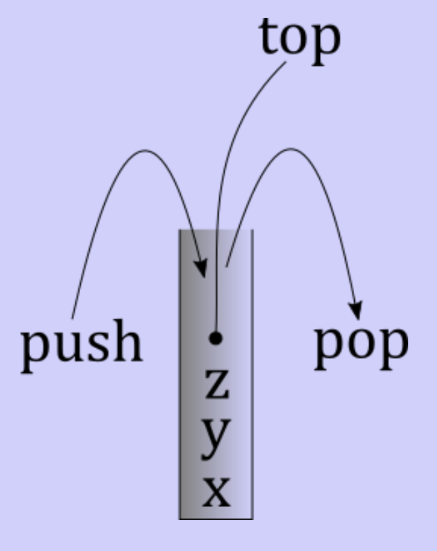
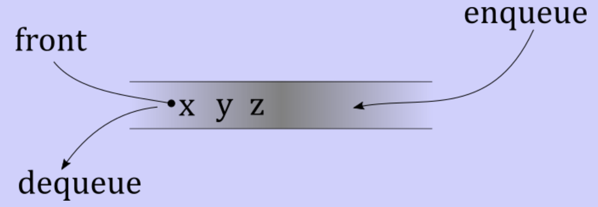

# Stacks, queues, and dequeues

## Classic linear data structure

- What they are used for
- Common operations
- How to implement them
- How well implementation works

## Stacks

- Tube with an open top
- Put elements into the top
- Only the top element is visible

### Common operations

- `push`: add element to top
- `pop`: remove element from top
- `top`: view element on top

### Implementation options

- Array/vector (reverse order)
	- Top element in cell 0
	- `top`: $\theta(1)$ constant time
	- `push`: $\theta(n)$ linear time
	- `pop`: $\theta(n)$ linear time
- Array/vector (in order)
	- Bottom element in cell 0
	- top element tracked by size
	- `top`: $\theta(1)$ constant time
	- `push`: $\theta(1)$
	- `pop`: $\theta(1)$
- Linked list
	- Top element is in the first node
	- Singly linked list with head is enough
	- `top`: $\theta(1)$
	- `push`: $\theta(1)$
	- `pop`: $\theta(1)$

## Queues

- Elements standing in line to be processed
- Line is handled fairly, first come, first serve

### Common operations

- `enqueue`: get in line
- `dequeue`: process first in line
- `front`: check what is at the front of the line

### Implementation options

- Linked list
	- Need singly linked list with head and tail pointers
	- Front is the head, end is the tail
	- `front`: $\theta(1)$ constant time
	- `enqueue`: $\theta(1)$ constant time
	- `dequeue`: $\theta(1)$ constant time
- `std::vector`
	- `dequeue` or `enqueue` will be costly
- Array
	- Maintain two pointer, `f` and `b`
	- Enqueue
		- Insert element at `b`, increment `b`
		- $\theta(1)$
	- Dequeue
		- Increment `f`
		- Optionally clear beforehand
		- $\theta(1)$
	- Enqueue past end of array wraps back around to front of array
	- Same can happen to `f`
	- Full when `b == f`
	- Empty when `f == b`
	- Track a size
		- Increment on enqueue
		- Decrement on dequeue
		- Empty when `size == 0`
		- Full when `size == capacity`
	- Called a circular array implementation

## Dequeues (pronounced "decks")

- Just like a queue
- Can enqueue and dequeue from both sides
- Peek the front and back element
- General structure for building other structures
- `std::deque` in C++
- Doubly linked list with head and tail pointer
- `std::vector` is problematic
	- In a circular array implementation, `f` and `b` can move in either direction