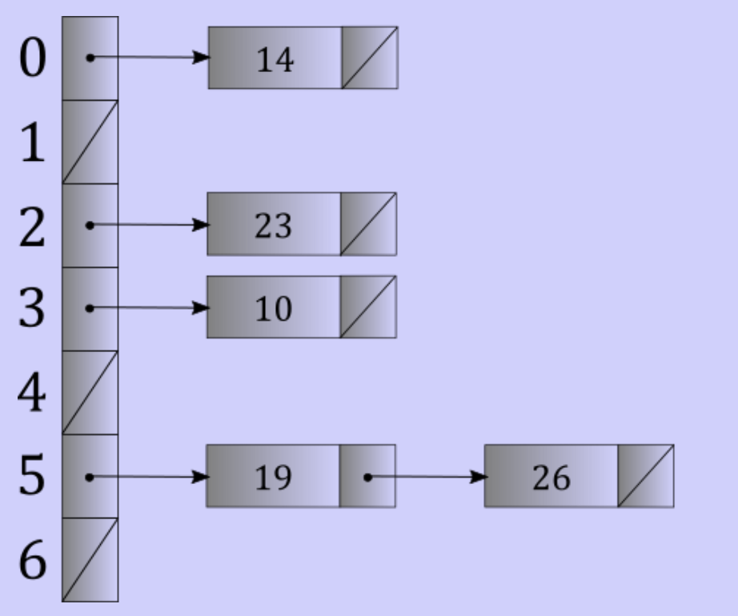

# Hash tables

## Avoiding the cost of searching

- Start with an array
- Associated with this a array is a magic box (function)
	- Give it a value
	- It returns the place it goes in the array
- This magic box is well-defined mathematical function known as a hash function
	- `h(k) = k`
	- It returns a hash value
	- Hash values are typically not valid array indices, so we'll need to modulo by the size of the array
- Sounds like this array can have constant
	- Searches
	- Insertions
	- Removals
- Caveat: two values cannot share the same hash cell, meaning they must be unique

## Collisions

- Occur when two values belong in the same hash cell
- To avoid, we could
	- Use a unique index for each value
	- Uses a lot of memory
- To incorporate, we could
	- Allow multiple values in the same hash cell (requires more than just an array)
	- Allow values to be stored in alternate cells (alternative should be relatively easy to find)

### Separate chaining

- Start with an array
- Every element is a pointer to a singly linked list
- Each element initially points to `nullptr`
- `h(k) % size` gives the index where value `k` should go
- To insert, simply extend the list at the given index
- When collisions occur
	- Hash the colliding value
	- Go to appropriate linked list
	- Ensure value is not already in the list (search it)
	- Insert value at end or beginning of list
- Reducing list search time
	- Don't use a dumb hash function
	- Be careful about the capacity (don't let the lists get too long)
- Reallocation
	- Rehash the *entire* table
	- Size change means values may have different cells
	- Should be done in linear time
		- Don't do it very often
		- Amortized like `std::vector`

### Open addressing

- Store the value in its determined cell **if** it is available
- If not available, find an alternative cell
	- Look at adjacent cells until an open cell is found
	- If reached the end, wrap to start of table
	- Insertions and lookup need to perform this as well
		- Lookup should stop if an empty cell is found
	- When removing, cells should be marked that open addressing was used
		- Signals to continue searching if empty cell is found during removal
	- Rehash when marked cells are marked again
- Early on, insertion may occur without probing
- Data likely to be separated
- Creates clusters of used cells
	- Increases chances of hashing to same cell
	- Clusters can merge into mega clusters
	- 

## Good hash functions

- Is fast to compute
	- Result is based only on the value being hashed
	- Needs to be fast because it is used for searches, insertions, and removals
- Spreads values evenly throughout the table
	- Picking any one value has an equal chance of landing in any cell
