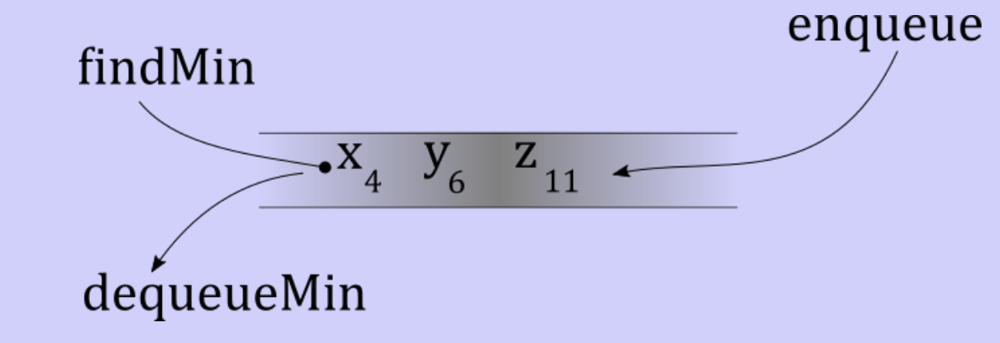

# Priority queues

## Queues (review)

- Allows objects to stand in a line
- Process one at a time
- Assumes objects are equally important
	- Often correct, but not always
	- Sometimes, some objects have VIP status
	- First-come-first-serve isn't good enough in that case

## Priority queues

- Just like a queue
- Objects have different priorities
	- Can be represented as integers
	- Typically lower integer value is a higher priority
- Common operations
	- `enqueue`
		- Enqueues an item with an assigned priority
		- Typically inserted in a sorted manner
		- Two identical priorities are considered equal
	- `dequeMin`
		- Pulls out the object with the smallest priority
	- `findMin`
		- Look for the object with the smallest priority

### Implemented as a linked list

- Sorted linked list
	- Nodes include an element and a priority
	- Nodes are sorted
	- `findMin` and `dequeMin` become constant time operations
	- `enqueue`
		- Requires a search through the list
		- Painfully expensive to maintain sorted order
- Unsorted linked list
	- Makes `enqueue` cheap
	- `findMin` and `dequeMin` become expensive
- An array-based solution would have the same results
- Suggests a flat data structure is insufficient

### Implemented as a min heap

> A min heap is a tree with the following properties
> 	- The key in the root is less than or equal to the key(s) in the roots of its subtrees
> 	- Every subtree is also a min heap

- Has no restriction on its shape
	- Could become degenerate
	- Could have way too many children
- Binary min heaps
	- A complete binary tree that is also a min heap
	- Can be stored in an array-based structure
		- For a node numbered $i$
			- The left child is $2i$
			- The right child is $2i + 1$
			- Parent is $\text{floor}(i / 2)$
- Insertions
	- Requires and new node
	- Position is fixed to maintain tree completeness
	- Algorithm
		- Place an additional node
		- If node fits and maintains the min heap property, we're done
		- If not, swap the child and parent
		- Follow the path upward the tree, potentially to the root
	- Analysis
		- Fact: the height of a complete binary tree is $\theta(\log_{2}(n))$
		- Swapping the child and parent is constant
		- At worst, may swap all the way to the top: $O(\log_{2}(n))$
- Removals
	- Purpose for a priority queue: can we remove the smallest?
	- Requires two things
		1) Key at the root to go away
		2) Node of the key at rightmost last level go away
	- Algorithm
		- Remove the key at the root
		- Place leftmost leaf node at the root
		- Promote the smaller child if key does not fit
		- Repeat until the orphaned node fits
	- Analysis
		- Swapping the parent and child is constant
		- Find child and parent indices is constant
		- May have to swap the entire height of the tree: $O(\log_{2}(n))$
- Find minimum
	- It's the root node: $\theta(1)$