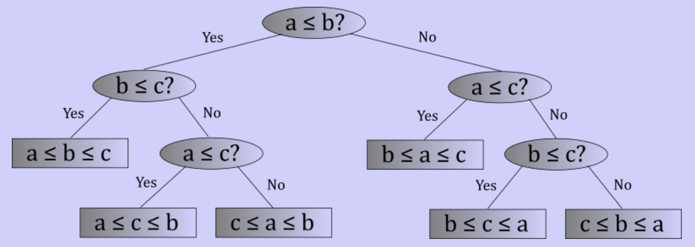

# Linear time sorting

## Comparison lower bounds

- Compares elements and makes a decision on where to place them
- $\Omega(n \log_{2}(n))$ or worse
- Decision tree
	- Non-leaf tree ask question of ordering to elements
	- Sorting $n$ elements requires at least $n!$ leaves in the decision tree
	- The height of the decision
		- $n$ leaves -> $\theta(\log_{2}(n))$ height
		- $n!$ -> $\theta(\log_{2}(n)!) = \theta(n \log_{2}(n))$
		- At least $n!$ leaves -> $\Omega(n \log_{2}(n))$



- Takes $\Omega(n \log_{2}(n))$ time at its best
- This is a fundamental limit of comparison based sorting

## Counting sort

- Start with a counters array filled with zeroes
	- Iterate over the source array
	- Increment counter for each occurrence
- Offsets array
	- Where does element with a given key belong
	- Each element is initialized to 0
	- Each subsequent offset is the sum of all the previous occurrence
- Sort
	- Copy source elements to target where they belong
	- Increment offset when elements are placed

```
CountingSort(Array source, Array target, int range):
    counters = an array of integers with indices 0 .. range - 1
    initialize all counters to 0

    for each element in source:
        counters[element.key]++

    offsets = an array of integers with indices 0 .. range - 1
    initialize all offsets to 0

    for i in 1 .. range - 1:
        offsets[i] = offsets[i - 1] + counters[i - 1]

    for i in 0 .. source.length - 1:
        target[offsets[source[i].key]] = source[i]
        offsets[source[i].key]++
```

### Analysis

- Memory
	- Counters array (linear w.r.t $m$)
	- Offset array (linear w.r.t $m$)
	- Target array (linear w.r.t $n$)
	- Requires $\theta(m + n)$ memory. Not in-place
- Time
	- Initialize counters (linear w.r.t $m$)
	- Counting occurrences (linear w.r.t $n$)
	- Determine offsets (linear w.r.t $m$)
	- Copying to target (linear w.r.t $n$)
	- Requires $\theta(n + m)$ runtime
- If $n >> m$
	- Basically a linear sort
	- Stable because of counters and offsets

## Radix sort

- Utilize a number base (typically 2, 10, or 16)
- Sort one digit at a time
- Start the least significant, disregard the others
- Move to next until at the most significant digit
- Use a counting sort that is stable

### Analysis

- $n$ is the number of elements
- $r$ is the radix (number of values for a digit)
- $w$ is the width of each element(number of digits)
- $w$ passes(one for each digit) in each pass
	- Counting sort
	- Takes $\theta(n + r)$ time
	- Total is $\theta(w(n + r))$ time
- Linearity depends on values of w, n, r
- let
	- $n = 30,000$
	- $r = 10$
	- $w = 8$
	- $n >> r$ and $n >> w$
- If $n$ dominates, approaches linear time
- Not in place because counting sort isn’t in place
- Stable because counting sort is stable