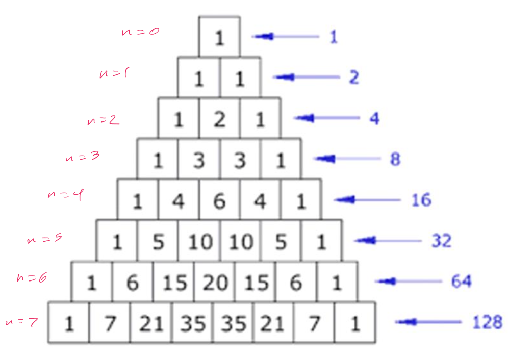

# Binomial coefficients and combinatorial identities

## Binomial formuli

### Multiply

- Multiply the following polynomials

$$
	(x + y)(x + y) = x^{2} + 2xy + y^{2}
$$

$$
	(x + y)^{3} = x^{3} + 3x^{2}y + 3xy^{2} + y^{3}
$$

### Opening up

- To get the coefficient of the $x^{2}y$ term
	- xxy
	- xyx
	- yxx
- Can be determined by ${\text{permutations of term} \choose \text{chosen number of x terms}}$

### Generalize

- $(x + y)^{n}$ = sum over $2^{n}$ terms, each of which is a "string" of length $n$ over $\{x,\, y \}$
- Coefficient of $x^{k}y^{n-k}$ is the number of strings of length `n` with `k` $x$'s and `n - k` $y$'s

### The binomial theorem

> For any $x$ and $y$ and any natural number $n$

$$
	(x + y)^{n} = \sum \limits_{k = 0}^{n} {n \choose x} x^{k}y^{n - k}
$$

- Applied to $(x + y)^{5}$

$$
	{5 \choose 0}x^{0}y^{5} +
	{5 \choose 1}x^{1}y^{4} +
	{5 \choose 2}x^{2}y^{3} +
	{5 \choose 3}x^{3}y^{2} +
	{5 \choose 4}x^{4}y^{1} +
	{5 \choose 5}x^{5}y^{0}
$$

- Applied to $(3a - 2b)^{6}$

$$
	{6 \choose 0}(3a)^{0}(2b)^{5} +
	{6 \choose 1}(3a)^{1}(2b)^{4} +
	{6\choose 2}(3a)^{2}(2b)^{3} +
	{6 \choose 3}(3a)^{3}(2b)^{2} +
	{6 \choose 4}(3a)^{4}(2b)^{1} +
	{6 \choose 5}(3a)^{5}(2b)^{0} +
	{6 \choose 6}(3a)^{6}(2b)^{0}
$$

## Identities given by the binomial theorem

### `x = y = 1` identity

$$
	2^{n} = \sum \limits_{k = 0}^{n} {n \choose k}
$$

- Combinatorial argument: this formula determines the number of all possible subsets

### Pascal's identity

- The # of k-subsets of $\{1,\, 2,\, \dots,\, n,\, n + 1 \}$ is given by ${ n + 1 \choose k}$
- The # of k-subsets of $\{1,\, 2,\, \dots,\, n,\, n+1 \}$ that do **not** include $1$ is given by ${ n \choose k}$
- The # of k-subsets of $\{1,\, 2,\, \dots,\, n,\, n+1 \}$ that **do** include $1$ is given by ${ n \choose k - 1}$
- The relationship between these counts is as follows

$$
	{n + 1 \choose k} =
	{n \choose k} +
	{n \choose k - 1}
$$

### Pascal's triangle

- Can help compute coefficients in binomials

