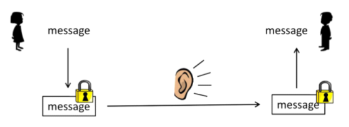

# Intro to cryptography

## Cryptography

- Alice wants to send a messages to Bob so that even if Eve can see the transmitted information, she does not learn the true message.

### Numbers as messages

- Modern cryptography is based on number theory
- Usually we want to send text messages
- Need to convert text to a number and back
	- Translation between text and numbers does not need to be secure
	- Text to number function must be one-to-one so that translation back to text is well defined

### Mapping

- Function mapping text to numbers
	- Could use ASCII representation of each character
	- `SEND_HELLO` -> `190514042708051216`
	- Left pad with 0's so each representation has the same number of digits

### Plaintext/cyphertext

- Can break up message so that each individual message is a number in the range from $0$ through $N-1$ for some large $N$
	- Cryptographic scheme will use arithmetic mod $N$
- `m`: plaintext
	- `encrypt(m) = c`
- `c`: cyphertext
	- `decrypt(c) = m`

## A simple cryptosystem

- Alice: message sender
- Bob: message received
- Alice and Bob meet in advance and agree on a secret key $k \in \mathbb{Z}_{n}$
	- Encrypt: $c = (m + k) \mod N$
	- Decrypt: $m = (c - k) \mod N$
- Encrypt is one-to-one

### Pitfalls

- Not very secure
	- One `(m, c)` pair reveals $k$
	- Can infer $k$ from many c's

## Public key cryptography

- **Private key cryptography**: requires that communicating parties agree in advance on a secret key
- **Public key cryptography**: 
	- Bob publishes an encoding key (public key) so that anyone can send Bob a message
	- Only Bob has the decryption key (private key) that can decode messages by the public key

### One way functions

- Security of a public key cryptosystem relies on the assumption that some functions are hard to compute
	- If Eve knows $c$, she can test all possible messages $m$ to see if `encrypt(m, e) = c`
	- Prohibitively expensive if the space of all possible messages is large
	- Assume that there is no fast way to directly compute the decryption function without knowing the private key in advance

### RSA

- Bob picks two large primes $p$ and $q$
- Bob computes
	- $N = pq$
	- $\phi = (p - 1)(q - 1)$
	- Find $e$ such that $\text{gcd}(e, \phi) = 1$. Usually $e$ is prime
	- Compute $d$ to be the multiplicative inverse of $e \mod \phi$
		- $de \mod \phi$
	- Public key: $(e,\, N)$
	- Private key: $d$
	- Encrypt m: $c = m^{e} \mod N$
	- Decrypt c: $m = c^{d} \mod N$

### Why does it work

- **Fermat's theorem**: if $p$ is prime and $\text{gcd}(m, p) = 1$ then $m^{(p-1)} \mod p = 1$
- **Euler's theorem** (special case): If $p$ and $q$ are prime and $\text{gcd}(m, pq) = 1$
	- Can use $\text{lcm}(p-1, q-1)$ instead of $(p - 1)(q - 1)$
	- Know: $c = m^{e} \mod N$ want to know that $m = c^{d} \mod N$
	- Looking for $d$ such that $de \mod (p - 1)(q - 1) = 1$