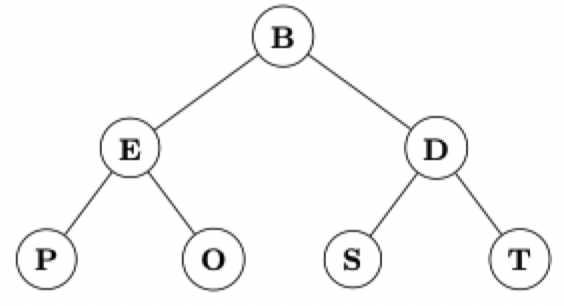
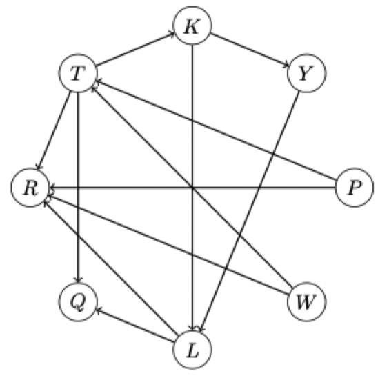

# Fundamental review

## Constrained answer

### Question 1

> For each of the following functions, determine whether it is $O(n)$ or $\Omega(n)$, or both
> You do not need to provide proof or justification
> Note that we are *not* asking you to provide the "best" notation; merely describe it with one or both choices presented

1) $a(n) = n(\log(n))^{10}$
    - [ ] $O(n)$
    - [x] $\Omega(n)$
2) $b(n) = n^{0.99}$
    - [x] $O(n)$
    - [ ] $\Omega(n)$
3) $c(n) = 10^{100}n$
    - [x] $O(n)$
    - [x] $\Omega(n)$
### Question 2

> Rank the following functions in order from smallest asymptotic running time to largest.
> Additionally, identify a pair of functions $x$, $y$ where $x(n) = \theta(y(n))$.
> You do not need to show your work.

- $a(n) = 2^{n -2} - n$
- $b(n) = 10^{4}!$
- $c(n) = n \log(64n) + \log n$
- $d(n) = 8^{(\log n) + 1}$
- $e(n) = n^{8} \log n$
- $f(n) = n \log^{8} n$
- $g(n) = 2^{6 \log \sqrt{n}}$

$$
    b < g < c < d < f < a < e
$$

$$
    c(n) = \theta(d(n))
$$

### Question 3

> In lecture, we saw that an array can be considered a complete tree and, if the heap property applies, it is also a heap.
> In previous classes, you saw that a string (data type) is an array of characters.
> If we use alphabetical ordering, the string "BEDPOST" is a min-heap

1) Here is a binary heap, drawn as a tree. What is the character array/string representation of the heap

$$
    \text{BEDPOST}
$$

2) Suppose we perform a `remove-min` operation on this heap. What is the resulting array representation?

$$
    \text{DOETPS}
$$

3) Suppose we still have the initial heap from part 1. We insert the letter 'C' into the heap. What is the resulting array representation?

$$
    \text{BCDEOSTP}
$$

### Question 4

> Give a valid topological order of the following graph.

$$
    \text{PWTKYLQR}
$$

## Free response

### Question 1

> We say a positive integer $n$ is "resolute" if 3 evenly divides (that is, leaves no remainder when used as a divisor) $n^{2} + 2n$.
> I put forth a claim that all odd positive integers are resolute. Demonstrate that this claim is false

1) Let $n = 5$
2) Then the number in question is $(5)^{2} + 2(5) = 35$
3) If $35$ is divided by $3$, the remainder is $2$
4) Since $2 \ne 0$, the claim is false

### Question 2

> Suppose we have a fair die that has twelve (12) sides.
> That is, if we roll it, each of the first 12 positive integers are equally likely to be the result of the roll.

1) If we roll the die, what is the probability the result is prime? As a reminder, 1 is **not** a prime number.

$$
    P(\text{result is prime}) = \frac{5}{12}
$$

2) Suppose we roll this die 1000 times. What is the probability we get a prime number *exactly* 200 times?

$$
    P(\text{prime result exactly 200 out of 1000 rolls}) = {1000 \choose 200} \frac{5}{12}
$$

3) Suppose we roll this die 1000 times. What is the probability we get a prime number *at least* 200 times?

$$
    P(\text{prime result at leass 200 out of 1000 rolls}) 
    = 1 - P(\text{prime result exactly 200 out of 1000 rolls})
    = 1 - {1000 \choose 200} \frac{5}{12}
$$

4) What is the expected value of a single roll of this die?

$$
    E(v) = \sum \limits_{n = 1}^{12} \frac{1}{12}
$$

### Question 3

> A "fun sized" (Halloween) bag of Skittles candy has 20 pieces of candy in it.
> Each piece of candy is one of 5 flavors (grape, lemon, orange, strawberry, or green).
> Two bags of skittles are considered identical if the mix of pieces is the same in each.
> For example, a bag containing 10 grape and 10 lemon candies is the same as every other bag with 10 grape and 10 lemon, regardless of the order the grape of lemon candies were added to the bag

1) How many different fun-sized bags of Skittles are possible?

$$
    {20 + 5 - 1 \choose 5 -1} = {24 \choose 4}
$$

2) How many different fun-sized bags of Skittles are possible if each must contain at least one of each flavor?

$$
    {15 + 5 - 1 \choose 5 - 1} = {19 \choose 4}
$$

3) How many different fun-sized bags of skittles are possible if
    - we no longer have the restriction that at least one of each flavor must be chosen
    - a bag contains *at most* 20 candies (and at least one piece of candy) rather than it must contain exactly 20?

$$
    \sum \limits_{i = 1}^{20} {i + 5 - 1 \choose 5 - 1} = \sum \limits_{i = 1}^{20} {i + 4 \choose 4}
$$