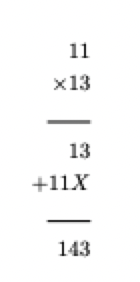
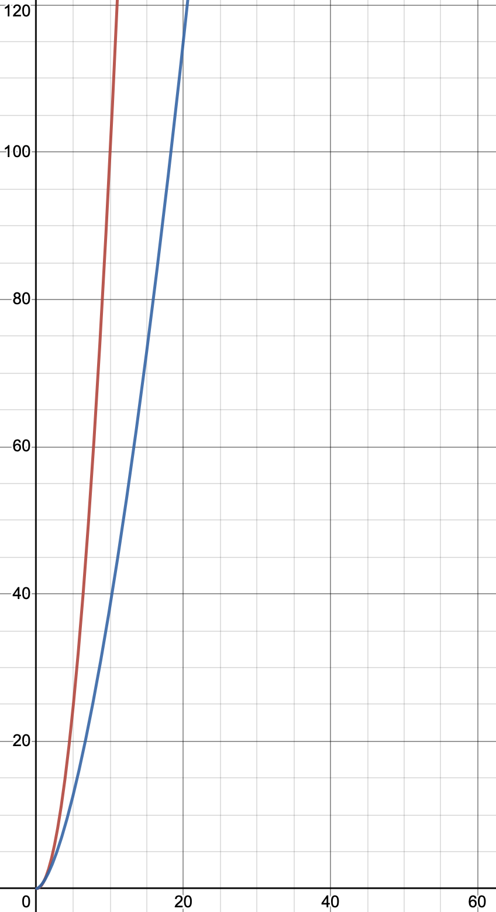

# Divide and conquer (part 3)

## Warm-up exercise

> In grade school, we learned to multiply two 2-digit numbers like so



> Suppose you use the same method to calculate $X \times Y$, where $X$ and $Y$ are both n-digit numbers.
> Assume that multiply two single-digit numbers takes $O(1)$, as does addition of 2-3 single digit numbers, as does extracting the tens and units digits of a two-digit number.
> What is the asymptotic running time, in terms of $n$, of multiplying two n-digit numbers using the method you used for the first question?

Multiplying 2 n-digit numbers will require $n^{2}$ multiplication operations and then $n + 1$ addition operations to resolve the final answer. Thus the asymptotic running time of multiplying 2 n-digit numbers is $O(n^{2})$

## Integer multiplication

### Divide and conquer

> For the divide-and-conquer algorithm, we are going to divide $X$ and $Y$ each into their "higher order" and "lower order" bits first
> $X_{H}$ is the $n/2$ higher-order bits, and $X_{L}$ is the lower order bits

#### Example

- Let $X = 150$ or `10011100`
- Let $Y = 225$ or `11100001`

| $X_{H}$ | $X_{L}$ | $Y_{H}$ | $Y_{L}$ |
|:---:|:---:|:---:|:---:|
| `1001` | `1100` | `1110` | `0001`

#### Initial algorithm

Using algebra, we can see that

$$
    X \times Y = 
    (X_{H} \times 2^{n/2} + X_{L}) \times 
    (Y_{H} \times 2^{n/2} + Y_{L}) =
    X_{H}Y_{H} \times 2^{n} + (X_{H}Y_{L} + X_{L}Y_{H}) \times 2^{n/2} + X_{L} + Y_{L}
$$

The expression can be simplified to (**NOT algebraically**, this is simply the necessary computation in the overall algorithm)

$$
    E = (X_{L} + X_{H})(Y_{L} + Y_{H}) = X_{L}Y_{L} + X_{L}Y_{H} + X_{H}Y_{L} + X_{H}Y_{H}
$$

We can use this information to create the following algorithm

```
Multiply(X, Y):
    /* Create X_hi, X_lo, Y_hi, Y_lo */
    A = Multiply(X_hi, Y_hi)
    B = Multiply(X_hi, Y_lo)
    C = Multiply(X_lo, Y_hi)
    D = Multiply(X_lo, Y_lo)
    return A * exp(2, n) + (B + C) * exp(2, n/2) + D
```

#### Analysis

We make four recursive calls, each of size $n/2$, plus some addition

$$
    T(n) = 4T(\frac{n}{2}) + n \implies \theta(n^{2})
$$

Unfortunately, this isn't much better than our grade-school method...

### Making improvements

#### Review the expression


$$
    X \times Y = 
    (X_{H} \times 2^{n/2} + X_{L}) \times 
    (Y_{H} \times 2^{n/2} + Y_{L}) =
    X_{H}Y_{H} \times 2^{n} + (X_{H}Y_{L} + X_{L}Y_{H}) \times 2^{n/2} + X_{L} + Y_{L}
$$

- Previously, we performed 4 multiplication per call.
- Looking closer at the RHS of the expression shows that only 3 multiplications are necessary between $X$ and $Y$

#### The final algorithm

```
Multiply(X, Y)
    /* Create X_hi, X_lo, Y_hi, Y_lo */
    A = Multiply(X_hi, Y_hi)
    D = Multiply(X_lo, Y_lo)
    E = Multiply(X_lo + X_hi, Y_lo + Y_hi)
    G = E - A - D
    return A * exp(2, n) + D + exp(2, n/2) * G
```

#### Analysis

We make three, instead of four, recursive calls, each of size $n/2$

$$
    T(n) = 3T(n/2) + n \implies \theta(n^{\log_{2} 3})
$$

This asymptotic running time looks similar to the previous one. However, $\log_{2} 3$ evaluates to about $1.585$, which is smaller than $2$. 



- The graph above shows the initial and final algorithm asymptotic functions
    - Red is $O(n^{2})$
    - Blue is $O(n^{\log_{2} 3})$
- Although the growth rate is similar, it can clearly be seen that blue is slower growing than red