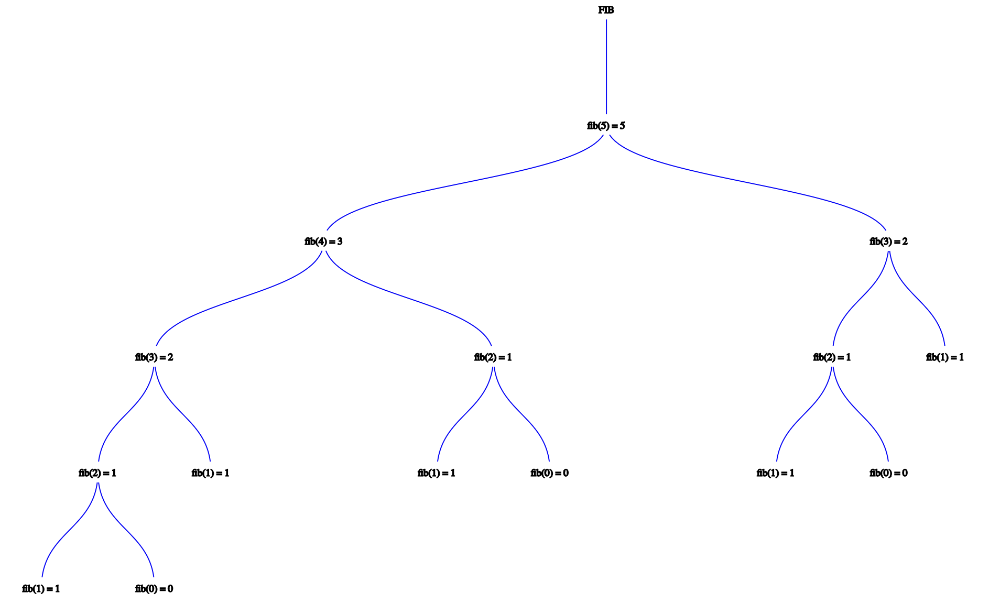
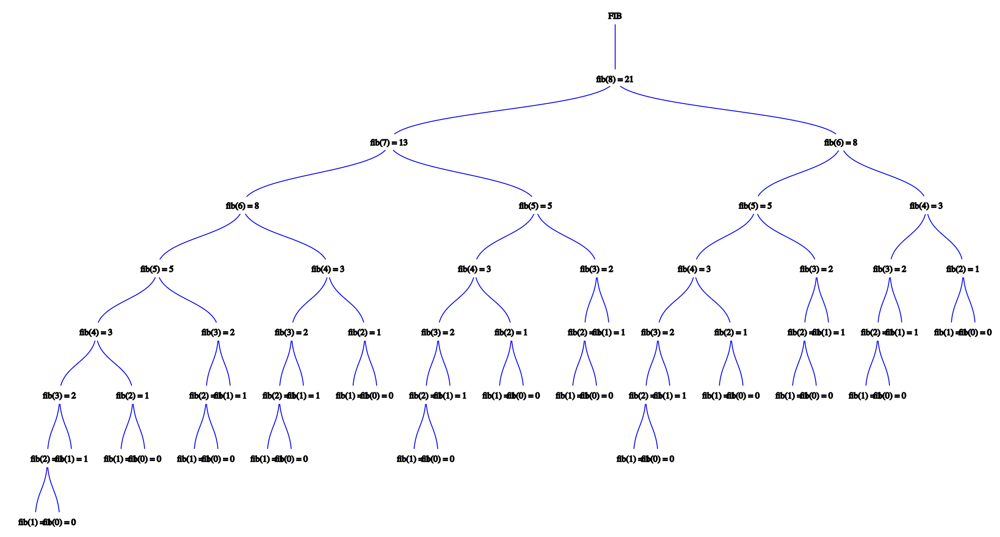

# Dynamic programming (part 1)

## Warm-up exercises

### Question 1

> Consider the traditional recursive function to compute Fibonacci numbers

```
Fib(n):
    if n == 0 or n == 1 then
        return n
    else:
        return Fib(n - 1) + Fib(n - 2)
```

> Suppose we call `Fib(5)`. How many total function calls happen? What if we call `Fib(8)`?

- `Fib(5)` will require 15 function calls



- `Fib(8)` will require 65 function calls



### Question 2

> We are given a set of $n$ intervals, numbered $1\dots n$, each of which has a start time $s_{i}$ and a finish time $f_{i}$.
> For each interval, we want to compute a value `p[i]`, which is the interval $j$ with the *latest* finish time $f_{j}$ such that $f_{j} \le s_{i}$; that is, the last-ending interval that finishes before interval $i$ starts.
> If no intervals end before interval $i$ begins, then `p[i] = 0`.
> Give an $O(n \log n)$ time algorithm that computes `p[i]` for all intervals. You may assume that the intervals are already sorted by finish time

```
FindLatestEndingIntervals(intervals):
    p = []
    for j=0...intervals.length:
        j = /* Binary search the finish times to find where the starting time should go */
        if intervals[j - 1].end < intervals[j].start < intervals[j + 1].end then
            p.add(intervals[j - 1])
        else:
            p.add(0)
    return p
```

## Weighted interval scheduling

### Problem statement

**The big problem**: Fed up after the first two quizzes in CompSci 161, your friend has decided to change majors to one that grades based only on attendance. The only question is which classes your friend should take in the Fall quarter. The classes all meet once a day, at different times and lengths, are are worth different amounts of credits. Your friend's goal is to maximize the amount of credits earned in that quarter without having to skip any classes (as this may interfere with passing those classes)

**More formally**: We are given a set of $n$ intervals, each of which as a start time $s_{i}$, a finish time $f_{i}$, and a value $v_{i}$. Our goal is to select a subset of the intervals such that no two selected intervals overlap and the total value of those taken is maximized.

### Recursive solution

Let's solve this *recursively* (yay!). We will write a function `OPT(i)` that returns the optimal number of credits obtainable among intervals (classes) $1 \dots i$. We can then call `OPT(n)` to figure out the optimal number of credits obtainable among all intervals

The key observation here is that your friend will either take class $i$ or won't take class $i$

#### The algorithm

```
OPT(i):
    // Base case
    if i < 1 then
        return 0

    // If friend doesn't take class i
    value_if_not_taken := OPT(i - 1)

    // If friend does take class i
    value_if_taken := classes[i].credits + OPT(i - 1)

    return max(value_if_not_taken, value_if_taken)
```

#### Design considerations

**Should we implement it this way?**: We now have a recursive solution. Think back to the fibonacci example earlier in lecture. What will happen if we implement this program this way?

> Overlapping subproblems: the tendency for a recursive solution to break down a larger problem into a sets of subproblems where the two sets are not disjoint and the overlap is significant.
> This leads to the same subproblem being solved over and over again, rather than solving any new subproblems.

### Iterative solution

We can now move to have a solution that uses no recursive *functions calls*. Note that our solution is still conceptually recursive. The iterative solution will also allow us to output which courses to take, not simply the optimal value.

```
OPT(n):
    memo = [-1 for i=0...n]
    /* Compute p[i] values (O(nlogn) time) */
    memo[0] = 0
    for i=1...n do
        memo[i] = max(memo[i], memo[[p[i]] + classes[i].credits)
    i := n
    while i > 0 do
        // Take class i?
        if memo[i] > memo[i-1] then
            /* output memo[i] */
            i := p[i]
        else
            i--
```

| $i$ | `p[i]` | `classes[i].credits` | `OPT(p[i])` | `OPT(p[i]) + classes[i].credits` | `OPT(i - 1)` | `OPT(i)` |
| --- | --- | --- | --- | --- | --- | --- |
| $0$ | N/A | N/A | N/A | N/A | N/A | 0 |
| $1$ | 0 | 2 | 0 | 0 + 2 | 0 | 2 |
| $2$ | 0 | 4 | 0 | 0 + 4 | 2 | 4 |
| $3$ | 1 | 4 | 2 | 2 + 4 | 4 | 6 |
| $4$ | 0 | 7 | 0 | 0 + 7 | 6 | 7 |
| $5$ | 3 | 2 | 6 | 6 + 2 | 7 | 8 |
| $6$ | 3 | 1 | 6 | 6 + 1 | 8 | 8 |

> Dynamic programming is **not** about filling tables. Dynamic programming is about *smart recursion*